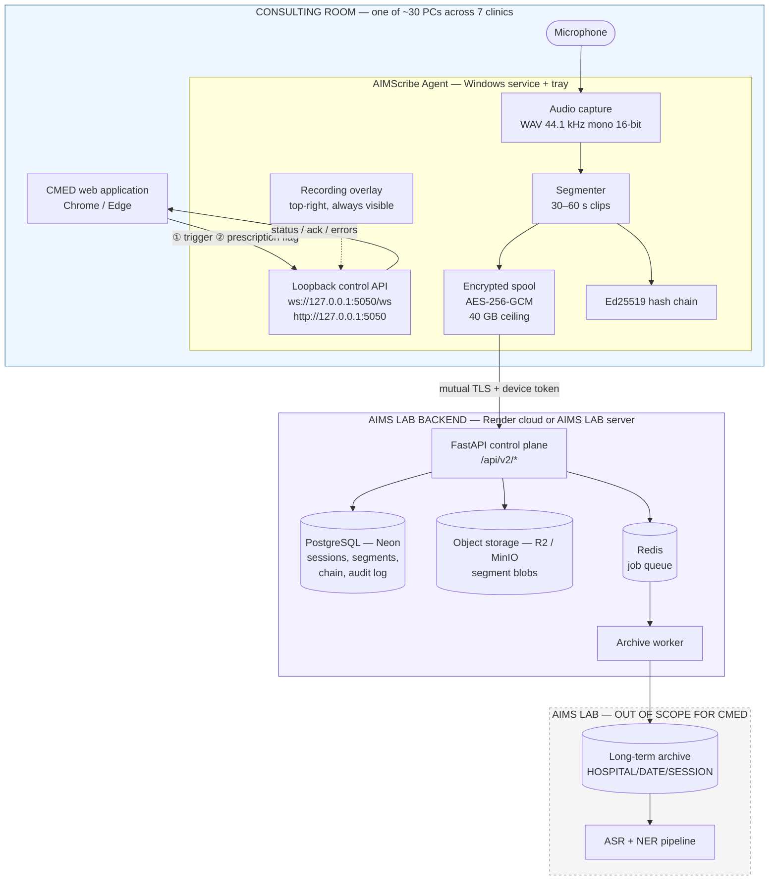
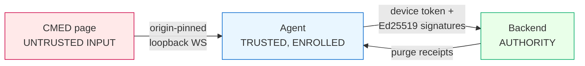
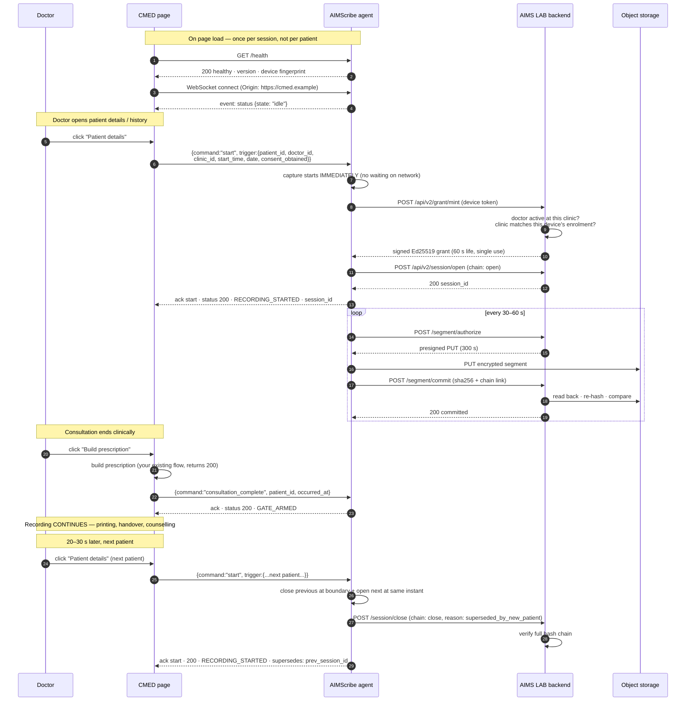
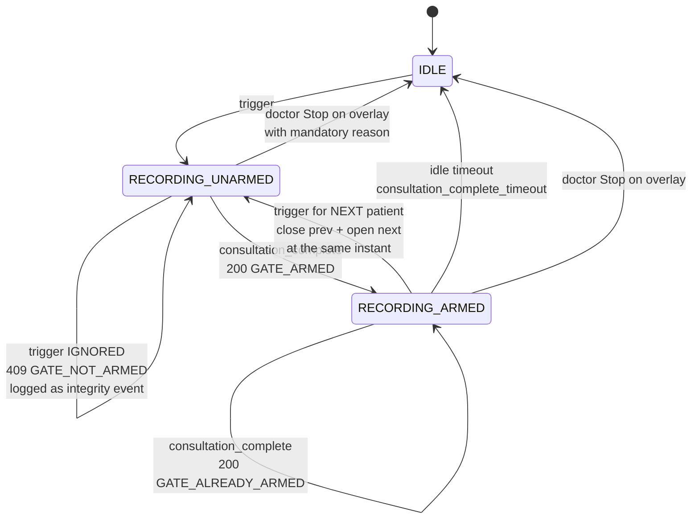
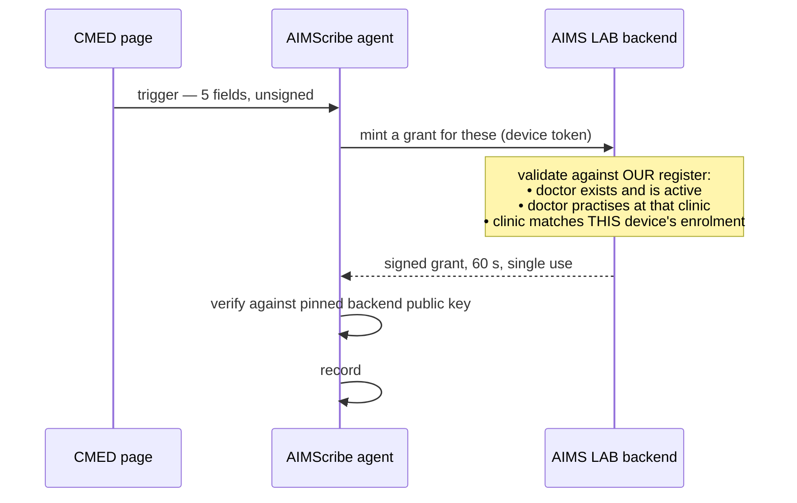

# AIMScribe ↔ CMED — Integration & Architecture README

**For the CMED software engineering team.**
Prepared by AIMS LAB · Independent University, Bangladesh.

| | |
|---|---|
| Document version | 1.0 |
| Date | 22 August 2026 |
| Agent version | 2.3.1 |
| Wire protocol | 2 |
| Target deployment | 7 clinics · ~30 doctors · ~30 laptops |
| Status | Design baseline for integration. Sections marked **DECISION** need your answer. |
| Out of scope | The ASR (speech-to-text) and NER (entity extraction) pipeline. Those run entirely inside AIMS LAB, downstream of everything described here, and require nothing from CMED. |

---

## Contents

1. [Read this first](#1-read-this-first)
2. [System architecture](#2-system-architecture)
3. [Life of a consultation](#3-life-of-a-consultation)
4. [The integration contract](#4-the-integration-contract)
5. [The consultation gate](#5-the-consultation-gate)
6. [The recording control overlay](#6-the-recording-control-overlay)
7. [Security model](#7-security-model)
8. [What crosses the boundary, and what never does](#8-what-crosses-the-boundary-and-what-never-does)
9. [Database: from beta console to production grade](#9-database-from-beta-console-to-production-grade)
10. [Server sizing](#10-server-sizing)
11. [Failure behaviour](#11-failure-behaviour)
12. [Environments, versioning and compatibility](#12-environments-versioning-and-compatibility)
13. [Definition of done](#13-definition-of-done)
14. [What we need from you](#14-what-we-need-from-you)
15. [Glossary](#15-glossary)
16. [Appendix A — response code reference](#appendix-a--response-code-reference)
17. [Appendix B — reference client](#appendix-b--reference-client)

---

## 1. Read this first

### 1.1 What AIMScribe is

AIMScribe is a Windows agent installed on the doctor's consulting-room PC. It
records the doctor–patient conversation, encrypts it, seals it into a
tamper-evident hash chain, and uploads it to the AIMS LAB backend for
transcription and clinical summarisation.

It runs beside CMED on the same machine. It is not a browser extension, not a
plugin, and not hosted by you.

### 1.2 The one thing AIMScribe cannot do by itself

**AIMScribe cannot know which consultation it is recording.**

A microphone hears a room. It does not know that the person speaking is patient
`P00123`, that the doctor is `DR0042`, or that the consultation has ended and a
new one has begun. Only CMED knows that, because only CMED is where the doctor
works.

Everything in this document follows from that single fact. We are asking you for
**two signals**. Not an API, not a database, not a key, not an integration
server — two messages sent from a page you already render.

### 1.3 The rule that overrides everything else in this document

> **A failure in AIMScribe must never stop a doctor seeing a patient.**

If the agent is not installed, not running, crashed, out of disk, or refusing to
record, CMED must behave exactly as it does today. No blocking dialog, no
spinner, no retry loop, no error the doctor must dismiss. Every call you make to
us is fire-and-forget with a short timeout and a silent failure path.

If any requirement in this document conflicts with that rule, that rule wins and
we will change the requirement.

### 1.4 What we are *not* asking for

Before you read further, here is everything you do **not** have to build:

- No cryptographic keys to generate, hold, rotate or protect
- No audio to capture, store, receive, or transmit
- No changes to your database schema
- No writes to any AIMS LAB system
- No server-to-server integration — no firewall rules, no VPN, no IP allowlist
- No hosting, updating, or supporting our software
- No patient names, notes, diagnoses, prescriptions or history — identifiers only
- No new authentication system; we do not authenticate against CMED at all

The integration surface is a WebSocket to `127.0.0.1` on the same PC, spoken by
JavaScript already running in the doctor's browser.


### 1.5 What already works today, and what is still to be built

This document is a design baseline, not a description of shipped software. Some
of it you can test against a real agent this week; some of it does not exist
yet. The split matters for planning, so it is stated here rather than discovered
in the meeting.

| Working today | Still to be built | Built by |
|---|---|---|
| WebSocket transport on `ws://127.0.0.1:5050/ws`, origin allowlist, `Host` check, loopback-only peer check | — | AIMS LAB (done) |
| `start`, `stop`, `pause`, `resume`, `status`, `doctors` | — | AIMS LAB (done) |
| Grant verification: Ed25519, 60-second lifetime, single-use `jti` | — | AIMS LAB (done) |
| `GET /health`, device enrolment, hash chain, encrypted spool, segment upload with server-side read-back verification | — | AIMS LAB (done) |
| Automatic handover: a new trigger closes the previous session and opens the next with no gap | — | AIMS LAB (done) |
| — | The **trigger payload** of §4.3. Today the page mints a grant itself and sends that; §7.2 moves minting to the AIMS LAB backend so CMED sends five plain fields instead | Joint |
| — | `POST /api/v2/grant/mint` on the AIMS LAB backend. Does not exist yet | AIMS LAB |
| — | `consultation_complete` and the consultation gate of §5 | AIMS LAB (CMED sends the signal) |
| — | The `request_id` / `status` / `code` reply envelope of §4.3 and Appendix A. Replies today carry no numeric status | AIMS LAB |
| — | `202 RECORDING_PROVISIONAL` and the clinic-mismatch refusal of §7.3 | AIMS LAB |
| — | The recording-control overlay of §6 | AIMS LAB — nothing for CMED |

Everything in the right-hand column is AIMS LAB's work except the trigger
payload, which is the one place both sides change at once. Until that change
ships, an integration built against §4.3 will be talking to an agent that still
expects a grant, so §4.3 and §7.2 should be scheduled together.

---

## 2. System architecture

### 2.1 Topology



### 2.2 Component responsibilities

| Component | Owner | Responsibility | Talks to CMED? |
|---|---|---|---|
| CMED web app | **CMED** | Emits the two signals. Nothing else. | — |
| AIMScribe agent | AIMS LAB | Capture, segment, encrypt, chain, spool, upload | **Yes**, loopback only |
| Recording overlay | AIMS LAB | Doctor-facing stop/pause with mandatory reason | No |
| Backend API | AIMS LAB | Enrolment, grants, segment verification, chain verification | No |
| PostgreSQL (Neon) | AIMS LAB | Session ledger, integrity chain, audit log | No |
| Object storage | AIMS LAB | Segment blobs, then purged | No |
| Archive worker | AIMS LAB | Moves verified sessions to long-term archive | No |
| ASR + NER | AIMS LAB | Transcription and extraction — **out of scope** | No |

The single line of contact between the two organisations is the arrow from the
browser to `127.0.0.1:5050`. There is no other.

### 2.3 Trust boundaries



Read this diagram carefully, because it drives the whole API design:

**The CMED page is untrusted input.** Not because we distrust CMED as an
organisation, but because a browser page is a browser page: any website the
doctor visits runs JavaScript on the same machine and can open a WebSocket to
`127.0.0.1`. The agent cannot tell CMED's JavaScript from anyone else's by
looking at the connection alone.

That is why we pin the `Origin` header, and why the identity of the doctor,
clinic and patient is re-validated by the backend against its own register
before a recording is authorised. **This is not a request for CMED to prove
itself — it is our defence against a page that is pretending to be you.**

---

## 3. Life of a consultation



Two things in that diagram matter more than the rest:

**Step 8 — capture starts before authorisation completes.** We do not make the
doctor or the patient wait for a round-trip to a server in another country. The
microphone opens on the click; the grant is validated in parallel. If validation
fails, the few seconds captured are discarded and never leave the machine. This
is why your `start` call feels instant regardless of network conditions.

**The gap between "build prescription" and the next trigger.** Recording does
**not** stop when the prescription is built. The doctor prints it, hands it over,
and counsels the patient for one to two minutes. That counselling is clinical
content and belongs in the record. The flag arms the handover; the next patient's
trigger performs it.

---

## 4. The integration contract

This is the section your engineers will implement against.

### 4.1 Transport

| Property | Value |
|---|---|
| Protocol | WebSocket, JSON text frames |
| URL | `ws://127.0.0.1:5050/ws` |
| Health probe | `GET http://127.0.0.1:5050/health` — unauthenticated, no patient data |
| Bound to | Loopback only. The port is not reachable from the network. |
| Max frame | 64 KB |
| Reconnect | Exponential backoff, 1 s → 30 s cap. Never block the UI. |
| Required header | `Origin` — must exactly match an allowlisted value |

**Why WebSocket and not a plain HTTP POST.** The agent must push state changes to
your page unprompted: a recording that stopped because the doctor pressed Stop on
the overlay, a microphone that was unplugged, a spool that filled. Polling for
that would be both slower and heavier. There is deliberately **no HTTP route to
start a recording** — grant verification and origin pinning live on the
WebSocket, and we will not add a second path around them.

**Mixed content.** If your production site is HTTPS, browsers permit
`ws://127.0.0.1` (loopback is a "potentially trustworthy origin" under the W3C
Secure Contexts spec) in Chrome and Edge. This is the configuration we run today.
If your CSP sets `connect-src`, you must add `ws://127.0.0.1:5050` and
`http://127.0.0.1:5050`.

### 4.2 Connection handshake

On connect, the agent immediately sends an unsolicited status event. Use it to
decide whether to show a recording indicator at all:

```json
{
  "event": "status",
  "state": "idle",
  "session_id": null,
  "armed": false,
  "connected_clients": 1,
  "protocol_version": 2,
  "agent_version": "2.3.1",
  "timestamp": "2026-08-23T04:14:32.118Z"
}
```

`state` is one of: `starting`, `idle`, `recording`, `paused`, `awaiting_reason`,
`degraded`.

### 4.3 Signal 1 — the consultation trigger

**Sent when:** the doctor opens a patient's details or history — the same click
that today loads the patient into the consultation view.

**Send:**

```json
{
  "command": "start",
  "request_id": "d3f1c8a2-5b7e-4d19-9a03-1f2e4c6b8d0a",
  "trigger": {
    "patient_id":       "P0012345",
    "doctor_id":        "DR0042",
    "clinic_id":        "CMED-DHK-BANANI-01",
    "start_time":       "2026-08-23T10:14:32+06:00",
    "date":             "2026-08-23",
    "consent_obtained": true,
    "consent_method":   "verbal_at_reception",
    "patient_name":     "optional, display only"
  }
}
```

| Field | Type | Req. | Notes |
|---|---|:--:|---|
| `patient_id` | string | **M** | Your patient identifier. Becomes `patient_ref`. Charset rule in §4.7. |
| `doctor_id` | string | **M** | **No fallback exists anywhere in the chain.** If absent the trigger is refused rather than guessed. See the note below. |
| `clinic_id` | string | **M** | Your clinic identifier. AIMS LAB maps it to `hospital_id`. |
| `start_time` | RFC 3339 | **M** | With offset. Used as the session boundary and as the previous session's end time. |
| `date` | `YYYY-MM-DD` | **M** | Local clinic date. Used for archive foldering — it is not derivable from `start_time` across midnight in a different timezone. |
| `consent_obtained` | boolean | **M** | Must be `true`. See §4.9. |
| `consent_method` | string | S | Free text, ≤64 chars. e.g. `verbal_at_reception`, `written_form`. |
| `patient_name` | string | C | **Display only**, ≤120 chars, never used for identity, never written to the archive path. Omit it if you would rather not send it — nothing breaks. |
| `request_id` | UUID | S | Echoed in the reply so you can correlate. Strongly recommended. |

> **Why `doctor_id` has no fallback.** A consulting room runs two shifts on the
> same laptop. An earlier version of AIMScribe fell back to the doctor recorded
> at enrolment when the trigger omitted one — and filed every afternoon
> consultation under the morning doctor, silently, in the filename. That fallback
> is gone. The doctor is named per consultation or the recording does not start.

**Receive — success:**

```json
{
  "event": "ack",
  "command": "start",
  "request_id": "d3f1c8a2-5b7e-4d19-9a03-1f2e4c6b8d0a",
  "status": 200,
  "code": "RECORDING_STARTED",
  "data": {
    "session_id": "01JB8XQ4M7YZ2K9V3N5P6R8T0W",
    "started_at": "2026-08-23T10:14:32.441+06:00",
    "armed": false,
    "supersedes": "01JB8W2H5T3QF8N1C4B7D9E2A6"
  },
  "timestamp": "2026-08-23T04:14:32.441Z"
}
```

**This is the 200 OK you asked for.** `status: 200` with
`code: "RECORDING_STARTED"` is the agent's confirmation that audio is being
captured and the session has been filed under the identifiers you supplied. It
is safe to show the doctor a recording indicator at this point.

`supersedes` is present when this trigger closed a previous consultation. Its
value is the previous `session_id`. Use it if you want to show "previous
consultation saved"; ignore it otherwise.

`session_id` is a ULID — opaque, sortable, and deliberately **not** derived from
the patient identifier, because object keys leak into access logs and error
traces. You may store it against the visit if that is useful to you. **We do not
require you to store anything.**

**Receive — provisional (slow network):**

```json
{ "event":"ack", "command":"start", "request_id":"…",
  "status": 202, "code": "RECORDING_PROVISIONAL",
  "data": { "session_id": "01JB…", "started_at": "…" } }
```

Capture is running; authorisation is still in flight. Treat it exactly as 200 for
UI purposes. A later `status` event confirms (`state: "recording"`) or cancels
(`event: "error"`, `code: "AUTHORISATION_FAILED"`).

The full code table is in [Appendix A](#appendix-a--response-code-reference).

### 4.4 Signal 2 — the prescription-built flag

**Sent when:** the doctor presses **Build prescription** — the action that
converts the raw tabular entry into the prescription view, and which your API
already answers with 200. Send this signal on that 200, from the same handler.

This is mandatory for every patient in your workflow, because the paramedic in
the investigation chamber reads the built prescription. That property is exactly
what makes it a reliable end-of-consultation marker, and it is why we are asking
for this signal rather than inventing a new button.

**Send:**

```json
{
  "command": "consultation_complete",
  "request_id": "9c2b7e40-1a55-4f83-b6d2-77e0c1a94b3f",
  "patient_id": "P0012345",
  "occurred_at": "2026-08-23T10:26:11+06:00"
}
```

| Field | Type | Req. | Notes |
|---|---|:--:|---|
| `patient_id` | string | **M** | Must match the patient of the open session. Guards against a flag arriving for a different record. |
| `occurred_at` | RFC 3339 | **M** | When the prescription was built. |
| `request_id` | UUID | S | Echoed back. |

**No clinical content.** Not the drugs, not the doses, not the diagnosis, not the
investigations. We store a single boolean per session — *was a prescription built
before this session closed, and at what time* — and nothing else. If you send us
prescription content we will discard it.

**Receive:**

```json
{ "event":"ack", "command":"consultation_complete", "request_id":"…",
  "status": 200, "code": "GATE_ARMED",
  "data": { "session_id": "01JB…", "armed": true,
            "armed_at": "2026-08-23T10:26:11+06:00" } }
```

**Idempotent by design.** Doctors revise prescriptions and press Build again.
Every repeat returns `200 GATE_ALREADY_ARMED`. It never disarms, never restarts
the recording, never opens a new session. Send it as many times as it happens —
do not deduplicate on your side.

**Recording does not stop here.** This is the most commonly misunderstood point
in the whole integration. See §5.

### 4.5 Other commands

| Command | Purpose | Who normally sends it |
|---|---|---|
| `status` | Poll current state | CMED, on reconnect |
| `pause` / `resume` | Supervised pause with mandatory reason | The **overlay**, not CMED |
| `stop` | Close the session with a mandatory reason | The **overlay**, not CMED |
| `doctors` | Typing suggestions for the doctor field | CMED, optional |

**You do not need to build pause or stop controls.** They moved to the AIMScribe
overlay (§6) precisely so that the doctor is not dependent on your UI for them,
and so that we can enforce a reason before the action takes effect. If you
already have such controls, leave them; they still work.

### 4.6 Events the agent pushes to you

Unsolicited, at any time. Handle unknown `event` values by ignoring them — we
will add more.

| `event` | When | What you should do |
|---|---|---|
| `status` | Any state change | Update your recording indicator |
| `session_opened` | Recording began | Optional |
| `session_closed` | Recording ended, with `close_reason` | Clear the indicator |
| `paused` / `resumed` | Doctor used the overlay | Update the indicator |
| `error` | Command failed | See Appendix A; never block the doctor |
| `integrity_alert` | Silent microphone, ignored trigger, clinic mismatch | Optional; the overlay already shows it |

An `integrity_alert` with `alert_type: "trigger_ignored"` is the one worth
surfacing in your UI if you can — it means the doctor clicked the next patient
and nothing happened, and the fastest way to fix it is to tell them why.

### 4.7 Identifier rules — non-negotiable

```
^[A-Za-z0-9_-]{1,64}$
```

`patient_id`, `doctor_id` and `clinic_id` must match this pattern exactly.

**Why so strict.** These values become directory names on the archive volume and
components of object keys. Spaces, slashes, colons, dots, quotes, Unicode and
Bengali script have all, at some point in some system, produced either an
unreachable file or a path traversal. A value that fails this test is refused
with `400 INVALID_IDENTIFIER` and the recording does not start.

If your identifiers contain characters outside this set, tell us at the meeting
and we will agree a deterministic, reversible transformation — applied on our
side, not yours.

**`clinic_id` → `hospital_id` mapping.** Your clinic identifiers are yours;
`hospital_id` is ours, is the archive folder name, and is **immutable once
assigned**. We maintain the mapping table. We need your full clinic list, and
notification when it changes.

**DECISION:** we need your identifier formats and your clinic list.

### 4.8 The origin allowlist

The agent accepts WebSocket connections only from an exact list of origins. This
is the control that stops any other website on the doctor's machine from starting
a recording.

We need, exactly, including scheme and port:

- Production origin — e.g. `https://cmed.com.bd`
- Staging origin — e.g. `https://staging.cmed.com.bd`
- Any other origin from which the consultation page is served

Wildcards are not supported and will not be added. `null` origins and
origin-less connections are rejected. A `Host` header allowlist runs alongside it
to defeat DNS rebinding, where a hostile domain resolves to `127.0.0.1`.

**DECISION:** we need your exact origins.

### 4.9 Consent

`consent_obtained: true` is enforced in three independent places: your payload,
the agent, and a `CHECK` constraint in the database. Consent is a precondition
for recording, not a field to be filled in afterwards.

Two ways to satisfy it:

1. **CMED records consent.** If you already capture it — at reception, on the
   visit record — send it and we use it. Preferred: it is one less thing for the
   doctor to do.
2. **AIMScribe asks.** If you do not, the overlay prompts the doctor once per
   patient before capture is authorised.

We must agree which. Running both produces two prompts and doctors will start
clicking through them.

**DECISION:** does CMED record consent for recording today?

### 4.10 Handling the case where AIMScribe is absent

On a PC without the agent, or with the agent stopped, the WebSocket connection
simply fails. Required behaviour:

```
try connect → fail → log at debug → hide recording indicator → carry on
```

No dialog. No toast. No retry that blocks. No console error the doctor can see.
The health probe at `GET http://127.0.0.1:5050/health` with a 500 ms timeout is
the cheapest way to decide whether to attempt the WebSocket at all.

---

## 5. The consultation gate

This is the mechanism that stops a misclick from filing one patient's
consultation under another patient's name.

### 5.1 The problem

Under clinic pressure a doctor may open the *next* patient's details in the
middle of the current consultation — to check something, or by mistake. Without a
gate, that trigger closes the current recording and opens a new one. The rest of
the current consultation is then filed under the next patient. The audio is
perfect and the label is wrong, which is worse than no recording at all.

### 5.2 The state machine



### 5.3 The rules, stated plainly

1. **A trigger only performs a handover when the gate is armed.** Unarmed, it is
   ignored — logged, shown on the overlay, and answered `409 GATE_NOT_ARMED`.
2. **Only `consultation_complete` arms the gate.**
3. **Arming does not stop the recording.** Printing, handover and 1–2 minutes of
   counselling all follow the prescription being built, and all of it is clinical
   content with the patient present.
4. **Arming is idempotent and irreversible within a session.** It never disarms.
5. **The handover is seamless.** The previous session closes at a clip boundary
   and the next opens at the same instant, on a parallel thread, with no gap in
   capture. The previous session's end time is the next session's start time.
6. **The idle timeout exists for the end of the day, not for gaps between
   patients.** Gaps are 20–30 seconds; the timeout is 10–15 minutes. It stops a
   microphone being left live on an empty room after the last patient. Close
   reason: `consultation_complete_timeout`.

### 5.4 Known residual risk, and how it is handled

A patient who leaves before a prescription is built — walked out, declined
treatment, referred as an emergency — produces no arming flag. The session stays
unarmed and the next patient's trigger is ignored.

**The overlay Stop button is the designed fix.** The doctor stops with a reason,
the session closes cleanly, and the next patient's trigger starts a clean
session. This is why the overlay is a safety requirement and not a convenience
feature.

We will measure how often this happens once the flag is live. If it exceeds a few
percent of consultations, we will come back and ask for a second
end-of-consultation signal — a patient-closed or visit-ended event.

**DECISION:** is *build prescription* genuinely performed for **every** patient,
including those who leave early? And is there any other action that reliably
marks a consultation clinically complete?

---

## 6. The recording control overlay

Included so your team knows what the doctor will see beside your application, and
so that neither side builds it twice.

Today the doctor must find the system tray, locate AIMScribe, right-click, and
choose Stop or Pause. Under clinic pressure that does not happen — which means
that when a patient asks for the recorder to be stopped, it often is not.

**What we are building:** a small, fixed overlay in the top-right of the screen,
visible above the browser, appearing only while a recording is active. Two
controls:

- **Stop** — red, circular
- **Pause** — blue, rectangular

**The interaction, and why it is designed this way.** Pressing either button
presents a list of reasons plus a free-text comment box. The doctor selects a
reason or types one, and presses Enter. **Only then does the action take
effect.** Pause does not pause and Stop does not close the session until a reason
has been given.

For Stop specifically the form is not dismissable: once opened, the session will
close, and the only question is what reason is recorded. This closes the obvious
gap — a doctor who wants to stop recording and does so with no explanation, or a
vague one, degrading the dataset for everyone.

For Stop there is one subtlety worth stating: the microphone cuts **immediately**
on the button press — a patient asking to stop being recorded must not have to
wait for a form. The reason governs how the *session is closed and filed*, not
whether capture continues.

**Reasons required only for doctor-initiated stops.** System closes —
`superseded_by_new_patient`, `consultation_complete_timeout`, shutdown — carry
automatic reasons and never prompt.

**Nothing here requires anything from CMED.** It is drawn by the agent, it does
not sit inside your page, and it does not need your styling, your z-index, or
your cooperation.

---

## 7. Security model

### 7.1 Layered, and each layer stops something different

| Layer | What it stops | Where enforced |
|---|---|---|
| Device enrolment | An unenrolled laptop contributing audio at all | Agent ↔ backend |
| Origin allowlist | Another website on the doctor's PC starting a recording | Agent, WS + HTTP |
| Host allowlist | DNS rebinding — a hostile domain resolving to `127.0.0.1` | Agent middleware |
| Loopback binding | Anything on the network reaching the control port | OS socket bind |
| Signed grant | A page fabricating a doctor, clinic or patient | Backend mints, agent verifies |
| Single-use `jti` | Replay of a captured grant | Agent, in-memory guard |
| 60-second grant life | A stolen grant surviving long enough to be useful | Backend claim |
| Register validation | A doctor recording at a clinic they do not practise at | Backend, against its own tables |
| Hash chain | Silent insertion, deletion or reordering of segments | Agent signs, backend verifies |
| Read-back verification | A corrupted or substituted segment being accepted | Backend, on every commit |
| Purge receipts | Audio being deleted without proof it was archived | Backend signs, agent requires |

### 7.2 The change that matters most to CMED

**Grant minting moves from the web application to the AIMS LAB backend.**

Today, the *dummy* CMED application we built for development mints the Ed25519
grant itself, holding a private key. Real CMED will not do that, will not hold a
key, and told us plainly: you read from our API, you do not write to it.

That constraint is entirely acceptable, and the resulting design is **stronger**
than the one it replaces:



Before, the agent trusted what a page claimed. Now the backend checks every claim
against its own register before authorising anything. **CMED holds no key, signs
nothing, and exposes no write route.**

Cost on our side: one round-trip at session start. Mitigated by starting capture
immediately and validating in parallel, so a slow link never costs the opening
seconds of a consultation. Cost on your side: none.

### 7.3 Clinic mismatch: we will refuse, not warn

If the `clinic_id` in a trigger maps to a `hospital_id` different from the one
this laptop was enrolled at, the recording is **refused**
(`401 CLINIC_MISMATCH`), not recorded-with-a-warning.

Against our dummy application, recording anyway and raising an alert was the
right call. Against real CMED, a mismatch means either a bad clinic mapping or a
laptop that has been physically moved to another building. Both are conditions
where continuing to record produces mislabelled evidence.

### 7.4 What enrolment does and does not do

Enrolment binds a specific laptop to a specific hospital in the AIMS LAB backend.
It is agent-to-backend only: **CMED appears nowhere in the enrolment request, the
response, or the stored identity.** Migrating from our dummy application to real
CMED requires no re-enrolment of the existing fleet.

What enrolment does **not** do is stop a random web page from triggering a
recording on a laptop that *is* enrolled. That is the job of the origin
allowlist and the signed grant, together. Neither alone is sufficient: the origin
check can be defeated by a compromised browser extension, and the grant alone
would let any page that could reach the backend try its luck.

---

## 8. What crosses the boundary, and what never does

### 8.1 CMED → AIMScribe

| Data | Sent | Retained by AIMS LAB |
|---|---|---|
| `patient_id` | Yes | Yes — as `patient_ref`, in the session ledger and archive path |
| `doctor_id` | Yes | Yes |
| `clinic_id` | Yes | Yes — mapped to `hospital_id` |
| `start_time`, `date` | Yes | Yes |
| `consent_obtained`, `consent_method` | Yes | Yes |
| `patient_name` | Optional | **Display only. Never written to the archive path or object keys.** |
| Prescription *built* | Yes — one boolean + timestamp | Yes |
| Prescription *contents* | **Never** | **Never** |
| Diagnoses, investigations, notes, history, vitals | **Never** | **Never** |

### 8.2 AIMScribe → CMED

| Data | Purpose |
|---|---|
| `state` | Drive your recording indicator |
| `session_id` | Correlation, if you want it. Optional to store. |
| `status` / `code` | Success and failure handling |
| `close_reason` | Why a recording ended |
| Agent version, device fingerprint, health | Support and diagnostics |
| **Audio** | **Never. Under no circumstances, by any route.** |
| **Transcripts, summaries, extracted entities** | Not part of this integration. Separate agreement if ever wanted. |

Your system is never a route to patient audio. There is no endpoint, no
parameter, and no configuration that would make it one.

---

## 9. Database: from beta console to production grade

We currently track patient and session information in a **Neon (beta console)**
PostgreSQL project. Neon is a sound choice — serverless Postgres, branching,
point-in-time recovery — but a beta-console project configured for development is
not a production clinical database. This is what changes before we integrate with
a live CMED.

### 9.1 The gap, and the ten changes that close it

| # | Change | Why it matters clinically |
|---|---|---|
| 1 | **Paid production project**, separate from dev and staging | A free-tier project has no SLA and can be reclaimed. Three isolated projects, not three branches of one — a branch shares the parent's compute and its failure domain. |
| 2 | **Disable autosuspend (scale-to-zero) on production** | Cold start adds seconds to the first `segment/commit` after a quiet period. Every one of those is a segment sitting unverified in a laptop's spool. |
| 3 | **Autoscaling floor ≥ 1 CU, ceiling 4 CU** | Predictable latency during the 09:00 clinic rush; headroom for spool-drain bursts after an outage. |
| 4 | **Connect through the pooled endpoint** (`-pooler` host, PgBouncer transaction mode) | FastAPI async workers open and close connections constantly. Note for the implementers: transaction-mode pooling forbids server-side prepared statements — asyncpg needs `statement_cache_size=0`. |
| 5 | **PITR retention 7 → 30 days** | Beta defaults are shorter than the window in which a data problem is typically noticed. |
| 6 | **Nightly logical backup to a *different* provider** | **PITR is not a backup.** It protects against your mistakes, not against losing the account. Nightly `pg_dump --format=custom`, encrypted, to object storage under separate credentials. |
| 7 | **Least-privilege roles** — `aims_app` (DML only), `aims_migrate` (DDL, CI only), `aims_readonly` (dashboards) | Today one role does everything. A compromised API key should not be able to `DROP TABLE`. |
| 8 | **Versioned, forward-only migrations in CI** (Alembic), reviewed like code | **The single most important cultural change: no more editing schema in the web console.** A hand-applied change on production that is not in the repository is a change nobody can reproduce, review or roll back. |
| 9 | **`sslmode=verify-full` with a pinned CA**, IP allowlist or Neon private networking | `require` alone does not authenticate the server. |
| 10 | **Read replica for reporting and dashboards** | An analyst's unindexed query must not be able to slow down segment commits during a clinic session. |

### 9.2 Already correct, and must be preserved

- `audit_log` is append-only, enforced by a database trigger rather than by
  convention.
- Consent is a `CHECK` constraint, not application logic.
- Object keys are built from the opaque session ULID, never the patient
  reference — because keys leak into access logs, metrics and error traces.
- Segment hashes are verified by **reading the object back from storage and
  re-hashing it**, not by trusting the client's claim.
- The hash chain is verified server-side at session close, and a mismatch
  quarantines the session rather than accepting it.

### 9.3 Monitoring to add

Connection count against ceiling · p99 query latency on `segment/commit` ·
autovacuum lag on `segments` and `audit_log` · WAL volume · failed-login rate ·
open sessions with no segment in 5 minutes · sessions quarantined per day.

---

## 10. Server sizing

Requested: what CPU and storage the backend needs to serve **7 hospitals and 30
doctors simultaneously**, whether deployed in the cloud or on an AIMS LAB local
server.

Everything below is derived, not guessed. The derivation is shown so you can
challenge the assumptions rather than the conclusions.

### 10.1 Load model

| Input | Value | Source |
|---|---|---|
| Clinics | 7 | Deployment |
| Doctors / concurrent devices at peak | 30 | Deployment |
| Consultations per doctor per day | 30 | Observed clinic pressure |
| Sessions per day | **900** | 30 × 30 |
| Mean consultation | 12 min | Observed |
| Recording hours per day | **180 h** | 900 × 12 min |
| Audio bitrate | 88.2 KB/s | WAV PCM 44.1 kHz mono 16-bit |
| Per recording hour | 318 MB | 88.2 KB/s × 3600 |
| Mean segment | 45 s ≈ 4 MB | 30–60 s window |

### 10.2 Derived load

| Quantity | Derivation | Result |
|---|---|---|
| Aggregate ingest | 30 × 88.2 KB/s | **2.65 MB/s ≈ 21 Mbit/s** |
| Segments per day | 180 h × 3600 ÷ 45 s | **14,400** |
| Segment rate at peak | 30 devices ÷ 45 s | **0.67 /s** |
| API requests, steady | 0.67×2 (authorize+commit) + 1.0 (heartbeat) + sessions | **≈ 2.5 req/s** |
| API requests, design peak | 10× for reconnect storms and spool drain | **25 req/s** |
| API tier bandwidth | ingest + hash read-back (2.65 MB/s each way) | **≈ 5.3 MB/s ≈ 42 Mbit/s** |
| Audio per day | 180 h × 318 MB | **≈ 57 GB/day** |
| Audio per month | × 26 working days | **≈ 1.5 TB/month** |
| Audio per year | | **≈ 18 TB/year** |
| Database rows per day | 900 sessions + 14,400 segments + ~16,000 chain/audit | **≈ 32,000/day** |
| Database growth | ~500 B/row with indexes | **≈ 6 GB/year** |

**The headline conclusion, stated plainly: this is not a compute-bound system, it
is a storage-and-bandwidth-bound one.** Two and a half requests per second is a
trivial load for any modern server. Fifty-seven gigabytes a day is not trivial at
all, and it arrives every working day whether anyone is watching or not.

**One CPU cost is easy to miss.** `POST /segment/commit` reads every segment back
out of object storage and re-hashes it on the API server before accepting it.
That is the check that makes the whole integrity chain meaningful, and it means
the API tier carries the full audio volume in *both* directions — it is not a
thin control plane. At 2.65 MB/s with SHA-NI hardware acceleration the hashing
itself is well under 1% of one core, but the bandwidth and the transient memory
(one segment per in-flight commit) are real and are budgeted above.

### 10.3 Option A — cloud (recommended)

| Component | Specification | Rationale |
|---|---|---|
| API — Render | **2 × (1 vCPU, 2 GB)** Standard | Two for zero-downtime deploys and single-instance failure, **not** for throughput. One handles the load. |
| PostgreSQL — Neon | **1–4 CU autoscaling, 8 GB**, autosuspend **off**, PITR 30 d | §9. Compute is oversized for 2.5 req/s; the floor exists to remove cold starts. |
| Object storage — Cloudflare R2 | Pay-as-you-go, lifecycle rules | **No egress fees** — decisive, given we read every segment back for verification. ~432k class-A and ~864k class-B operations/month. |
| Redis | **256 MB** managed | Job queue only. Not a datastore. |
| Archive worker | **1 vCPU, 2 GB** | Polls every 30 s, batch of 5. |
| Long-term archive | See §10.5 | The real cost line. |
| **Indicative monthly cost** | **USD 120–200** excluding archive storage and the AI pipeline | |

### 10.4 Option B — AIMS LAB local server

If the backend is hosted in-house instead. Minimum, then recommended.

| Component | Minimum | Recommended | Rationale |
|---|---|---|---|
| CPU | 8 cores / 16 threads | **16 cores / 32 threads** — Xeon E-2400 series or AMD EPYC 4004 | Allocation: 2 API, 4 Postgres, 1 Redis + worker, 1 OS, remainder headroom. **Must have SHA-NI / SHA extensions** for segment hashing. |
| RAM | 32 GB ECC | **64 GB ECC** | Postgres `shared_buffers` 8 GB, `effective_cache_size` 24 GB, 2×2 GB API, 1 GB Redis, 2 GB MinIO, OS page cache. ECC is not optional for a system whose value is integrity. |
| OS / application disk | 250 GB NVMe, mirrored | 500 GB NVMe, mirrored | |
| Database disk | **500 GB NVMe, RAID 1, with power-loss protection** | 1 TB NVMe, RAID 1, PLP, separate WAL device | **The number that matters is fsync latency, not capacity.** Target p99 under 1 ms. Consumer SSDs without PLP lie about flush completion — which is precisely the failure this architecture is built to detect. |
| Audio staging | 4 TB NVMe or SAS SSD | 8 TB | ~57 GB/day, held until archived and receipted. Two weeks of buffer if the archive path stalls. |
| Long-term archive | **6 × 8 TB in RAID 6 = 32 TB usable** | **8 × 12 TB in ZFS RAIDZ2 = 60 TB usable** | 18 TB/year raw. RAIDZ2 preferred for end-to-end checksums and scrub. |
| Network — LAN | 1 GbE | 2 × 1 GbE bonded | |
| Network — WAN uplink | **100 Mbit/s symmetric** | 200 Mbit/s symmetric | 42 Mbit/s sustained (§10.2) plus catch-up bursts. Symmetric matters: this is an *upload*-dominated system and most Bangladeshi business links are not. |
| Power | **UPS, mandatory** | UPS + generator transfer | A server without a UPS invalidates every durability guarantee that depends on fsync reaching the medium. |
| Offsite copy | **Required** | Nightly to cloud object storage | RAID is not a backup. RAID survives a disk; it does not survive a fire, a theft, or a mistaken `rm`. |

### 10.5 Per-clinic network

Each clinic uploads independently over the public internet.

| Quantity | Value |
|---|---|
| Laptops per clinic | 4–5 |
| Sustained upstream per clinic | 5 × 88.2 KB/s ≈ **3.5 Mbit/s** |
| Recommended upstream per clinic | **10 Mbit/s** minimum, 20 Mbit/s preferred |

The 20 Mbit/s recommendation is for **catch-up, not steady state**. Each laptop
spools locally with a 40 GB ceiling — roughly 135 recording hours, about three
weeks of backend downtime. When a clinic's link returns after an outage, several
laptops drain simultaneously; a link sized exactly for steady state will take
days to recover.

### 10.6 Growth

Storage scales linearly with recording hours and nothing else.

| Scale | Devices | Audio/day | Audio/year | Change needed |
|---|---|---|---|---|
| Today | 30 | 57 GB | 18 TB | — |
| 2× | 60 | 114 GB | 36 TB | Storage only. API and database untouched. |
| 5× | 150 | 285 GB | 90 TB | Add one API instance; Neon ceiling to 8 CU; storage. |
| 10× | 300 | 570 GB | 180 TB | Archive tiering becomes mandatory; consider regional ingest. |

The API and database tiers have roughly an order of magnitude of headroom at the
recommended specification. **The first constraint you will hit, at every scale, is
archive storage — plan retention policy before you plan hardware.**

**DECISION (AIMS LAB, not CMED):** retention period for raw audio. Retaining
everything forever is 18 TB per year, growing. A defined retention policy —
90 days hot, then cold storage or deletion under the purge-receipt mechanism —
changes the storage line by an order of magnitude.

---

## 11. Failure behaviour

| Failure | Doctor sees | CMED sees | Consequence |
|---|---|---|---|
| Agent not installed | Nothing | WS connect fails | **None.** Clinic runs normally. |
| Agent crashed | Tray icon gone | WS closes | Sealed audio is preserved; resumes on restart |
| Backend unreachable | Nothing | `202 RECORDING_PROVISIONAL` | Recording continues into the local spool. Up to 3 weeks tolerated. |
| Microphone unplugged / muted | `integrity_alert` on overlay | `integrity_alert` event | Session continues; the alert is the signal to check the hardware |
| Spool full (40 GB) | Overlay warning | `503 AGENT_NOT_READY` | Recording refused. **Consultation is unaffected.** |
| Disk below 20 GB free | Overlay warning | `503 AGENT_NOT_READY` | Refuses to write rather than filling the system disk |
| Power cut mid-consultation | — | — | Loses at most the unsealed tail. A durability checkpoint beneath per-segment sealing is in design to reduce this bound further. |
| Grant refused | Overlay message | `401 AUTHORISATION_FAILED` | No recording. Captured seconds discarded, never uploaded. |
| Clinic mismatch | Overlay message | `401 CLINIC_MISMATCH` | No recording. Investigate the mapping or the laptop's location. |
| Segment hash mismatch on arrival | — | — | Session quarantined, critical alert raised, agent keeps its local copy |

Note the pattern: **every row's consequence column is about the recording, never
about the consultation.** That is by design and is the rule from §1.3 made
concrete.

---

## 12. Environments, versioning and compatibility

| Item | Value |
|---|---|
| Wire protocol version | `2` — sent in every `status` event |
| Agent version | Semantic, currently `2.3.1` |
| Compatibility | The agent accepts any command it knows and answers `unknown command` for the rest. **Ignore `event` types you do not recognise** — we will add more. |
| Breaking changes | Protocol major bump, announced 30 days ahead, with an overlap period where both versions are accepted |
| Staging | AIMS LAB provides a staging backend and a signed staging build. Integrate against staging first. |
| Test fixtures | We provide golden wire vectors — canonical request/response pairs with pinned SHA-256 — so both sides can prove they agree without a live clinic |

**Contract testing.** The golden vectors are the mechanism by which a change on
either side that breaks the other is caught in CI rather than in a consulting
room. We recommend your build runs them too; we will supply them as a JSON file
with a stable checksum.

---

## 13. Definition of done

The integration is complete when all of the following pass on staging, and then
in one pilot clinic for five consecutive working days:

1. Opening a patient's details starts a recording within **500 ms** of the click,
   and the page receives `200 RECORDING_STARTED` with a `session_id`.
2. The session is filed under the exact `patient_id`, `doctor_id` and mapped
   `hospital_id` from the trigger — verified in the archive path, not just in the
   API response.
3. Pressing **Build prescription** produces `200 GATE_ARMED` within 500 ms.
4. Pressing **Build prescription** a second and third time produces
   `200 GATE_ALREADY_ARMED` and changes nothing.
5. Opening the next patient's details performs a handover with **no gap in
   captured audio**, and the previous session's end time equals the next
   session's start time.
6. Opening a different patient's details **before** the prescription is built is
   ignored, answered `409 GATE_NOT_ARMED`, logged as an integrity event, and
   shown on the overlay.
7. A WebSocket connection from any origin not on the allowlist is **rejected**,
   and the same trigger from the allowlisted origin **succeeds**.
8. With the agent stopped, the clinic runs a full session with **no visible
   difference** to the doctor.
9. With the backend unreachable, recordings continue locally and upload
   automatically when connectivity returns — verified by pulling the network
   cable for one hour mid-clinic.
10. A trigger naming a doctor who does not practise at that clinic is refused,
    and the refusal is legible to the doctor.

---

## 14. What we need from you

### 14.1 Decisions — needed at the meeting

| # | Question | Blocks |
|---|---|---|
| 1 | Is **build prescription** performed for **every** patient, including those who leave early? Is there any other reliable end-of-consultation action? | §5 — the entire gate design |
| 2 | Your exact **production and staging origins**, scheme and port included | §4.8 — nothing works without these |
| 3 | Does CMED **record patient consent** for recording today? | §4.9 — determines who prompts |
| 4 | Can you supply a **doctor and clinic register**, and notify us when it changes? | §7.2 — grant validation |
| 5 | Your **identifier formats** for patient, doctor and clinic — do they satisfy `^[A-Za-z0-9_-]{1,64}$`? | §4.7 — archive paths |
| 6 | Are **Aalo** and **Amader Susastho** separate systems, or the same platform under different brands? | Scope and sequencing |

### 14.2 Engineering work — CMED side

Estimated at **2–4 developer-days**, not weeks.

- [ ] A small WebSocket client module: connect, backoff, send, handle events
- [ ] Health probe on page load; hide the indicator if the agent is absent
- [ ] Emit `start` from the existing patient-details handler
- [ ] Emit `consultation_complete` from the existing build-prescription success path
- [ ] A recording indicator driven by `status` events
- [ ] Silent, non-blocking failure on every path (§1.3, §4.10)
- [ ] CSP `connect-src` entries if a CSP is in force
- [ ] Run the golden wire vectors in CI

### 14.3 What AIMS LAB brings

Enrolment, installation and support on every PC. Audio capture, encryption,
archive, verified deletion. The overlay. The backend, the database, the storage,
the archive worker. Transcription and summarisation. The staging environment, the
reference client, the golden vectors, and the clinic-side troubleshooting.

---

## 15. Glossary

| Term | Meaning |
|---|---|
| **Agent** | `AIMScribe_Agent.exe` — the Windows service on the consulting-room PC |
| **Trigger** | Signal 1. Doctor opened a patient; start recording. |
| **Flag / arm** | Signal 2. Prescription built; the gate may now hand over. |
| **Gate** | The interlock that requires an arming flag before a trigger performs a handover |
| **Handover** | Closing one session and opening the next at the same instant, with no gap |
| **Grant** | A 60-second, single-use, Ed25519-signed authorisation to record one consultation |
| **Session** | One consultation. Identified by an opaque ULID. |
| **Segment** | One 30–60 s audio clip. The unit of upload, hashing and chaining. |
| **Spool** | The agent's encrypted local queue of segments awaiting upload |
| **Hash chain** | Per-session Ed25519-signed chain over every event; verified server-side at close |
| **Purge receipt** | Signed proof a session is safely archived — the only authorisation to delete local audio |
| **Enrolment** | Binding one laptop to one hospital in the AIMS LAB backend |
| **`hospital_id`** | AIMS LAB's clinic identifier. Immutable — it is the archive folder name. |
| **`clinic_id`** | CMED's clinic identifier. Mapped to `hospital_id` by AIMS LAB. |

---

## Appendix A — response code reference

Every `ack` and `error` carries a numeric `status` mirroring HTTP semantics and a
stable string `code`. **Branch on `code`, never on the human-readable `message`** —
messages are shown to doctors and will be reworded.

### `start`

| status | `code` | Meaning | CMED action |
|:--:|---|---|---|
| 200 | `RECORDING_STARTED` | Capture running, session filed | Show indicator |
| 202 | `RECORDING_PROVISIONAL` | Capture running, authorisation in flight | Show indicator; await confirmation |
| 400 | `INVALID_IDENTIFIER` | A field failed `^[A-Za-z0-9_-]{1,64}$` | Log. **Do not retry** — it will fail identically. |
| 400 | `CONSENT_REQUIRED` | `consent_obtained` absent or false | Log |
| 400 | `MISSING_FIELD` | A mandatory field is absent | Log. Do not retry. |
| 401 | `AUTHORISATION_FAILED` | Backend refused the grant | Log. Retry once after 2 s. |
| 401 | `CLINIC_MISMATCH` | `clinic_id` maps to a different hospital than this device's enrolment | Log and escalate — mapping or laptop location is wrong |
| 403 | `ORIGIN_NOT_ALLOWED` | Page origin is not on the allowlist | Escalate to AIMS LAB |
| 404 | `DOCTOR_NOT_AT_CLINIC` | Doctor is not active at that clinic in our register | Log and escalate — register is stale |
| 409 | `GATE_NOT_ARMED` | Previous consultation has no prescription flag; trigger ignored | Optionally tell the doctor the previous consultation is still open |
| 409 | `SESSION_ALREADY_ACTIVE` | Same patient already recording; no-op | Nothing |
| 423 | `DEVICE_NOT_ENROLLED` | This PC is not enrolled | Escalate to AIMS LAB |
| 503 | `AGENT_NOT_READY` | Starting, no microphone, spool full, or disk low | Hide indicator; retry in 30 s |
| — | *no connection* | Agent absent or stopped | **Silent. Carry on.** |

### `consultation_complete`

| status | `code` | Meaning | CMED action |
|:--:|---|---|---|
| 200 | `GATE_ARMED` | Gate armed; handover now permitted | Nothing |
| 200 | `GATE_ALREADY_ARMED` | Idempotent repeat | Nothing |
| 409 | `NO_ACTIVE_SESSION` | No recording is open | Log at debug. Normal if the agent was absent at trigger time. |
| 409 | `PATIENT_MISMATCH` | Flag names a different patient than the open session | Log and escalate — indicates a UI race |
| 400 | `INVALID_IDENTIFIER` | `patient_id` failed the charset rule | Log. Do not retry. |

### Error frame shape

```json
{
  "event": "error",
  "command": "start",
  "request_id": "d3f1c8a2-…",
  "status": 409,
  "code": "GATE_NOT_ARMED",
  "message": "The previous consultation has not been completed. Build the prescription, or press Stop on the recorder.",
  "timestamp": "2026-08-23T04:14:32.441Z"
}
```

---

## Appendix B — reference client

Illustrative TypeScript. A complete, tested module ships with the staging
environment; this is here so the shape is clear during the meeting.

```ts
type AgentState = 'starting' | 'idle' | 'recording' | 'paused'
               | 'awaiting_reason' | 'degraded';

export class AIMScribeClient {
  private ws: WebSocket | null = null;
  private backoff = 1000;
  private readonly pending = new Map<string, (msg: any) => void>();

  constructor(private readonly onState: (s: AgentState) => void) {}

  /** Never throws. Never blocks. Failure means "no recorder here". */
  async connect(): Promise<void> {
    try {
      const probe = await fetch('http://127.0.0.1:5050/health', {
        signal: AbortSignal.timeout(500),
      });
      if (!probe.ok) return this.retry();
    } catch {
      return this.retry();          // agent absent — this is normal, not an error
    }

    const ws = new WebSocket('ws://127.0.0.1:5050/ws');
    ws.onopen    = () => { this.ws = ws; this.backoff = 1000; };
    ws.onclose   = () => { this.ws = null; this.onState('idle'); this.retry(); };
    ws.onerror   = () => { /* deliberately silent */ };
    ws.onmessage = (e) => this.dispatch(JSON.parse(e.data));
  }

  private retry() {
    setTimeout(() => this.connect(), this.backoff);
    this.backoff = Math.min(this.backoff * 2, 30_000);
  }

  private dispatch(msg: any) {
    if (msg.request_id && this.pending.has(msg.request_id)) {
      this.pending.get(msg.request_id)!(msg);
      this.pending.delete(msg.request_id);
    }
    if (msg.event === 'status') this.onState(msg.state);
  }

  private send(payload: object): Promise<any> {
    const request_id = crypto.randomUUID();
    if (!this.ws || this.ws.readyState !== WebSocket.OPEN) {
      return Promise.resolve({ status: 0, code: 'AGENT_UNAVAILABLE' });
    }
    return new Promise((resolve) => {
      this.pending.set(request_id, resolve);
      this.ws!.send(JSON.stringify({ ...payload, request_id }));
      setTimeout(() => {
        if (this.pending.delete(request_id)) {
          resolve({ status: 0, code: 'TIMEOUT' });
        }
      }, 3000);
    });
  }

  // ---- Signal 1 ----
  startConsultation(t: {
    patient_id: string; doctor_id: string; clinic_id: string;
    start_time: string; date: string;
    consent_obtained: boolean; consent_method?: string; patient_name?: string;
  }) {
    return this.send({ command: 'start', trigger: t });
  }

  // ---- Signal 2 ----
  prescriptionBuilt(patient_id: string) {
    return this.send({
      command: 'consultation_complete',
      patient_id,
      occurred_at: new Date().toISOString(),
    });
  }
}
```

Call sites:

```ts
// existing patient-details handler
await loadPatientRecord(patientId);                       // your code, unchanged
aimscribe.startConsultation({ ... }).catch(() => {});     // fire and forget

// existing build-prescription success path
const rx = await buildPrescription(patientId);            // your code, returns 200
if (rx.ok) aimscribe.prescriptionBuilt(patientId).catch(() => {});
```

**The `.catch(() => {})` is not laziness.** It is §1.3 expressed in code: nothing
AIMScribe does may ever propagate into a code path that could stop a doctor
seeing a patient.

---

*Questions to the AIMS LAB engineering team. This document is the integration
baseline; changes to it are versioned and circulated to both sides.*
