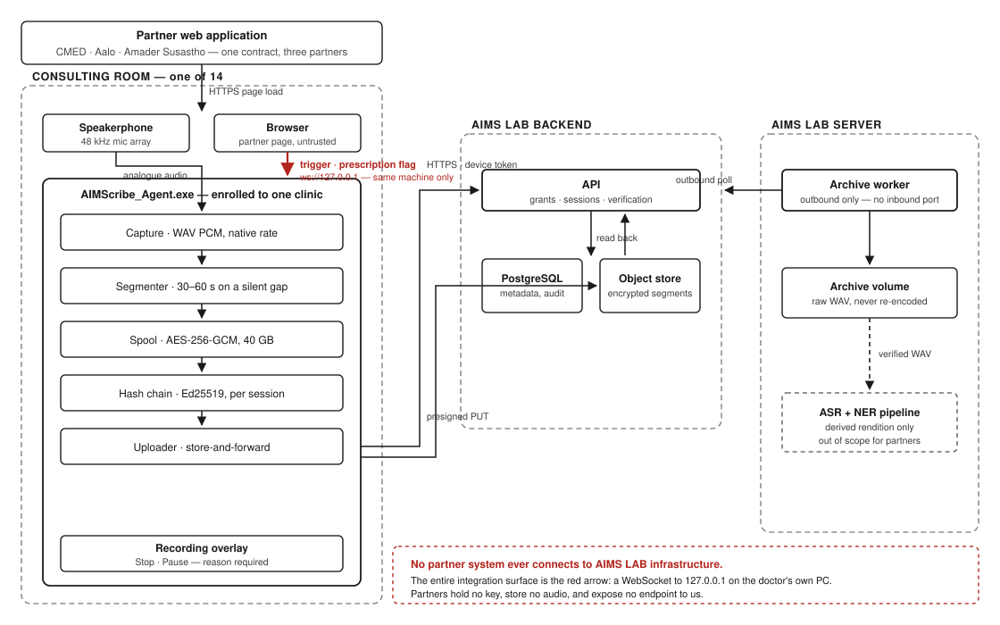
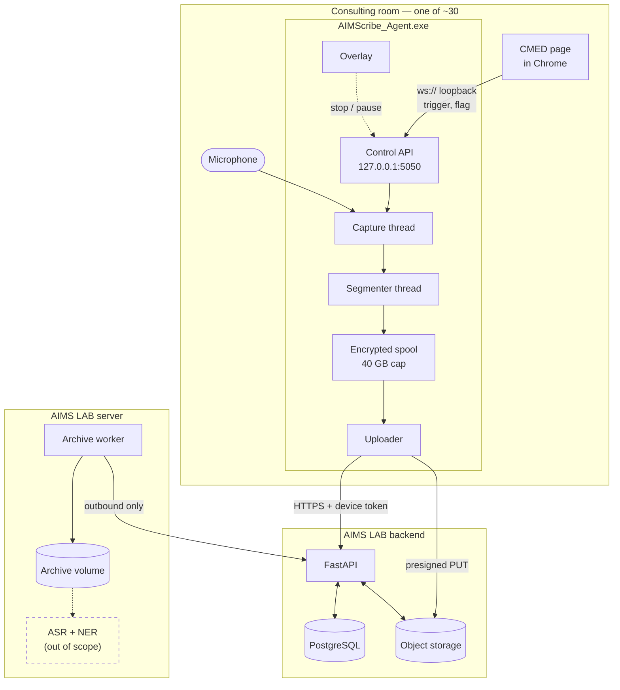
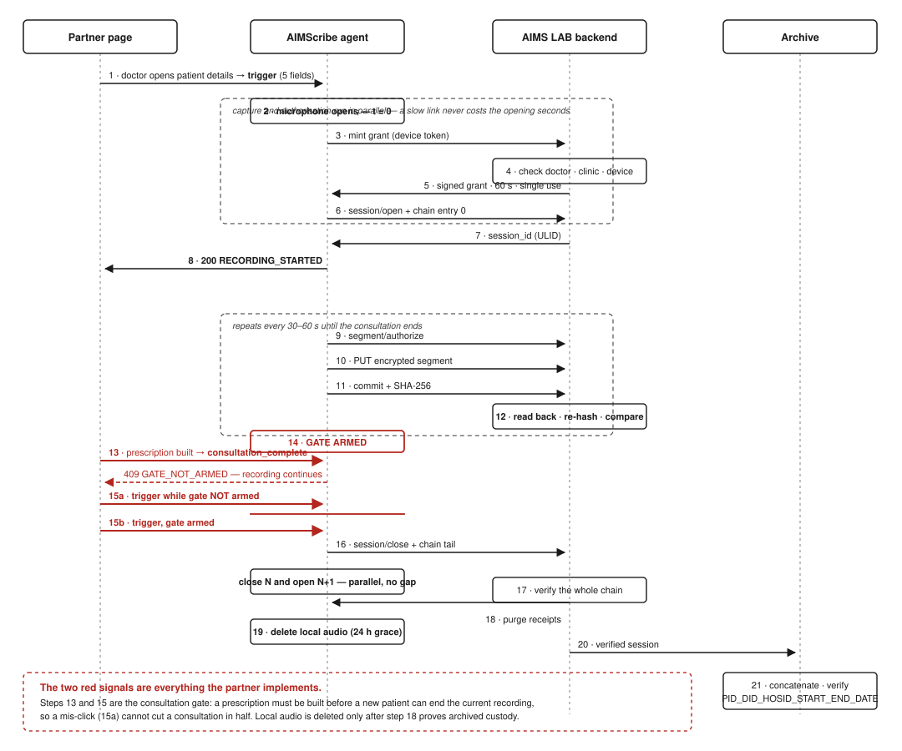
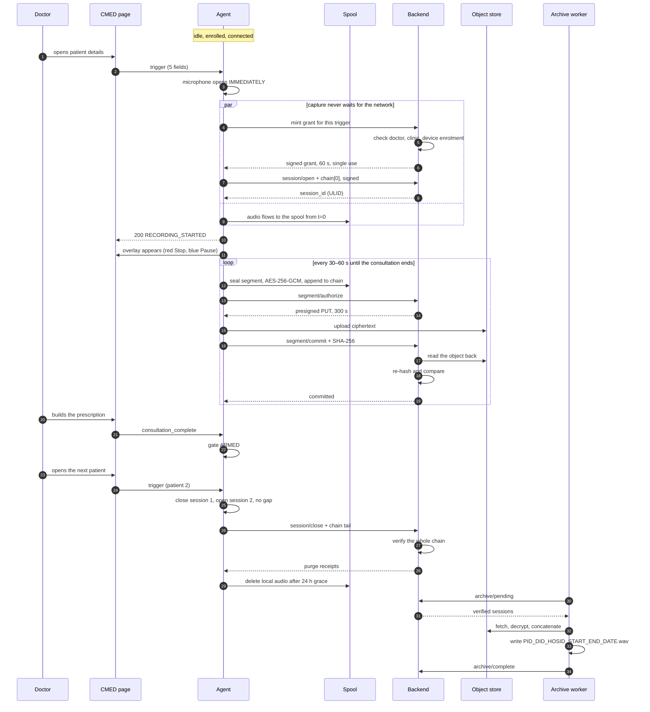
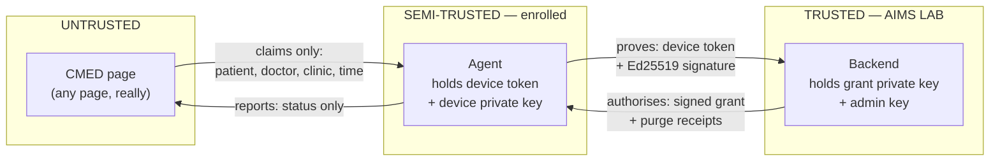
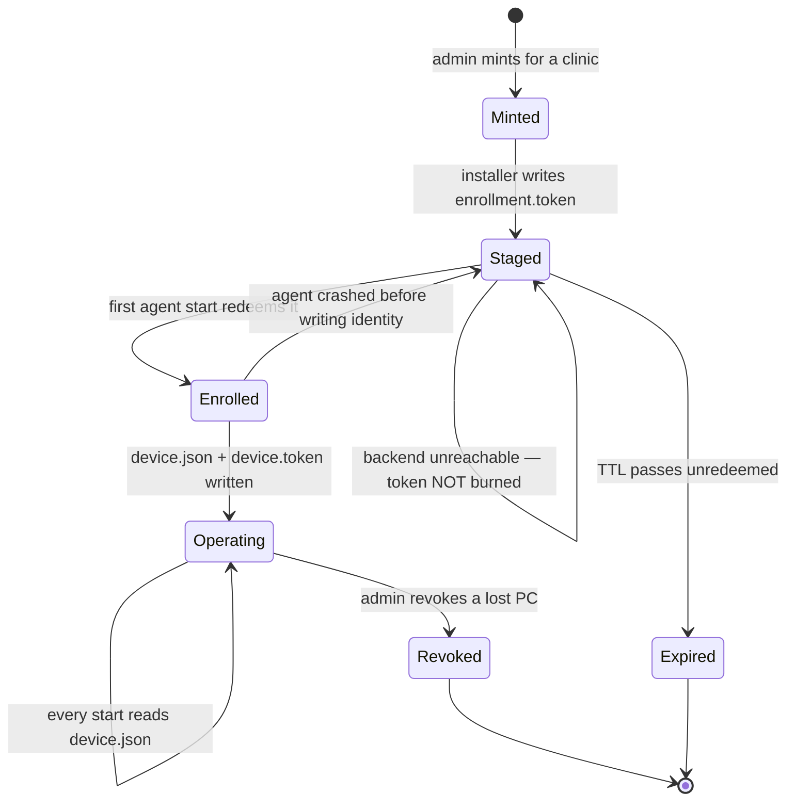
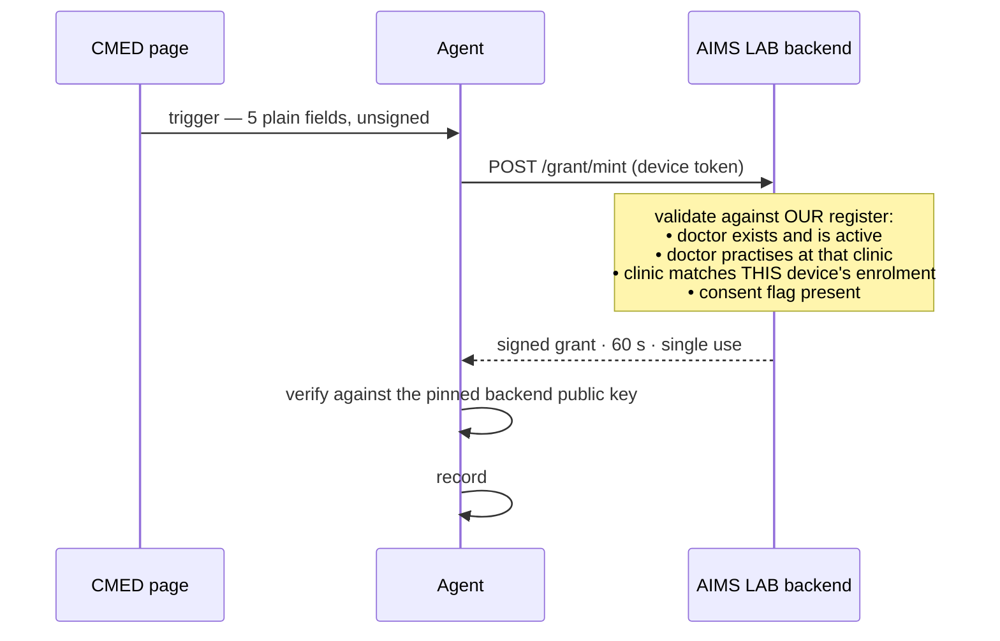
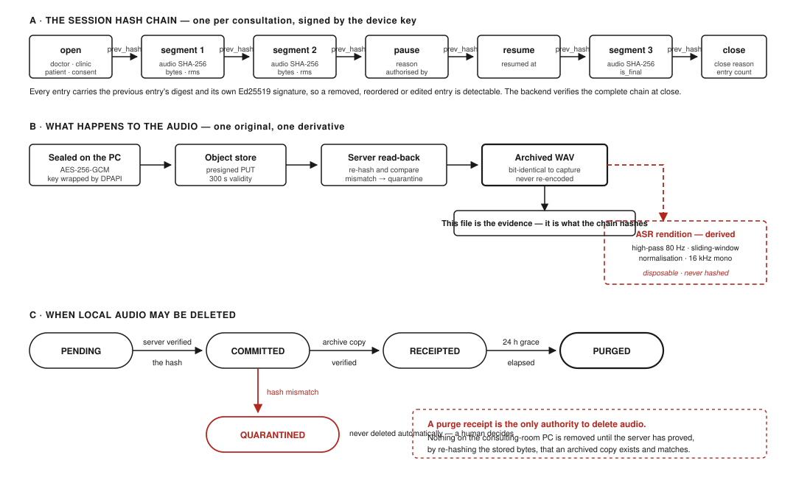
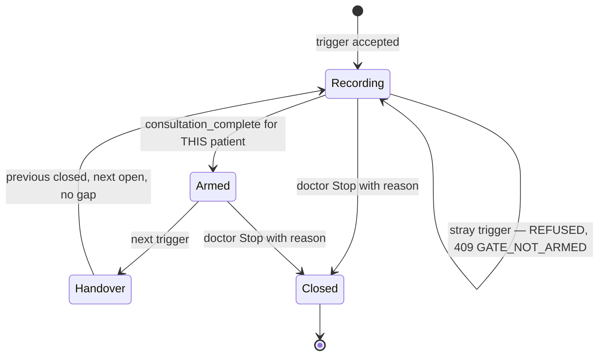

# AIMScribe — Software Requirements Specification

**System:** AIMScribe clinical consultation recording pipeline
**For:** the CMED software engineering team, and AIMS LAB engineering
**Prepared by:** AIMS LAB · Independent University, Bangladesh

| | |
|---|---|
| Document | AIMS-SRS-001 |
| Version | 1.3 |
| Date | 25 August 2026 |
| Status | Baseline for integration. Items marked **OD-nn** are open and need a decision. |
| Relationship to other documents | Complements `CMED_INTEGRATION_README.md` (narrative) with numbered, testable requirements. |
| Agent version | 2.3.1 |
| Wire protocol | 2 |
| Target deployment | 7 clinics · 14 consulting rooms · 30 doctors · 16 enrolled laptops |

---

## Contents

**Part I — Context**
1. [Introduction](#1-introduction)
2. [Overall description](#2-overall-description)
3. [System architecture](#3-system-architecture)

**Part II — The two questions CMED asks first**
4. [Device enrolment and machine identity](#4-device-enrolment-and-machine-identity)
5. [Authorisation: the recording grant](#5-authorisation-the-recording-grant)

**Part III — Requirements**
6. [External interface requirements](#6-external-interface-requirements)
7. [Functional requirements](#7-functional-requirements) — including the capture path (§7.1a) and speech-level monitoring (§7.1b)
8. [Data requirements](#8-data-requirements)
9. [Non-functional requirements](#9-non-functional-requirements)
10. [Capacity and sizing](#10-capacity-and-sizing)
11. [Failure modes and degraded operation](#11-failure-modes-and-degraded-operation)

**Part IV — Closing out**
12. [Verification and acceptance](#12-verification-and-acceptance)
13. [Delivery plan and division of work](#13-delivery-plan-and-division-of-work)
14. [Open decisions](#14-open-decisions)
15. [Appendices](#15-appendices)

---

# Part I — Context

## 1. Introduction

### 1.1 Purpose

This document states, in numbered and individually testable form, what the
AIMScribe system must do from the moment a microphone opens in a consulting room
to the moment a verified recording rests in the AIMS LAB archive.

It exists so that CMED's engineers can build their side of the integration
against a fixed, unambiguous contract, and so that both organisations can later
point at a specific requirement and say *that one is met* or *that one is not*.

### 1.2 Scope

**In scope.** Audio capture on the consulting-room PC; segmentation; local
encrypted spooling; the cryptographic evidence chain; upload and server-side
verification; session lifecycle including automatic patient-to-patient handover;
the consultation gate; the recording-control overlay; device enrolment;
recording authorisation; the CMED integration surface; the AIMS LAB backend; the
archive worker; and the server capacity needed to run all of it.

**Out of scope.** The ASR (speech-to-text) and NER (clinical entity extraction)
pipeline. Those run entirely inside AIMS LAB, strictly downstream of everything
described here, and require nothing whatsoever from CMED. They consume archived
audio; they do not participate in producing it. No requirement in this document
depends on them, and none is changed by them.

Also out of scope: CMED's own clinical application, its database, its user
interface and its authentication. This SRS states what AIMScribe needs to
*receive*, never how CMED should build what sends it.

### 1.3 Intended audience, and how to read it

| If you are | Read |
|---|---|
| A CMED engineer implementing the integration | §4.6, §5.4, §6.1, §6.2, §7.7, Appendix A, Appendix B |
| A CMED architect or tech lead | §1–§3, §5, §9, §13, §14 |
| A CMED security reviewer | §4, §5, §8.4, §9.4 |
| AIMS LAB engineering | All of it |
| An infrastructure or procurement decision-maker | §10, §11 |

**The shortest useful summary for CMED:** you send two signals to a WebSocket on
`127.0.0.1`, and you read the replies. That is the entire integration. Everything
else in this document is AIMS LAB's obligation, written down so you can hold us
to it.

### 1.4 Definitions and acronyms

| Term | Meaning |
|---|---|
| **Agent** | `AIMScribe_Agent.exe`, the Windows tray application on each consulting-room PC |
| **Backend** | The AIMS LAB API service (FastAPI), currently hosted on Render |
| **Archive worker** | A process on the AIMS LAB server that copies verified audio to permanent storage |
| **Session** | One recorded consultation, identified by a ULID |
| **Segment** | One 30–60 s audio clip; the unit of encryption, upload, retry and loss |
| **Spool** | The agent's local encrypted store-and-forward buffer |
| **Chain** | The per-session Ed25519-signed hash chain proving the recording is complete and unaltered |
| **Grant** | A short-lived signed authorisation without which the agent will not record |
| **Enrolment token** | A single-use administrator-issued secret that binds one PC to one clinic |
| **Device token** | The long-lived bearer credential the backend issues to a PC at enrolment |
| **Trigger** | The signal from CMED that a consultation has begun |
| **Flag / arm** | The signal from CMED that a prescription has been built, permitting the session to end |
| **Gate** | The rule that a new trigger does not end the current recording until the flag has arrived |
| **Overlay** | The small always-visible Stop/Pause window shown while recording |
| **DPAPI** | Windows Data Protection API, used to wrap secrets at rest on the PC |
| **ULID** | Universally Unique Lexicographically Sortable Identifier |
| **PLP** | Power-Loss Protection, a property of enterprise SSDs |

### 1.5 References

| Ref | Document |
|---|---|
| R1 | `CMED_INTEGRATION_README.md` — the narrative companion to this SRS |
| R2 | `PARTNER_INTEGRATION_REQUIREMENTS.md` — the same interface offered to Aalo and Amader Susastho |
| R3 | `INTEGRATION_SPECIFICATION.md` — the as-built wire contract, protocol 2 |
| R4 | `ARCHITECTURE.md`, `SECURITY.md`, `OPERATIONS.md` — AIMS LAB internals |
| R5 | RFC 8032 (Ed25519), RFC 7519 (JWT), RFC 6455 (WebSocket), RFC 5116 (AES-GCM) |
| R6 | W3C *Secure Contexts* — the rule permitting `ws://127.0.0.1` from an HTTPS page |
| R7 | ISO/IEC/IEEE 29148:2018 — the requirements conventions this document follows |

### 1.6 Requirement conventions

Every requirement has an identifier of the form **`SRS-GRP-nn`**, a priority and
a verification method. Identifiers are permanent: a withdrawn requirement is
marked withdrawn, never reused.

**Keywords** follow RFC 2119. **Must / shall** is binding. **Should** is a strong
recommendation whose omission needs a written reason. **May** is genuinely
optional.

| Priority | Meaning |
|---|---|
| **M** | Mandatory. The system is not acceptable without it. |
| **S** | Should. Expected at general release; may be deferred through the pilot by agreement. |
| **C** | Could. Desirable, scheduled only if it costs little. |

| Verification | Meaning |
|---|---|
| **T** | Automated test |
| **D** | Demonstration on a running system |
| **I** | Inspection of code, configuration or output |
| **A** | Analysis, calculation or measurement |

The **Owner** column names who builds it: *AIMS*, *CMED*, or *Joint* where both
sides change at once.

---

## 2. Overall description

### 2.1 Product perspective

AIMScribe is an evidence-producing recorder. It is not a clinical system, it
holds no clinical record, and it makes no clinical decision.

Its single hard problem is one sentence long: **AIMScribe can hear a
consultation but cannot know whose it is.** A microphone captures sound; it does
not capture the patient's identity, the doctor's identity, or the fact that a
consultation has begun at all. Only the clinical application the doctor is
already using knows those things.

That is the whole reason CMED is involved. CMED is not being asked to record
anything, store anything, or protect anything. CMED is being asked to say *a
consultation with this patient, by this doctor, has just begun* — and later, *it
is finished*.

Everything else in this document follows from those two sentences.

### 2.2 The three identities — the system's central invariant

Almost every design decision below is a consequence of keeping these three
apart. Conflating any two of them is what produced misfiled consultations in v1.

| Identity | Authoritative source | Changes how often | Can a browser page set it? |
|---|---|---|---|
| **Clinic** (`hospital_id`) | The PC's enrolment record, held by the backend | Never, for a given PC | **No.** Not by any route. |
| **Doctor** (`doctor_id`) | CMED, per consultation | Twice a day — morning and afternoon shifts share a laptop | Only as a *claim*, which the backend then checks against its own register |
| **Patient** (`patient_id`) | CMED, per consultation | Every consultation | Only as a claim, and never stored as a name |

**Why the clinic comes from the machine and not from the page.** `hospital_id` is
the top-level folder name on the archive volume. If a page could set it, a
mistyped or malicious value would create a new archive tree and the recording
would disappear into it silently. It is fixed at enrolment by an administrator
and is not an input to anything afterwards.

**Why the doctor cannot come from the machine.** A consulting room runs two
shifts. Binding the doctor to the PC filed every afternoon consultation under the
morning doctor — silently, and in the filename, which is the worst possible place
for a wrong value because it looks authoritative. The doctor must therefore come
from CMED, which knows the rota because doctors log in there.

> **`SRS-INV-01`** [M, I, AIMS] `hospital_id` shall be derived exclusively from
> the device's enrolment record and shall never be accepted from any client
> payload, on any interface.
>
> **`SRS-INV-02`** [M, I, AIMS] `hospital_id` shall be immutable for the life of
> a device enrolment. A clinic's *display name* may be changed at any time; its
> identifier may not, because existing archive paths depend on it.
>
> **`SRS-INV-03`** [M, T, AIMS] `doctor_id` shall have no default and no
> fallback anywhere in the chain. A trigger naming no doctor shall be refused
> rather than attributed to a guess.
>
> **`SRS-INV-04`** [M, T, AIMS] The agent shall accept `patient_name` from the
> browser for on-screen display only. It shall never be written to the chain,
> the filename, or the archive path.

### 2.3 User classes

| Class | Count | Technical skill | What they touch |
|---|---|---|---|
| **Doctor** | ~30 | Low. Uses CMED all day; has no interest in AIMScribe. | The overlay's two buttons, and nothing else. Never a terminal. |
| **Clinic administrator** | ~7 | Low–moderate | Runs the installer once per PC. Pastes one token. |
| **AIMS LAB operator** | 2–3 | High | Mints enrolment tokens, watches alerts, manages the archive |
| **CMED developer** | 2–4 | High | Implements §6.1; never operates the system |
| **Auditor / researcher** | Occasional | Moderate | Verifies a chain after the fact; reads, never writes |

> **`SRS-USR-01`** [M, I, AIMS] No routine task performed by a doctor or a clinic
> administrator shall require a command line, a script, a `.bat` file or a
> terminal window. Clinical machines receive a signed installer and a graphical
> interface only.

This is not a preference. A `.bat` file on a clinical PC is a support incident
waiting to happen and an audit finding waiting to be written.

### 2.4 Operating environment

| Element | Specification |
|---|---|
| Consulting-room PC | Windows 10 21H2 or Windows 11; x64; ≥ 4 GB RAM; ≥ 60 GB free on the spool volume |
| Audio input | USB speakerphone or microphone. **The capture path is a requirement, not a detail — see §7.1a.** |
| Browser | Chrome or Edge, current stable, on the same PC as the agent |
| Clinic network | Intermittent by assumption. Broadband where available, mobile tethering elsewhere. |
| Agent runtime | Python 3.12 packaged with PyInstaller; nothing installed on the PC beyond the app |
| Backend | FastAPI on Python 3.12; containerised; Render today, portable by requirement |
| Database | PostgreSQL 15+ (Neon today) |
| Object storage | S3-compatible (Cloudflare R2 or MinIO) |
| Archive | AIMS LAB server, `D:\AIMSLAB_AUDIO_STORAGE` |
| Locale | `Asia/Dhaka` (UTC+06). All wire timestamps are RFC 3339 with an explicit offset. |

### 2.5 Design and implementation constraints

| ID | Constraint | Consequence |
|---|---|---|
| **CON-01** | CMED will not change its architecture for AIMScribe | The integration must be additive: a few lines of JavaScript on pages that already exist |
| **CON-02** | CMED exposes a read API and accepts no writes from us | AIMS LAB never calls CMED. All traffic is CMED → agent, on the same machine. |
| **CON-03** | CMED will not hold, generate or rotate a cryptographic key | Grant minting moves to the AIMS LAB backend (§5) |
| **CON-04** | Clinical PCs get an installer, never scripts | `SRS-USR-01` |
| **CON-05** | Both source repositories are public | No secret of any kind may appear in either. Token sheets are credentials. |
| **CON-06** | Clinic bandwidth is limited and unreliable | Store-and-forward is mandatory, not an optimisation |
| **CON-07** | The archive is evidence | Lossy re-encoding is prohibited; a re-encoded file cannot be hashed back to what was recorded |
| **CON-08** | Consultations run back to back, 20–30 s apart | Session handover must be seamless; no start-up cost may fall between two patients |
| **CON-09** | The browser page is untrusted input | Not because CMED is distrusted as an organisation, but because a page is a page and anything on the PC can open one |

### 2.6 Assumptions and dependencies

| ID | Assumption | If it proves false |
|---|---|---|
| **ASM-01** | The doctor's browser runs on the same physical PC as the agent | The loopback integration cannot work; a fundamentally different design is required |
| **ASM-02** | CMED can execute JavaScript on the patient-details page | No integration is possible without it |
| **ASM-03** | CMED holds a stable `patient_id`, `doctor_id` and a per-clinic identifier | These are the trigger; without them nothing can be filed |
| **ASM-04** | A "build prescription" action exists and is performed for every patient | The gate (§7.7) needs a signal; §11 covers its absence |
| **ASM-05** | Patient consent is obtained by clinic process before the consultation | Consent is enforced technically in three places but originates in process |
| **ASM-06** | CMED authenticates its own doctors | AIMScribe does not authenticate anyone against CMED and never will |
| **ASM-07** | PC clocks are within ±5 min of true time | Grant validation fails; see §11 |

### 2.7 Division of responsibility

| Concern | AIMS LAB | CMED |
|---|---|---|
| Audio capture, segmentation, encryption | ● | |
| Cryptographic keys — all of them | ● | |
| Device enrolment and its tokens | ● | |
| Grant minting and verification | ● | |
| Backend, database, storage, archive | ● | |
| The recording-control overlay | ● | |
| Agent installation and support | ● | |
| Server capacity and cost | ● | |
| **Sending the consultation trigger** | | ● |
| **Sending the prescription-built flag** | | ● |
| **Reading the reply and failing quietly** | | ● |
| **Giving us the exact origin for the allowlist** | | ● |
| Identifier stability over time | | ● |
| The trigger payload's shape | ◐ | ◐ |

CMED's total build is four rows. §13.2 estimates it at 2–4 developer-days.

---

## 3. System architecture

### 3.1 Component inventory

| # | Component | Runs on | Language / stack | Talks to |
|---|---|---|---|---|
| 1 | **CMED web page** | Doctor's browser | CMED's stack + ~60 lines of JS | The agent, over loopback WebSocket |
| 2 | **Agent — control API** | Consulting-room PC | FastAPI on `127.0.0.1:5050` | The page (in), the controller (out) |
| 3 | **Agent — capture** | Same process, own thread | PyAudio | The sound card |
| 4 | **Agent — segmenter** | Same process, own thread | NumPy RMS + ZCR | Capture queue → spool |
| 5 | **Agent — spool** | Same process | AES-256-GCM + journal | Local disk |
| 6 | **Agent — chain** | Same process | Ed25519 | Spool, backend |
| 7 | **Agent — uploader** | Same process, async | aiohttp | Backend, object storage |
| 8 | **Agent — overlay** | Same process, UI thread | tkinter | The doctor |
| 9 | **Backend API** | Render or AIMS LAB | FastAPI | Agents, worker, admins |
| 10 | **Database** | Neon / self-hosted | PostgreSQL 15+ | Backend only |
| 11 | **Object storage** | R2 / MinIO | S3 API | Backend, agent (presigned), worker |
| 12 | **Archive worker** | AIMS LAB server | Python, outbound-only | Backend, archive volume |
| 13 | *ASR / NER pipeline* | AIMS LAB | *out of scope* | Reads the archive |

### 3.2 Deployment topology



**Figure 1.** System architecture. A partner web application serves a page to the
browser on the consulting-room PC; that page reaches the AIMScribe agent only
over a loopback WebSocket on the same machine. The agent captures, segments,
encrypts, hash-chains and uploads audio to the AIMS LAB backend, which verifies
every segment by reading it back from storage and re-hashing it. An archive
worker inside AIMS LAB dials outward to collect verified sessions. No partner
system ever connects to AIMS LAB infrastructure.



Note the direction of every arrow crossing an organisational boundary. **Nothing
originates outside the clinic.** The archive worker dials out; it accepts no
inbound connection. CMED is never called by us.

### 3.3 The pipeline, end to end



**Figure 2.** Life of a consultation. The microphone opens on the trigger while
authorisation proceeds in parallel, so a slow link never costs the opening
seconds. Segments are sealed, uploaded and verified by server-side read-back
throughout. A prescription-built flag arms the gate; until it arrives a stray
trigger is refused (15a) and the recording continues undisturbed. Once armed,
the next trigger closes one session and opens the next on parallel threads with
no gap in capture. Local audio is deleted only after the chain verifies and
purge receipts are issued.

This is the answer to *"the full AIMScribe pipeline from the recording to
AIMScribe_Backend"*. Twenty steps, one consultation.



**Read step 4 and step 11 together.** Capture starts before authorisation
finishes, and the two run in parallel. This is deliberate: a slow link must never
cost the opening seconds of a consultation, which are the seconds in which the
patient says why they came. If authorisation subsequently fails, the audio
already captured is discarded under `SRS-GRT-08` — nothing is kept that was not
authorised, but nothing is lost that was.

**Read step 15 and step 16 together.** The previous session closes and the next
opens on separate threads, so the gap between two patients is not a gap in
recording. This is `CON-08` made real.

### 3.4 Trust boundaries



The single most important line in this diagram is the first arrow's label:
**claims only.** Nothing the page sends is trusted on its own. Every claim is
checked by the backend against a register the page cannot reach.

> **`SRS-TOP-01`** [M, I, AIMS] The agent shall bind its control API to loopback
> addresses only. It shall never listen on a routable interface.
>
> **`SRS-TOP-02`** [M, I, AIMS] The archive worker shall make outbound
> connections only. No inbound port shall be opened on the AIMS LAB server for
> the purposes of this system.
>
> **`SRS-TOP-03`** [M, I, Joint] No component shall require AIMS LAB to make an
> inbound or outbound connection to a CMED-operated service. `CON-02`.

---

# Part II — The two questions CMED asks first

## 4. Device enrolment and machine identity

> **This section answers the question directly: how are enrolment tokens
> maintained today, and what will CMED have to build for them after
> integration?**
>
> **Short answer: CMED builds nothing, and maintains nothing.** Enrolment is a
> transaction between the consulting-room PC and the AIMS LAB backend. CMED is
> not a party to it, has no visibility into it, and is not affected by it. This
> was true before the integration was contemplated and remains true after it.
>
> The reasoning in §4.6 is worth reading anyway, because it explains *why* the
> integration cannot weaken this, and why CMED's "we only read, we never write"
> constraint costs the design nothing.

### 4.1 What enrolment is for

Enrolment exists for exactly one purpose: **an unregistered laptop cannot run the
software.** A PC that has not been enrolled by an AIMS LAB administrator will
install, start, show its tray icon, and refuse to record.

It is worth being equally clear about what enrolment does *not* do, because the
distinction determines who has to build what:

| Enrolment **does** | Enrolment **does not** |
|---|---|
| Bind one PC to one clinic, permanently | Decide who the doctor is |
| Register the PC's Ed25519 public key with the backend | Authenticate a person |
| Issue the PC a long-lived bearer credential | Stop a random web page from triggering a recording |
| Give the backend a device register for revocation | Involve CMED in any way |

The third row is the one that matters for §5. Enrolment answers *may this machine
record at all*. It does not answer *is this particular request to record
legitimate*. That second question is the grant's job, and the two must not be
confused — an enrolled laptop with no grant check would happily record for any
page the doctor happened to visit.

### 4.2 The credential hierarchy

Four distinct secrets exist. Confusing them is the most common cause of a
misconfigured deployment, so they are tabulated explicitly.

| # | Secret | Created by | Lives where | Lifetime | Scope |
|---|---|---|---|---|---|
| 1 | **Enrolment token** | AIMS LAB admin, via `POST /admin/enrollment-token` | An instruction sheet, then `%PROGRAMDATA%\AIMScribe\state\enrollment.token`, then deleted | 72 h default, 720 h maximum, **single use** | Turns one PC into one enrolled device |
| 2 | **Device token** | Backend, at enrolment | `%PROGRAMDATA%\AIMScribe\state\device.token`, DPAPI-wrapped | Until revoked | Authenticates every later backend call by that PC |
| 3 | **Device private key** | The agent, on first start, never leaves the PC | `%PROGRAMDATA%\AIMScribe\keys\`, DPAPI-wrapped | Until the machine is rebuilt | Signs every chain entry |
| 4 | **Grant signing key** | AIMS LAB | Backend environment only | Rotatable | Signs recording authorisations (§5) |

> **`SRS-ENR-01`** [M, I, AIMS] The enrolment token shall be stored in the
> database as SHA-256 only. The plaintext shall exist nowhere but the generated
> instruction sheet, and shall be unrecoverable once that sheet is destroyed.
>
> **`SRS-ENR-02`** [M, T, AIMS] The enrolment token shall be single-use, enforced
> inside a single database transaction with row locking, so two concurrent
> presentations cannot both succeed.
>
> **`SRS-ENR-03`** [M, T, AIMS] The token shall carry a TTL between 1 and 720
> hours, defaulting to 72.
>
> **`SRS-ENR-04`** [M, I, AIMS] An unknown token, an expired token and an
> already-used token shall produce one identical error, so a caller learns
> nothing about which case occurred.
>
> **`SRS-ENR-05`** [M, I, AIMS] Both the device token and the device private key
> shall be wrapped by DPAPI at rest. Plaintext storage shall be permitted only
> under an explicit development flag that production configuration validation
> rejects.
>
> **`SRS-ENR-06`** [M, I, AIMS] Enrolment token sheets are credentials. They
> shall never be committed to a repository, and the generated `register.csv`
> shall deliberately contain no tokens.

### 4.3 The enrolment lifecycle



The two self-transitions at the bottom are hard-won and deserve a note each.

**A backend that is merely unreachable must not burn the administrator's token.**
If enrolment fails because the network is down, the token is deliberately left on
disk and the agent retries at the next start. Burning it would strand a PC in
another district with a credential that cannot be reissued remotely.

**A token may be presented twice — but only in one narrow case.** If the server
committed the enrolment and the agent then failed to write its identity file (a
full disk, a permissions problem, a crash between two writes), the machine has no
credential and its token is spent. It can never recover on its own, and the only
symptom is a PC reporting *not enrolled* while the server shows it enrolled
perfectly well. That happened in the field. So a used token may be redeemed again
by the *same* machine, proven by the *same* device public key, and only while the
device it created has never once been seen — after the first heartbeat, a second
presentation is a replay and is refused.

> **`SRS-ENR-07`** [M, T, AIMS] A failed enrolment caused by an unreachable
> backend shall leave the token on disk for retry.
>
> **`SRS-ENR-08`** [M, T, AIMS] A used token may be redeemed a second time only
> if all three hold: the device it created exists, that device has never been
> seen (`last_seen_at IS NULL`), and the presented public key matches the
> registered one. Any other repeat presentation shall be refused and logged as a
> replay attempt.
>
> **`SRS-ENR-09`** [M, T, AIMS] The agent shall write the device token before the
> identity file, so a crash between the two leaves the machine unenrolled rather
> than holding an identity it has no credential for.
>
> **`SRS-ENR-10`** [M, T, AIMS] The agent shall delete the enrolment token from
> disk immediately after successful redemption.
>
> **`SRS-ENR-11`** [M, T, AIMS] The agent shall compare the stored key
> fingerprint against the live device key at every start. On mismatch — a wiped
> key folder, a restored disk image — it shall refuse to record and require
> re-enrolment.

### 4.4 The administrator's procedure today

One token per **laptop**, not per doctor. A room with two laptops needs two.

1. The operator writes a **new, dated** CSV of machines to enrol. Existing fleet
   files are never edited in place — a rewritten `laptops.csv` reads as *these
   hospitals were deleted*.
2. A tool calls `POST /api/v2/admin/enrollment-token` once per row, authenticated
   by the admin key, and writes one instruction sheet per PC plus a
   token-free `register.csv`.
3. The administrator runs `AIMScribeSetup.exe` on the PC and pastes the token
   into one of three fields. The other two are pre-filled.
4. The installer stages the token, registers a logon task and installs the pinned
   public keys. The agent consumes the token on first start and deletes it.
5. The instruction-sheet folder is destroyed once the machines are live.

`doctor_id` in the enrolment record is **optional and decides nothing.** It
labels the room in the paperwork. Most laptops are shared across shifts and have
none — and if one is set, it is not used to attribute a consultation, because the
doctor arrives from CMED with each trigger. This is `SRS-INV-03` in practice.

> **`SRS-ENR-12`** [M, I, AIMS] Fleet registration files shall be additive. A new
> dated file shall be written; an existing one shall not be rewritten.
>
> **`SRS-ENR-13`** [S, D, AIMS] Token minting shall be available to an operator
> through an interface that does not require editing the database directly.
>
> **`SRS-ENR-14`** [M, I, AIMS] `doctor_id` on an enrolment token shall be
> optional and shall never be used to attribute a recorded consultation.

### 4.5 Revocation

> **`SRS-ENR-15`** [M, T, AIMS] An administrator shall be able to revoke a device
> by identifier. Revocation shall clear the stored token hash, not merely set a
> flag, so a stolen laptop's credential stops working immediately.
>
> **`SRS-ENR-16`** [M, T, AIMS] A revoked device shall be refused at every
> authenticated route, and shall be told clearly enough that its tray reports the
> state to the user.
>
> **`SRS-ENR-17`** [M, I, AIMS] Every enrolment, re-issue and revocation shall be
> written to the append-only audit log with the acting administrator's name.
>
> **`SRS-ENR-21`** [M, T, AIMS] A device shall not be re-enrolled while segments
> remain unpurged in its spool. Re-enrolment issues a new device identity, and
> segments belonging to sessions opened under the previous identity cannot be
> committed with the new credential. The spool shall be drained to zero first,
> and the agent shall refuse re-enrolment until it is.

### 4.6 What changes for enrolment when CMED is integrated

**Nothing.** This is worth stating as a requirement rather than a reassurance,
because the question will be asked again by CMED's security reviewer:

> **`SRS-ENR-18`** [M, I, Joint] Device enrolment shall require no participation
> from CMED. No CMED endpoint shall be called during enrolment; no CMED
> credential shall be presented; no enrolment state shall be stored in a CMED
> system; and no change to CMED software shall be required to enrol, re-enrol or
> revoke a device.

The reasoning, in full, because it is the part that generalises:

Enrolment binds a **machine** to a **clinic**. Both of those facts are AIMS LAB
facts. AIMS LAB owns the laptop fleet, ships the laptops, assigns each one to a
consulting room, and owns the archive whose top-level folder is that clinic's
identifier. CMED knows none of this and has no reason to. A laptop moved from one
clinic to another is an AIMS LAB logistics event, handled by re-enrolment, and
CMED is not told because there is nothing for it to do.

Contrast that with the **doctor**, which is a CMED fact — CMED runs the rota and
authenticates the people on it — and the **patient**, likewise. Those two arrive
per consultation, in the trigger. The clinic does not, because it does not change.

This is also precisely why CMED's constraint — *we only read from our API, we
never write* — costs this design nothing. Enrolment never needed a write from
CMED. Neither, after the change in §5, does authorisation. The only thing CMED
ever sends is a message to a WebSocket on the doctor's own PC, which is not a
write to anything CMED owns.

**The one operational touchpoint.** When a new clinic comes online, AIMS LAB
needs its `hospital_id` to be stable and needs to know which CMED clinic
identifier corresponds to it. That is a one-row mapping agreed once per clinic,
by email, and recorded on both sides. It is a fact, not an interface.

> **`SRS-ENR-19`** [M, I, Joint] For each clinic, CMED and AIMS LAB shall agree
> one stable mapping from CMED's clinic identifier to the AIMS LAB
> `hospital_id`, recorded in writing before the first recording at that site.

**The register.** Seven sites, two consulting rooms each, one laptop per room:

| `hospital_id` | Site | Operator | Rooms | Status |
|---|---|---|---|---|
| `HOSP001` | Karail | Aalo | 2 | In service — signed recordings exist |
| `HOSP002` | Mirpur | Aalo | 2 | Assigned |
| `HOSP003` | Dholpur | Aalo | 2 | In service — signed recordings exist |
| `HOSP004` | Shyampur | Aalo | 2 | In service — signed recordings exist |
| `HOSP005` | Naryanganj | Aalo | 2 | To be assigned |
| `HOSP006` | Ershadnagar | Aalo | 2 | To be assigned |
| `HOSP007` | Amader Susastho | Amader Susastho | 2 | To be assigned |

`HOSP001`–`HOSP006` are the six Aalo branches; `HOSP007` is Amader Susastho.
Fourteen rooms, fourteen laptops, two spares held centrally — sixteen enrolment
tokens in total.

Identifiers `HOSP001`, `HOSP003` and `HOSP004` are **immutable in the strongest
sense**: they appear inside signed chain payloads in the existing archive, so
changing one would invalidate the Ed25519 signature over every entry that
follows it. They cannot be renamed, and a signed payload cannot be edited by
hand. Display names remain free to change at any time.
>
> **`SRS-ENR-20`** [M, T, AIMS] The backend shall reject a trigger whose clinic
> identifier does not map to the enrolled clinic of the device that presented it.
> See §5.5 for why this refuses rather than warns.

---

## 5. Authorisation: the recording grant

### 5.1 The problem enrolment leaves open

An enrolled laptop may record. That is not the same as *this request to record is
legitimate*.

Consider the gap concretely. A doctor's PC is enrolled and working correctly. The
doctor opens a browser tab to an unrelated website. That page runs JavaScript. It
opens a WebSocket to `127.0.0.1:5050` — which any page on that machine can
attempt — and sends `start`. Without a second control, the agent records.

That is the gap the grant closes, and it is the reason the grant exists as a
separate mechanism rather than being folded into enrolment.

### 5.2 What a grant is

A short-lived, single-use, Ed25519-signed statement that a named doctor may
record a named patient at a named clinic.

| Property | Value | Why |
|---|---|---|
| Algorithm | EdDSA / Ed25519 | Small, fast, no parameter choices to get wrong |
| Lifetime | 60 s | Long enough for a click to reach the agent; short enough that a captured grant is worthless before it can be replayed |
| Clock leeway | 5 s | Consulting-room PCs drift |
| Replay protection | Single-use `jti`, tracked by the agent | A captured grant is refused even inside its 60 s |
| Audience | `aimscribe-recorder` | A grant cannot be repurposed for another service |
| Required claims | `consent_obtained`, `patient_ref`, `doctor_id`, `hospital_id` | Consent is a precondition, not an afterthought |

### 5.3 Where grants are minted — the change that matters to CMED

**Today**, in the development environment, the dummy CMED application we wrote
mints the grant itself and holds a private key.

**Real CMED will not do that**, will not hold a key, and has said so plainly.
That constraint is entirely acceptable, and the design that replaces it is
*stronger* than the one it replaces.

**Target:** grant minting moves to the AIMS LAB backend.



Compare the two honestly. Before, the agent trusted what a page claimed, because
the page held the key that made the claim believable. Now the backend checks
every claim against a register the page cannot reach, and the page holds nothing.

| | Old (dummy) | New (real CMED) |
|---|---|---|
| Who holds a private key | The web app | AIMS LAB backend only |
| What the page sends | A signed token it minted | Five plain fields |
| Who validates the doctor | Nobody | The backend, against its register |
| Who validates the clinic | Nobody | The backend, against the device's enrolment |
| CMED's key-management burden | Real | **None** |

> **`SRS-GRT-01`** [M, I, AIMS] Grant minting shall be performed exclusively by
> the AIMS LAB backend. No grant signing key shall be issued to, held by, or
> required of CMED.
>
> **`SRS-GRT-02`** [M, T, AIMS] The mint endpoint shall be authenticated by the
> calling device's token, and shall mint only for that device's enrolled clinic.
>
> **`SRS-GRT-03`** [M, T, AIMS] The backend shall validate, before minting: the
> doctor exists and is active; the doctor is associated with that clinic; the
> clinic matches the device's enrolment; and consent is asserted. Failure of any
> check shall refuse the mint with a distinguishable code.
>
> **`SRS-GRT-04`** [M, T, AIMS] The agent shall verify every grant against a
> public key pinned at installation, checking signature, issuer, audience and
> expiry with no more than 5 s leeway.
>
> **`SRS-GRT-05`** [M, T, AIMS] The agent shall enforce single use by `jti` and
> refuse a repeat within the grant's lifetime.
>
> **`SRS-GRT-06`** [M, T, AIMS] The agent shall refuse to start a recording when
> no grant verification key is installed. It shall not fall back to unauthorised
> recording under any configuration reachable in production.
>
> **`SRS-GRT-07`** [M, D, AIMS] The mint round-trip shall not delay the opening
> of the microphone. Capture shall begin on receipt of the trigger and
> authorisation shall proceed in parallel.
>
> **`SRS-GRT-08`** [M, T, AIMS] If authorisation fails after capture has begun,
> audio captured under that trigger shall be discarded and not written to the
> spool.

### 5.4 What CMED must build for authorisation

Nothing cryptographic. Concretely, CMED's authorisation-related work is:

1. Send five fields instead of a signed token. (Fewer moving parts than the dummy.)
2. Read the reply and branch on `code`.

That is the entire list. There is no key to generate, store, protect, rotate or
audit; no signing library to add; no clock synchronisation to manage; and no
secret in CMED's environment variables.

> **`SRS-GRT-09`** [M, I, CMED] CMED shall send the trigger as plain JSON fields
> and shall not be required to compute any signature, hash or MAC.

### 5.5 Clinic mismatch refuses rather than warns

If a trigger names a clinic that does not match the device's enrolment, one of
two things is true: the clinic mapping is wrong, or a laptop is physically in a
different building from where it is registered. Both produce mislabelled
evidence, and mislabelled evidence is worse than no evidence, because it is
believed.

> **`SRS-GRT-10`** [M, T, AIMS] A clinic mismatch shall refuse the recording with
> `401 CLINIC_MISMATCH` and raise an operational alert. It shall not record and
> warn.

Against the dummy, recording-and-warning was the right behaviour. Against real
CMED it is not. **OD-03** offers CMED the option of keeping warn-and-record for
the pilot only.

---

# Part III — Requirements

## 6. External interface requirements

### 6.1 Interface 1 — CMED page → agent

This is the only interface CMED implements. Everything in this subsection is
CMED-facing; everything after it is AIMS LAB's own obligation.

#### 6.1.1 Transport

| Property | Value |
|---|---|
| Endpoint | `ws://127.0.0.1:5050/ws` |
| Health probe | `GET http://127.0.0.1:5050/health` — unauthenticated, no side effects |
| Encoding | UTF-8 JSON, one object per frame |
| Maximum frame | 64 KB; larger frames are refused |
| Reconnection | Exponential backoff, 1 s → 30 s, indefinitely |
| Origin header | Mandatory; must exactly match an allowlisted value |

**Why plain `ws://` from an HTTPS page is permitted.** The W3C *Secure Contexts*
specification treats loopback as a potentially trustworthy origin, so browsers do
not apply mixed-content blocking to `ws://127.0.0.1`. The alternative — a TLS
certificate for `127.0.0.1` on thirty machines — is worse in every dimension:
certificates expire, and an expired certificate on a clinical PC stops
recordings silently at 3 a.m.

**Why WebSocket rather than HTTP.** Three reasons, in order of importance. The
agent must *push* state to the page — a stopped recording, a full disk, a lost
microphone — and HTTP cannot push. WebSockets are not subject to CORS, so the
agent enforces its own origin check rather than relying on a browser mechanism
that does not apply. And a persistent connection means the page knows the agent
is alive without polling. There is deliberately **no** `POST /session/start`
route; starting a recording requires the WebSocket, because that is where grant
verification and origin pinning live, and a second start path would be a weaker
one.

> **`SRS-IF1-01`** [M, D, CMED] CMED shall connect to `ws://127.0.0.1:5050/ws`
> from the doctor's browser and maintain the connection for the session.
>
> **`SRS-IF1-02`** [M, T, CMED] CMED shall reconnect with exponential backoff on
> disconnection and shall not busy-loop.
>
> **`SRS-IF1-03`** [M, I, CMED] If CMED enforces a Content-Security-Policy, its
> `connect-src` directive shall permit `ws://127.0.0.1:5050`. Without this the
> browser blocks the connection before the agent sees it.
>
> **`SRS-IF1-04`** [S, D, CMED] CMED should probe `GET /health` before the first
> connection attempt to distinguish *agent absent* from *agent failing*.

#### 6.1.2 Admission control

Three checks run in order **before** the handshake completes. Each closes the
socket with code `4403`.

| # | Check | Rule | Defends against |
|---|---|---|---|
| 1 | `Origin` | Must appear exactly in the allowlist. Absent or literal `null` is refused. | A random page on the PC opening a socket |
| 2 | `Host` | Must be an expected loopback authority | DNS rebinding — `http://evil.example` can resolve to 127.0.0.1, and only `Host` distinguishes it |
| 3 | Peer address | Must be `127.0.0.1` or `::1` | A non-loopback client |

Check 3 alone is not sufficient and was the v1 flaw: the peer address of *any*
browser on the PC is loopback, so that check always passed.

> **`SRS-IF1-05`** [M, I, CMED] CMED shall provide AIMS LAB with the exact
> origins — scheme, host and port — from which the page will connect, for
> production and for staging. Wildcards shall not be accepted.
>
> **`SRS-IF1-06`** [M, T, AIMS] The agent shall refuse a connection whose origin
> is absent, `null`, or not exactly allowlisted, and shall refuse a startup
> configuration containing a wildcard origin.

#### 6.1.3 Signal 1 — the consultation trigger

Sent when the doctor opens a patient's details or history.

```json
{
  "command": "start",
  "request_id": "cmed-7f3a2b91",
  "trigger": {
    "patient_id":       "P0012345",
    "doctor_id":        "DR0042",
    "clinic_id":        "CMED-DHK-BANANI-01",
    "start_time":       "2026-08-25T10:14:32+06:00",
    "date":             "2026-08-25",
    "consent_obtained": true,
    "consent_method":   "verbal_at_reception",
    "patient_name":     "optional, display only"
  }
}
```

| Field | M/S/C | Type | Rule |
|---|---|---|---|
| `patient_id` | **M** | string | `^[A-Za-z0-9_-]{1,64}$`. Stable for the patient. |
| `doctor_id` | **M** | string | Same pattern. No default, ever (`SRS-INV-03`). |
| `clinic_id` | **M** | string | Same pattern. Must map to the device's enrolled clinic. |
| `start_time` | **M** | string | RFC 3339 with explicit offset |
| `date` | **M** | string | `YYYY-MM-DD`, local clinic date |
| `consent_obtained` | **M** | boolean | Must be `true`. `false` or absent refuses. |
| `consent_method` | S | string | Free text ≤ 64 chars, for the audit record |
| `patient_name` | C | string | Display only, ≤ 120 chars, never stored |
| `request_id` | S | string | Echoed in the reply for correlation |

#### 6.1.4 The reply — the "200 OK" contract

Every command receives exactly one reply, carrying a numeric `status` mirroring
HTTP semantics and a stable string `code`.

```json
{
  "event": "ack",
  "command": "start",
  "request_id": "cmed-7f3a2b91",
  "status": 200,
  "code": "RECORDING_STARTED",
  "message": "Recording started.",
  "data": {
    "session_id": "01JB8XQ4M7YZ2K9V3N5P6R8T0W",
    "started_at": "2026-08-25T10:14:32+06:00",
    "armed": false,
    "supersedes": "01JB8W2H..."
  }
}
```

> **`SRS-IF1-07`** [M, T, AIMS] Every command shall receive exactly one reply
> carrying `status`, `code` and, where supplied, the caller's `request_id`.
>
> **`SRS-IF1-08`** [M, D, AIMS] A successfully started recording shall reply
> `status: 200`, `code: "RECORDING_STARTED"`, including the `session_id`.
>
> **`SRS-IF1-09`** [M, I, CMED] CMED shall branch on `code`, never on `message`.
> Message text is shown to doctors and will be reworded without notice.
>
> **`SRS-IF1-10`** [M, T, AIMS] The full response-code set of Appendix A shall be
> implemented, and no code outside it shall be returned for these commands.

#### 6.1.5 Signal 2 — the prescription-built flag

Sent when the doctor presses **Build Prescription** — the action that converts
the raw tabular entry into a proper prescription. This action is performed for
every patient, because the paramedic in the investigation chamber reads the
result, so it is a reliable signal that the consultation has reached its
conclusion.

```json
{
  "command": "consultation_complete",
  "request_id": "cmed-7f3a2b92",
  "patient_id": "P0012345",
  "occurred_at": "2026-08-25T10:26:11+06:00"
}
```

**What this signal does and does not do.** It does **not** stop the recording.
The doctor builds the prescription, prints it, hands it over, and then counsels
the patient for another one to two minutes — and that counselling is clinically
valuable audio. The flag *arms the gate*: it permits the **next** trigger to end
this session. Recording continues until the next patient arrives, typically 20–30
seconds later.

> **`SRS-IF1-11`** [M, D, CMED] CMED shall send `consultation_complete` when the
> prescription-build action succeeds, carrying the same `patient_id` as the
> trigger.
>
> **`SRS-IF1-12`** [M, T, AIMS] The flag shall not stop, pause or otherwise alter
> the current recording. It shall only set the gate to armed.
>
> **`SRS-IF1-13`** [M, T, AIMS] A flag naming a patient other than the open
> session's shall be refused `409 PATIENT_MISMATCH` and shall not arm the gate.
>
> **`SRS-IF1-14`** [M, T, AIMS] A repeated flag for the already-armed session
> shall succeed idempotently with `200 GATE_ALREADY_ARMED`.
>
> **`SRS-IF1-15`** [M, I, AIMS] The flag's value shall be used only as an
> internal safety interlock. Nothing from it shall be stored as clinical content.

#### 6.1.6 Events the agent pushes

| Event | When | What CMED should do |
|---|---|---|
| `status` | On connect, and on every state change | Update any indicator |
| `session_started` | Capture is running | Optional confirmation |
| `session_stopped` | Session closed, with reason | Update the indicator |
| `session_paused` / `session_resumed` | Doctor used the overlay | Update the indicator |
| `gate_armed` | Flag accepted | Optional |
| `warning` | Disk low, microphone lost, backend unreachable | Optionally surface to the doctor |

> **`SRS-IF1-16`** [M, I, AIMS] **CMED shall not be required to render anything.**
> Every message intended for the doctor — recording state, gate state, level
> prompts, disk and microphone warnings, errors — shall be delivered by the
> AIMScribe overlay (§7.8), which AIMS LAB builds and controls.
>
> **`SRS-IF1-18`** [C, D, CMED] CMED *may* additionally show its own indicator
> from the pushed events, but nothing in this specification depends on it and
> the system is fully usable when CMED renders nothing at all.

This is a deliberate consequence of the constraint that CMED will not modify its
software beyond sending two signals. If doctor-facing messaging depended on
CMED's user interface, every future message would require a CMED release. It
does not: the overlay is ours, so we can change what a doctor is told without
asking anyone.

#### 6.1.7 When the agent is absent

This is the requirement that outranks the rest of the document.

> **`SRS-IF1-17`** [M, T, CMED] A failure of any kind in the AIMScribe
> integration — connection refused, timeout, error reply, malformed frame —
> shall be caught, logged, and otherwise ignored by the CMED page. It shall never
> raise a dialog, block navigation, or prevent the doctor from seeing the
> patient.

A recording that fails is a recording lost. A clinical system that stops because
a recorder failed is a patient not seen. These are not comparable, and the design
never treats them as such. Appendix B shows this as three characters of
JavaScript: `.catch(() => {})`.

### 6.2 Interface 2 — agent → backend (AIMS LAB internal)

Documented so CMED's reviewers can see the whole chain of custody, not because
CMED implements any of it.

| Route | Auth | Purpose |
|---|---|---|
| `POST /device/enroll` | Enrolment token | Exchange a one-time token for an identity |
| `POST /grant/mint` | Device token | Authorise one consultation (§5, to be built) |
| `POST /session/open` | Device token | Open a session, submit chain entry 0 |
| `POST /segment/authorize` | Device token | Obtain a 300 s presigned PUT for one segment |
| `POST /segment/commit` | Device token | Declare a segment uploaded, with its SHA-256 |
| `POST /session/pause` · `/resume` | Device token | Record a supervised pause with its reason |
| `POST /session/close` | Device token | Close and submit the chain tail |
| `GET /session/{id}/receipts` | Device token | Collect purge receipts |
| `POST /heartbeat` | Device token | Liveness, spool depth, version |
| `GET /doctors` | Device token | Typing suggestions for this clinic only |
| `GET /archive/pending` · `POST /archive/complete` | Worker key | Archive worker |
| `/admin/*` | Admin key | Clinics, doctors, tokens, revocation, alerts |

> **`SRS-IF2-01`** [M, I, AIMS] All agent–backend traffic shall use TLS 1.2 or
> later.
>
> **`SRS-IF2-02`** [M, T, AIMS] Three separate bearer credentials shall exist —
> device, worker, admin — and shall not be interchangeable.
>
> **`SRS-IF2-03`** [M, T, AIMS] A device shall be able to read only its own
> clinic's data. `GET /doctors` for another clinic shall return 403.

### 6.3 Interface 3 — backend → archive worker

> **`SRS-IF3-01`** [M, I, AIMS] The archive worker shall poll outbound and shall
> never accept an inbound connection.
>
> **`SRS-IF3-02`** [M, T, AIMS] The worker shall claim work in batches with a
> visibility guard so two workers cannot archive the same session twice.

---

## 7. Functional requirements

### 7.1 Audio capture — `CAP`

| ID | Requirement | Pri | Ver | Owner |
|---|---|---|---|---|
| `SRS-CAP-01` | Capture shall be WAV PCM, 44.1 kHz, mono, 16-bit — 88,200 bytes/second. | M | I | AIMS |
| `SRS-CAP-02` | Audio shall never be re-encoded to a lossy format at any point before the archive. | M | I | AIMS |
| `SRS-CAP-03` | Capture shall begin within 500 ms of an accepted trigger. | M | A | AIMS |
| `SRS-CAP-04` | Capture shall run on a dedicated thread and shall not be blocked by network, disk or UI work. | M | I | AIMS |
| `SRS-CAP-05` | Loss of the input device mid-session shall raise a warning event, attempt recovery, and preserve everything captured so far. | M | T | AIMS |
| `SRS-CAP-06` | The agent shall detect a persistently silent session — RMS below ~-52 dBFS across two consecutive segments — and latch one `silent_session` notification per session. | S | T | AIMS |

**On `SRS-CAP-02`.** Opus at 32 kbps would cut storage by an order of magnitude
and was rejected. The archive is evidence. A lossy re-encode cannot be hashed
back to what the microphone heard, which destroys the property the entire chain
exists to establish. `CON-07`.

**On `SRS-CAP-06`.** This is the "floor noise" notification. It is a *level*
check on completed segments — a microphone muted at the hardware switch, unplugged,
or pointed at the wrong input. It is distinct from, and must not be confused
with, the segmenter's adaptive noise floor in `SRS-SEG-03`, which is a
*boundary-finding* mechanism and raises no notification at all.

### 7.1a The capture path — `CAP` continued

Between the microphone capsule and the WAV file sit several stages of optional
processing, and every one of them is a place where a quiet talker disappears. A
consultation has two talkers at very different levels: the doctor is close to
the device and speaks with professional projection; the patient is further away,
often unwell, often elderly, and speaks quietly. Any processing tuned to
"isolate the dominant near-field talker" — which is what conferencing hardware
is built to do — will remove the patient.

Measurements on 128 archived research sessions established the failure
signature. In degraded sessions the noise floor sits at −87 to −97 dBFS with
**8.7% of frames at literal digital zero**, and the quiet talker lands at −56 to
−69 dBFS. In healthy sessions from the same fleet the floor is −60 to −71 dBFS
and the quiet talker is at −36 to −42 dBFS. The loud talker is at −18 to −21
dBFS in both. A microphone in a room with a fan cannot produce digital zero;
only a gate can.

| ID | Requirement | Pri | Ver | Owner |
|---|---|---|---|---|
| `SRS-CAP-07` | Capture shall use the device's **native sample rate and channel count**, with no operating-system resampling or downmix in the path. | M | T | AIMS |
| `SRS-CAP-08` | Capture shall use a low-latency host API that bypasses the shared audio engine where one is available (WASAPI on Windows). The legacy MME path shall not be used. | M | I | AIMS |
| `SRS-CAP-09` | The capture device shall be selected by **name and host API**, never by numeric index, because indices move between reboots and USB ports. | M | T | AIMS |
| `SRS-CAP-10` | Device-side or OS-side automatic gain control, noise suppression and gating shall be disabled wherever the platform exposes them. | M | I | AIMS |
| `SRS-CAP-11` | A machine shall not be accepted into service until a commissioning measurement shows **< 0.5% of frames at digital zero** over 60 s of occupied-room audio. | M | T | AIMS |
| `SRS-CAP-12` | Commissioning shall record and store, per room: peak level, noise floor (P10), quiet-talker level (P25 of speech frames) and loud-talker level (P90). | M | T | AIMS |
| `SRS-CAP-13` | Where the platform cannot expose the device's processing, hardware without onboard processing shall be used instead. A conferencing device whose DSP cannot be disabled is not fit for archival capture. | M | A | AIMS |

**Acceptance envelope**, derived from the fleet's own healthy population rather
than chosen a priori:

| Quantity | Target | Reject |
|---|---|---|
| Peak (loud talker) | −6 to −12 dBFS | above −3 dBFS (clipping) |
| Noise floor (P10) | −60 to −75 dBFS | below −85 dBFS (gating) |
| Quiet talker (P25 of speech) | above −45 dBFS | below −50 dBFS |
| Frames at digital zero | < 0.5% | ≥ 0.5% |

**Gain is not the lever.** The fleet already records the doctor at −18 to −21
dBFS, which is correct, and at least one archived session clipped at 0.0 dBFS.
Raising input gain moves the loud talker into clipping without lifting the quiet
talker at all, because the quiet talker is not attenuated — it is being gated.
Physical placement is worth 6–10 dB and costs nothing: sound falls 6 dB per
doubling of distance, so moving the device toward the patient transfers level
from the talker who has 20 dB to spare to the one who needs it.

### 7.1b Speech-level monitoring — `LVL`

The condition that degrades transcription is the same condition that breaks
segmentation, so one measurement serves both. It must be expressed as a
**ratio**, never an absolute level: a loud room with a loud talker is fine.

| ID | Requirement | Pri | Ver | Owner |
|---|---|---|---|---|
| `SRS-LVL-01` | The agent shall compute, per sealed segment, the noise floor and the 25th and 90th percentiles of speech-frame level. | M | T | AIMS |
| `SRS-LVL-02` | These figures shall be reported to the backend as operational metrics for every session. | M | T | AIMS |
| `SRS-LVL-03` | When the quiet talker falls below −50 dBFS while the loud talker is above −25 dBFS, the overlay shall show a non-modal prompt to ask the patient to speak a little louder. | S | D | AIMS |
| `SRS-LVL-04` | When both talkers are low, the prompt shall instead report a microphone problem, because that is not something a patient can fix. | S | T | AIMS |
| `SRS-LVL-05` | When the loud talker exceeds −3 dBFS the agent shall warn that the recording is clipping. | S | T | AIMS |
| `SRS-LVL-06` | Level prompts shall latch **once per session**, shall never be modal, and shall never require dismissal. | M | T | AIMS |
| `SRS-LVL-07` | The first segment of a session shall be exempt, while the noise-floor estimate is still converging. | M | T | AIMS |
| `SRS-LVL-08` | Rooms chronically below the envelope shall be reported to operations as an **environment or hardware defect**, not addressed by prompting the doctor. | M | I | AIMS |

`SRS-LVL-08` matters more than the prompt does. A room that sits below the
envelope every day needs a microphone moved or replaced; asking a clinician to
raise their voice thirty times a day is not a fix, and treating it as one hides
a defect behind a human.

### 7.2 Segmentation — `SEG`

| ID | Requirement | Pri | Ver | Owner |
|---|---|---|---|---|
| `SRS-SEG-01` | Segments shall be 30–60 s, closing at a silent point inside the window. | M | T | AIMS |
| `SRS-SEG-02` | If no silence is found by 60 s, the segmenter shall continue up to a 15 s grace, then force a cut at 75 s. | M | T | AIMS |
| `SRS-SEG-03` | Silence detection shall use linear RMS with a 320 threshold and a 3.0 s hold, against an adaptive noise floor, combined with zero-crossing rate. | M | I | AIMS |
| `SRS-SEG-04` | Segmentation shall run on its own thread, so a slow disk cannot stall capture. | M | I | AIMS |
| `SRS-SEG-05` | Segments shall be numbered contiguously from zero within a session, with no gaps. | M | T | AIMS |
| `SRS-SEG-06` | Silence detection shall be **level-independent**: the speech estimate shall be seeded from the opening seconds of audio rather than from a fixed constant, so a quiet or gated input degrades gracefully instead of classifying an entire clip as silence. | M | T | AIMS |
| `SRS-SEG-07` | At least 80% of segments in a commissioned room shall fall within the 30–60 s target window, measured over a clinic day. | M | A | AIMS |

**Why 30–60 s and not three minutes.** A segment is the unit of upload, retry and
loss. At three minutes a single failure put three minutes of consultation at risk
and held everything behind it. At a minute, exposure is a minute, transcripts
begin arriving while the doctor is still talking, and a poor connection recovers
in smaller steps. The server merges the clips back into one file, so nothing is
lost by cutting often.

### 7.3 Local durability — `SPL`

| ID | Requirement | Pri | Ver | Owner |
|---|---|---|---|---|
| `SRS-SPL-01` | Every sealed segment shall be encrypted AES-256-GCM with a per-segment key, before it touches disk. | M | I | AIMS |
| `SRS-SPL-02` | The spool master key shall be DPAPI-wrapped at rest. | M | I | AIMS |
| `SRS-SPL-03` | Segment state shall follow PENDING → COMMITTED → RECEIPTED → PURGED, with QUARANTINED as a terminal branch. | M | T | AIMS |
| `SRS-SPL-04` | State transitions shall be recorded in an fsynced append-only `journal.jsonl` before the corresponding action. | M | T | AIMS |
| `SRS-SPL-05` | The spool shall survive an abrupt power loss with no partially-written segment accepted as complete. | M | T | AIMS |
| `SRS-SPL-06` | The spool shall hold 40 GB by default — about 135 recording-hours, roughly three weeks of one room's work. | M | A | AIMS |
| `SRS-SPL-07` | The agent shall warn at 50 % and alarm at 80 % of the spool cap, and shall refuse to start a session below 20 GB free. | M | T | AIMS |
| `SRS-SPL-08` | Local audio shall be deleted **only** on a valid purge receipt, after a 24 h grace period. | M | T | AIMS |
| `SRS-SPL-09` | A QUARANTINED segment shall never be deleted automatically. | M | T | AIMS |

**The volatile-memory exposure, stated honestly.** Between the capture buffer and
the pre-seal queue, approximately **99 seconds** of audio exists only in RAM — a
75 s buffer plus a 512 × 4096-byte queue of about 23.8 s. A hard power loss
during that window loses that audio. Segment sealing bounds this; it does not
eliminate it.

| ID | Requirement | Pri | Ver | Owner |
|---|---|---|---|---|
| `SRS-SPL-10` | An intermediate durability checkpoint shall be added beneath per-segment sealing, reducing volatile exposure without altering the segmentation, chain or encryption design. | S | T | AIMS |
| `SRS-SPL-11` | The checkpoint interval shall be set from measured fsync latency on the deployed clinical hardware, not chosen a priori. | S | A | AIMS |
| `SRS-SPL-12` | The checkpoint shall be validated across repeated induced-termination trials before being described as an operational capability. | S | T | AIMS |

### 7.4 Integrity — `CHN`



**Figure 3.** Chain of custody. Each session carries an Ed25519-signed hash chain
whose entries link by the previous entry's digest, so omission, reordering or
edit is detectable. A sealed segment is encrypted on the PC, uploaded, then read
back and re-hashed by the server before acceptance. The archived WAV is
bit-identical to what was captured and is the hashed evidence; the
speech-recognition rendition is derived from it and never hashed. Local audio
moves PENDING → COMMITTED → RECEIPTED → PURGED, and a hash mismatch quarantines
the session so nothing is deleted automatically.

| ID | Requirement | Pri | Ver | Owner |
|---|---|---|---|---|
| `SRS-CHN-01` | Each session shall carry an Ed25519-signed hash chain with entries of type `open`, `segment`, `pause`, `resume`, `close`. | M | T | AIMS |
| `SRS-CHN-02` | Each entry shall include the previous entry's digest, making omission and reordering detectable. | M | T | AIMS |
| `SRS-CHN-03` | Hashing shall be domain-separated SHA-256 — `aimscribe.chain.v2`, `aimscribe.receipt.v2`, and equivalents for spool and audit. | M | I | AIMS |
| `SRS-CHN-04` | Entries shall be signed by the device key registered at enrolment. | M | T | AIMS |
| `SRS-CHN-05` | The backend shall verify the complete chain at session close, and quarantine the session on any failure. | M | T | AIMS |
| `SRS-CHN-06` | Chain entries shall be serialised as canonical JSON so a signature is reproducible byte for byte. | M | T | AIMS |
| `SRS-CHN-07` | A broken chain shall be repaired only by a fix in system code. Manual editing of chain data is prohibited. | M | I | AIMS |

**On `SRS-CHN-07`.** A chain repaired by hand proves nothing. If a chain breaks,
the defect is in the code that produced it, and hand-patching the evidence
destroys the only reason the evidence exists.

### 7.5 Upload and server-side verification — `UPL`

| ID | Requirement | Pri | Ver | Owner |
|---|---|---|---|---|
| `SRS-UPL-01` | Segment upload shall use a presigned PUT valid for 300 s, obtained per segment. | M | T | AIMS |
| `SRS-UPL-02` | On commit, the backend shall **read the object back** from storage and re-hash it, comparing in constant time against the claimed SHA-256. | M | T | AIMS |
| `SRS-UPL-03` | A hash mismatch on arrival shall quarantine the session and alert. | M | T | AIMS |
| `SRS-UPL-04` | Object keys shall be built from the session ULID and a prefix, never from the patient reference. | M | I | AIMS |
| `SRS-UPL-05` | Upload shall retry with backoff and shall never block capture or segmentation. | M | T | AIMS |
| `SRS-UPL-06` | The agent shall function fully offline, spooling locally and uploading when connectivity returns. | M | D | AIMS |

**On `SRS-UPL-02` — and it has a cost worth naming.** Because every segment is
read back and re-hashed on the API server, the API tier carries the full audio
volume in *both* directions. This is not a thin control plane, and §10 sizes it
accordingly. The alternative — trusting the client's hash — would make the whole
chain decorative, since a corrupted upload would be recorded as verified.

**On `SRS-UPL-04`.** Object keys leak into access logs, metrics dashboards and
error traces. A patient reference in a key is a patient reference in all three.

### 7.5a Recovering audio that failed verification — `REC`

**The gap this closes.** Today a hash mismatch stops the session dead. The
uploader sees a quarantined segment, logs, emits one alert and `continue`s — for
that session, permanently. The audio stays sealed on the consulting-room PC and
**never reaches the server at all**. On restart the session is re-adopted from
its journal, reaches the same check, and stops again.

Stopping is right; stopping *forever* is not. The agent cannot currently tell
the difference between two very different failures:

| Cause | Local original | Correct response |
|---|---|---|
| Corruption in transit | **intact** | re-upload — the bytes on disk are good |
| Corruption in object storage | **intact** | re-upload to a fresh key |
| Local file decayed on disk | **damaged** | do not retry; escalate, keep, and mark it |

The agent holds everything needed to distinguish them — the sealed segment, and
the chain entry recording its SHA-256 at seal time — and never compares the two.
On a fleet uploading over intermittent links, transit corruption is far the most
likely cause, and it is the one case where the recording is entirely recoverable.

| ID | Requirement | Pri | Ver | Owner |
|---|---|---|---|---|
| `SRS-REC-01` | On a rejected segment the agent shall re-hash the local file and compare it against the SHA-256 recorded in that segment's chain entry. | M | T | AIMS |
| `SRS-REC-02` | If the local hash matches, the segment shall be re-uploaded to a **fresh object key** and re-committed. The suspect object shall not be overwritten; it is evidence of the failure. | M | T | AIMS |
| `SRS-REC-03` | Retries shall be bounded — at most three, with growing delay. A rejected segment shall not be retried on every drain tick. | M | T | AIMS |
| `SRS-REC-04` | If the local hash does **not** match, the agent shall stop retrying, keep the file, and raise a distinct alert naming local media corruption as the cause. | M | T | AIMS |
| `SRS-REC-05` | The backend shall quarantine the **segment**, and shall quarantine the session only once retries are exhausted. | M | T | AIMS |
| `SRS-REC-06` | An administrator shall be able to clear a session's quarantine after a verified re-upload, so a recovered session can be archived. | M | T | AIMS |
| `SRS-REC-07` | A segment that cannot be verified locally shall still be uploaded, to a separate `quarantine/` prefix, outside the chain and explicitly marked unverifiable. It shall not enter the evidence archive. | M | T | AIMS |
| `SRS-REC-08` | The agent shall report, in every heartbeat, the count and total bytes of segments held locally in a stuck state, so a PC hoarding unrecoverable audio is visible centrally rather than only in its own log file. | M | T | AIMS |
| `SRS-REC-09` | An operator view shall list sessions stuck in quarantine across the fleet, with clinic, room, age and size. | M | D | AIMS |

**On `SRS-REC-07` — the distinction that matters.** *Evidence* and *data* are not
the same goal. The hash chain protects evidence; a consultation whose chain broke
still contains clinical speech that is worth keeping for research. The present
design conflates them, so a failed verification means nothing reaches the server.
Separating them lets both hold: the verified archive stays strictly verified, and
the unverifiable recording is preserved with its defect recorded against it,
rather than left on a laptop in Dholpur until the disk fills.

### 7.6 Session lifecycle and handover — `SES`

| ID | Requirement | Pri | Ver | Owner |
|---|---|---|---|---|
| `SRS-SES-01` | Sessions shall be identified by a ULID generated by the backend. | M | I | AIMS |
| `SRS-SES-02` | A new trigger, when the gate permits, shall close the current session and open the next with no interruption in capture. | M | D | AIMS |
| `SRS-SES-03` | The new session's start time shall become the previous session's end time, so consultations tile without gap or overlap. | M | T | AIMS |
| `SRS-SES-04` | Closure and the new opening shall run on parallel threads so handover costs no recording time. | M | D | AIMS |
| `SRS-SES-05` | The archived file shall be named `PID_DID_HOSID_STARTTIME_ENDTIME_DATE`. | M | I | AIMS |
| `SRS-SES-06` | Every close shall record a reason, distinguishing normal from abnormal closure. | M | T | AIMS |
| `SRS-SES-07` | `superseded_by_new_patient` shall be a normal closure and shall not require a doctor-supplied reason. | M | T | AIMS |
| `SRS-SES-08` | Abnormal closures shall raise an integrity alert keyed on the close reason. | M | T | AIMS |
| `SRS-SES-09` | A crash mid-session shall leave a recoverable session; on restart the agent shall close it with an explicit abnormal reason rather than discarding it. | M | T | AIMS |

**On `SRS-SES-07`.** Requiring a reason from the doctor at every automatic
handover would demand thirty forms a day for the most ordinary event in the
clinic. The reason requirement in §7.8 applies to *deliberate* stops, not to
supersession.

### 7.7 The consultation gate — `GAT`

**The problem.** A doctor mid-consultation clicks another patient in the waiting
list — to check something, or by mistake. Under the plain handover rule that
trigger ends the current recording, and a consultation is cut in half with no
warning and no way to know it happened.

**The solution.** A new trigger does not end the current session until the
current session's prescription has been built.



| ID | Requirement | Pri | Ver | Owner |
|---|---|---|---|---|
| `SRS-GAT-01` | A session shall begin un-armed. | M | T | AIMS |
| `SRS-GAT-02` | Only `consultation_complete` for the open session's patient shall arm the gate. | M | T | AIMS |
| `SRS-GAT-03` | A trigger arriving while un-armed shall be refused `409 GATE_NOT_ARMED`; the current recording shall continue undisturbed. | M | T | AIMS |
| `SRS-GAT-04` | A trigger arriving while armed shall perform the handover of `SRS-SES-02`. | M | T | AIMS |
| `SRS-GAT-05` | The overlay Stop button shall close a session regardless of gate state, subject to §7.8. | M | T | AIMS |
| `SRS-GAT-06` | Every refused trigger shall be logged with patient, doctor and time, and surfaced in operational reporting. | M | T | AIMS |
| `SRS-GAT-07` | Gate state shall be reported in `status` so CMED can display it. | S | T | AIMS |

**Known residual risk.** If a patient leaves before a prescription is built —
they were sent for an investigation, they walked out, the doctor referred them —
the gate never arms, and the session stays open until the doctor stops it or the
day ends. This is precisely why the overlay's Stop button exists and why it is
always visible. **OD-04** asks CMED and the clinical team what share of
consultations end without a prescription, because that number decides whether an
inactivity timeout is also needed.

### 7.8 The recording-control overlay — `UIX`

Today a doctor who wants to pause must find the system tray, locate AIMScribe,
right-click, and choose from a menu — during a consultation, with a patient
watching. That is not usable, and an unusable control is an unused control.

**The replacement.** When recording starts, a small always-on-top window appears
at the top right of the screen, in front of the browser. It is not draggable and
never needs to be: it is small, fixed, and positioned to overlap nothing
clinically important.

| Control | Shape | Colour | Action |
|---|---|---|---|
| **Stop** | Circle | Red | Ends the session — after a reason |
| **Pause** | Rectangle | Blue | Suspends capture — after a reason |

| ID | Requirement | Pri | Ver | Owner |
|---|---|---|---|---|
| `SRS-UIX-01` | The overlay shall appear automatically when a session starts and disappear when it closes. | M | D | AIMS |
| `SRS-UIX-02` | It shall be always-on-top, fixed at the top right, and shall not require dragging. | M | D | AIMS |
| `SRS-UIX-03` | It shall present exactly two controls: a red circular Stop and a blue rectangular Pause. | M | I | AIMS |
| `SRS-UIX-04` | Pressing Pause shall present a list of reasons plus a free-text comment box. | M | D | AIMS |
| `SRS-UIX-05` | The pause shall take effect **only after** a reason is chosen or typed and confirmed. | M | T | AIMS |
| `SRS-UIX-06` | Pressing Stop shall present the same form, and the session shall close **only after** a reason is chosen or typed and confirmed. | M | T | AIMS |
| `SRS-UIX-07` | The reason form shall not be dismissable without either supplying a reason or cancelling the action entirely. | M | T | AIMS |
| `SRS-UIX-08` | On Stop, the microphone shall cut immediately on the button press; the reason shall govern how the session is *filed*, not whether the doctor stops being recorded. | M | T | AIMS |
| `SRS-UIX-09` | Reasons shall be recorded in the chain as signed `pause` / `resume` / `close` entries. | M | T | AIMS |
| `SRS-UIX-10` | A pause exceeding a configured duration shall be flagged for review. | S | T | AIMS |
| `SRS-UIX-11` | The overlay shall be operable by keyboard and legible at 125 % and 150 % display scaling. | S | D | AIMS |
| `SRS-UIX-12` | The overlay shall require nothing of CMED. | M | I | AIMS |

**On `SRS-UIX-08` — the subtlety that took a round of discussion to settle.** The
requirement is that a doctor cannot stop a recording without giving a reason, so
that a vague or absent justification cannot quietly damage data collection. But
if the doctor has pressed Stop because the patient just objected to being
recorded, the microphone must stop *now*, not after a form is filled in. The
resolution: the press cuts the microphone; the form governs the session's
filing. The doctor cannot escape the form — the session stays open and unfiled
until it is completed — but the patient's objection is honoured instantly.

### 7.9 Backend — `BKD`

| ID | Requirement | Pri | Ver | Owner |
|---|---|---|---|---|
| `SRS-BKD-01` | Consent shall be enforced independently in three places: the mint, the agent, and a database CHECK constraint. | M | T | AIMS |
| `SRS-BKD-02` | An `audit_log` shall record every security-relevant event, append-only, enforced by a database trigger rather than convention. | M | T | AIMS |
| `SRS-BKD-03` | Every write path shall be idempotent under retry; a repeated commit shall not create a duplicate segment row. | M | T | AIMS |
| `SRS-BKD-04` | Identifiers shall be validated against `^[A-Za-z0-9_-]{1,64}$` at every boundary. | M | T | AIMS |
| `SRS-BKD-05` | Error responses shall not disclose which of several failure causes occurred where that would help an attacker. | M | I | AIMS |
| `SRS-BKD-06` | The backend shall expose a health endpoint reporting database and object-storage reachability. | M | D | AIMS |

**On `SRS-BKD-04`.** Identifiers become folder names on the archive volume. Keep
them boring — this single regex is what stands between a stray `../` and the
archive tree.

### 7.10 Archive worker — `ARC`

| ID | Requirement | Pri | Ver | Owner |
|---|---|---|---|---|
| `SRS-ARC-01` | The worker shall archive only sessions whose chain has been verified. | M | T | AIMS |
| `SRS-ARC-02` | It shall concatenate segments in sequence order into one WAV per consultation. | M | T | AIMS |
| `SRS-ARC-03` | It shall verify the concatenated result before reporting completion. | M | T | AIMS |
| `SRS-ARC-04` | It shall file under `hospital_id` as the top-level folder. | M | I | AIMS |
| `SRS-ARC-05` | It shall issue purge receipts only after the archive copy is verified. | M | T | AIMS |
| `SRS-ARC-06` | It shall poll on a bounded interval with a bounded batch, and shall degrade gracefully when the backend is unreachable. | M | T | AIMS |
| `SRS-ARC-07` | The archive volume shall be backed up, and the backup shall be restore-tested. | M | D | AIMS |

---

## 8. Data requirements

### 8.1 Data crossing the CMED boundary

**CMED → AIMScribe**

| Datum | Classification | Retained? |
|---|---|---|
| `patient_id` | Pseudonymous identifier | Yes — filename and database |
| `doctor_id` | Identifier | Yes |
| `clinic_id` | Identifier | Yes, after mapping |
| `start_time`, `date` | Timestamp | Yes |
| `consent_obtained`, `consent_method` | Consent record | Yes |
| `patient_name` | Personal data | **No** — display only, discarded |
| Prescription contents | Clinical | **Never sent** |
| Diagnoses, notes, history | Clinical | **Never sent** |

**AIMScribe → CMED**

| Datum | Notes |
|---|---|
| `status`, `code`, `message` | Outcome of a command |
| `session_id` | Opaque ULID |
| Recording state, gate state | For the indicator |
| Warnings | Disk, microphone, connectivity |
| Audio | **Never.** Not in any form, at any time. |
| Transcripts or AI output | **Never** through this interface |

> **`SRS-DAT-01`** [M, I, AIMS] Audio shall never be transmitted to CMED, in any
> form, through any interface described in this document.
>
> **`SRS-DAT-02`** [M, T, AIMS] `patient_name` shall be held in memory for
> display and shall never be written to the chain, filename, archive path or
> database.
>
> **`SRS-DAT-03`** [M, I, Joint] No clinical content — prescriptions, diagnoses,
> notes, investigation results — shall cross the boundary in either direction.

### 8.2 Identifier rules

> **`SRS-DAT-04`** [M, T, Joint] All identifiers shall match
> `^[A-Za-z0-9_-]{1,64}$`.
>
> **`SRS-DAT-05`** [M, I, CMED] Identifiers shall be stable over time. If
> `patient_id` for a given patient changes, that patient's recordings become two
> unrelated sets and cannot be reconciled afterwards.
>
> **`SRS-DAT-06`** [M, I, CMED] Identifiers shall not embed personal data. A
> patient identifier containing a name or a national ID number places that data
> in filenames, logs and metrics.

### 8.3 Retention

| Data | Location | Retention |
|---|---|---|
| Spooled encrypted segments | Consulting-room PC | Until purge receipt + 24 h |
| Segment objects | Object storage | Until archived and verified |
| Archived WAV | AIMS LAB archive volume | **OD-06 — undecided** |
| Session metadata | Database | Indefinite |
| Audit log | Database | Indefinite, append-only |
| Agent logs | PC | 30 days |

> **`SRS-DAT-07`** [M, A, AIMS] A raw-audio retention period shall be decided
> before hardware is purchased. At 11 TB/year, retention is the single largest
> cost driver in the system. **OD-06.**

### 8.4 Data protection

> **`SRS-DAT-08`** [M, I, AIMS] Audio shall be encrypted at rest at every stage:
> AES-256-GCM in the spool, server-side encryption in object storage, and
> encrypted volumes in the archive.
>
> **`SRS-DAT-09`** [M, I, AIMS] Audio shall be encrypted in transit at every
> stage: TLS 1.2+ throughout.
>
> **`SRS-DAT-10`** [M, I, AIMS] No secret shall appear in either public source
> repository. `.env` shall be gitignored, and enrolment token sheets treated as
> credentials.

### 8.5 One original, one derivative

Improving audio for recognition and preserving it as evidence are incompatible
demands on a single file. They are not reconciled by compromise; they are
reconciled by keeping two renditions.

| | **Archive — the original** | **ASR rendition — derived** |
|---|---|---|
| Processing | none, ever | whatever aids recognition |
| Hashed into the chain | yes | no |
| Retained | per retention policy | disposable, regenerable |
| Format | WAV PCM, capture rate, mono | 16 kHz mono |

> **`SRS-DAT-11`** [M, I, AIMS] The archived recording shall be bit-identical to
> the captured audio. No filtering, levelling, noise reduction or re-encoding
> shall ever be applied to it.
>
> **`SRS-DAT-12`** [M, T, AIMS] Any rendition prepared for speech recognition
> shall be derived from the archived original, stored separately, and shall never
> replace it or be hashed as evidence.
>
> **`SRS-DAT-13`** [M, I, AIMS] The processing chain and its parameters shall be
> versioned and recorded, so a transcript can be traced to exactly how its audio
> was prepared and the rendition can be regenerated.
>
> **`SRS-DAT-14`** [S, A, AIMS] The recognition chain shall avoid aggressive
> spectral noise reduction and fast-acting compression, both of which introduce
> artefacts that increase hallucination in transformer-based recognisers.
> Measured room noise concentrates at 100–300 Hz, so a high-pass at 80 Hz and
> long-window level normalisation carry most of the benefit.

---

## 9. Non-functional requirements

### 9.1 Performance

| ID | Requirement | Pri | Ver |
|---|---|---|---|
| `SRS-NFP-01` | Trigger to microphone open: ≤ 500 ms at the 95th percentile. | M | A |
| `SRS-NFP-02` | Trigger to `200 RECORDING_STARTED`: ≤ 2 s at p95 on a working link. | M | A |
| `SRS-NFP-03` | Handover between patients: no gap in capture, measured on a continuous test tone. | M | T |
| `SRS-NFP-04` | Agent CPU: < 5 % of one core, average, while recording. | S | A |
| `SRS-NFP-05` | Agent memory: < 250 MB resident. | S | A |
| `SRS-NFP-06` | Backend p95 latency: < 300 ms for control routes, excluding segment commit. | S | A |
| `SRS-NFP-07` | Segment commit p95: < 3 s including read-back and re-hash. | S | A |

### 9.2 Capacity

| ID | Requirement | Pri | Ver |
|---|---|---|---|
| `SRS-NFC-01` | 7 clinics, 14 consulting rooms, 30 doctors across two shifts, ~560 sessions/day, ~112 recording-hours/day. Peak concurrency is 14, bounded by rooms rather than doctors. | M | A |
| `SRS-NFC-02` | Sustain ≈ 36 GB/day ingest — 0.9 TB/month, 11 TB/year. | M | A |
| `SRS-NFC-03` | Absorb a 3× burst for one hour without loss, by spooling. | M | A |
| `SRS-NFC-04` | Support 2× growth without architectural change. | S | A |

### 9.3 Availability and reliability

| ID | Requirement | Pri | Ver |
|---|---|---|---|
| `SRS-NFR-01` | The agent shall record with the backend entirely unreachable, for up to three weeks of one room's work. | M | D |
| `SRS-NFR-02` | Backend availability target: 99.5 % monthly, excluding planned maintenance. | S | A |
| `SRS-NFR-03` | A backend deployment shall not interrupt any recording in progress. | M | D |
| `SRS-NFR-04` | No single component failure shall cause silent loss of audio; every loss path shall raise an alert. | M | T |
| `SRS-NFR-05` | Recovery point objective for archived audio: zero. | M | A |

### 9.4 Security

| ID | Requirement | Pri | Ver |
|---|---|---|---|
| `SRS-NFS-01` | Defence shall be layered: origin, Host, loopback, grant, device token, chain, read-back verification, purge receipt. No single layer's failure shall be sufficient. | M | I |
| `SRS-NFS-02` | Bearer-token comparison shall be constant-time. | M | I |
| `SRS-NFS-03` | `AIMScribe_Agent.exe` and `AIMScribeSetup.exe` shall be Authenticode-signed. | M | I |
| `SRS-NFS-04` | Every credential shall be rotatable without reinstalling agents, except the device key, which requires re-enrolment by design. | S | D |
| `SRS-NFS-05` | Security-relevant failures shall be logged with enough context to diagnose, and without disclosing secrets. | M | I |
| `SRS-NFS-06` | The system shall assume the browser page is hostile and derive no trust from its claims. | M | I |

### 9.5 Observability

| ID | Requirement | Pri | Ver |
|---|---|---|---|
| `SRS-NFO-01` | Every agent shall heartbeat every 30 s with version, spool depth and pending count. | M | T |
| `SRS-NFO-02` | An agent silent for more than 3 heartbeat intervals during clinic hours shall alert. | M | T |
| `SRS-NFO-03` | Alerts shall exist for: chain verification failure, hash mismatch on arrival, spool above 80 %, abnormal close, silent session, repeated gate refusal, archive backlog growth. | M | T |
| `SRS-NFO-04` | An operator dashboard shall show fleet state without database access. | S | D |
| `SRS-NFO-05` | Logs shall be structured and free of patient identifiers beyond the pseudonymous reference. | S | I |

### 9.6 Maintainability and portability

| ID | Requirement | Pri | Ver |
|---|---|---|---|
| `SRS-NFM-01` | Wire protocol version shall be explicit; a mismatch shall be refused, never guessed at. | M | T |
| `SRS-NFM-02` | Golden wire vectors with pinned SHA-256 shall exist as a cross-repository compatibility tripwire. | M | T |
| `SRS-NFM-03` | The backend shall be deployable to a managed platform or to the AIMS LAB server from the same container image. | M | D |
| `SRS-NFM-04` | No component shall depend on a provider-proprietary API without an abstraction permitting substitution. | S | I |
| `SRS-NFM-05` | Unknown fields in a received message shall be ignored, not rejected, so either side can add fields without breaking the other. | M | T |

### 9.7 Usability

| ID | Requirement | Pri | Ver |
|---|---|---|---|
| `SRS-NFU-01` | A doctor shall need no training beyond "the red circle stops it, the blue rectangle pauses it". | M | D |
| `SRS-NFU-02` | Installation shall be one signed installer, three fields, two pre-filled. | M | D |
| `SRS-NFU-03` | The tray icon shall convey recording state at a glance. | S | D |
| `SRS-NFU-04` | Every message shown to a doctor shall be plain language with no technical vocabulary. | M | I |

---

## 10. Capacity and sizing

### 10.1 The load model

| Parameter | Value | Source |
|---|---|---|
| Clinics | 7 | 6 Aalo clinics + Amader Susastho |
| **Consulting rooms** | **14** | Deployment plan |
| **Peak concurrent recordings** | **14** | A room records one consultation at a time |
| Enrolled laptops | 16 | One per room, plus two spares |
| Doctors | 30 | Two shifts share the same rooms |
| Room hours per day | 8 | Morning and afternoon shift |
| Recording-hours per day | 112 | 14 rooms × 8 h |
| Mean consultation | 12 min | Estimate — **OD-05** |
| Sessions per day | ~560 | Derived |
| Audio bitrate | 88,200 B/s | `SRS-CAP-01` |
| Per recorded hour | 318 MB | Derived |

### 10.2 Derived load — and the conclusion that reframes the question

| Quantity | Value |
|---|---|
| Segments per day | ~9,000 |
| API requests per day | ~28,000 |
| **Mean request rate** | **~1.2 req/s** |
| Peak request rate (3×) | ~4 req/s |
| **Daily ingest** | **~36 GB** |
| Monthly | ~0.9 TB |
| Annual | ~11 TB |
| API tier throughput incl. read-back | **~2.5 MB/s ≈ 20 Mbit/s** |

> **This is not a compute-bound system. It is a storage-and-bandwidth-bound one.**

A little over one request per second is trivial — a single modest instance
handles it with room to spare. 36 GB per day is not trivial, and it arrives every
working day whether anyone is watching.

**Size this system by rooms, not by doctors.** A consulting room records one
consultation at a time, so 30 doctors sharing 14 rooms across two shifts produce
14 concurrent recordings, not 30. Every figure above follows from the room
count.

**Do not size the API tier from the request rate alone.** Because
`SRS-UPL-02` re-reads and re-hashes every segment server-side, the API tier
carries the full audio volume in both directions. It needs about 20 Mbit/s of
sustained throughput, not the near-zero that 1.2 req/s would suggest. It also
holds one segment in memory per in-flight commit, and hashing runs on a bounded
thread pool — so instance memory and pool size are real parameters, not
defaults to leave alone.

### 10.3 Cloud deployment

| Component | Specification | Rationale |
|---|---|---|
| API | 2 × (1 vCPU, 2 GB RAM) | One handles the load. Two exist for zero-downtime deploys and for one failing. |
| Database | Managed Postgres, 1–4 vCPU autoscaling, 100 GB, autosuspend **off** | Metadata is small; suspend adds cold-start latency to a clinical path |
| Object storage | S3-compatible, no egress fees | Egress fees on 11 TB/year dominate every other cost |
| Cache / queue | Redis, 256 MB | Rate limits, job coordination |
| Estimated | **USD 120–200/month** | Excludes archive storage and the out-of-scope AI pipeline |

SHA-NI hardware hashing is present on any current x86 instance and makes
re-hashing effectively free relative to network cost — worth confirming rather
than assuming when choosing an instance family.

### 10.4 On-premises deployment at AIMS LAB

| Component | Specification | Rationale |
|---|---|---|
| CPU | 16 cores | 8 would serve; 16 leaves room for the AI pipeline on the same box |
| RAM | 64 GB ECC | ECC is not optional for a system whose purpose is detecting corruption |
| Database disk | 500 GB NVMe **with power-loss protection** | See below |
| Bulk storage | 8 × 12 TB, RAIDZ2 → ~60 TB usable | ~5 years at 11 TB/year |
| Network | **50–100 Mbit/s symmetric** | See below |
| Power | UPS with clean shutdown | See below |
| OS | Linux, containerised deployment | Same image as cloud (`SRS-NFM-03`) |

**Three numbers decide whether this build succeeds, and two of them are not
capacity.**

**Power-loss protection is mandatory.** For the database disk, the number that
matters is fsync latency, not capacity: target p99 under 1 ms. Consumer SSDs
without PLP *lie about flush completion* — they acknowledge a write that is still
in a volatile cache. That is precisely the failure this entire architecture
exists to detect. A system that builds a signed hash chain on top of a disk that
lies is not an evidence system.

**The uplink must be symmetric.** This is an upload-dominated workload — 42
Mbit/s sustained inbound to the server. Most business connections in Bangladesh
are asymmetric, advertising a download figure that is irrelevant here.

**The UPS is a durability requirement, not a convenience.** Without clean
shutdown, every claim about write durability in §7.3 is unproven at exactly the
moment it matters.

### 10.5 Per-clinic network

| Rooms at site | Sustained upload needed |
|---|---|
| 2 (the average across 7 sites) | ~1.4 Mbit/s |
| 3 | ~2.1 Mbit/s |
| 4 | ~2.8 Mbit/s |

Modest — but sustained for six hours, and the spool covers the gaps rather than
the link being sized for the peak.

### 10.6 Growth

| Scale | Rooms | Daily | Annual | What changes |
|---|---|---|---|---|
| Today | 14 | 36 GB | 11 TB | — |
| 2× | 28 | 71 GB | 22 TB | Storage only |
| 5× | 70 | 178 GB | 55 TB | Storage, plus a second API instance genuinely needed |
| 10× | 140 | 356 GB | 111 TB | Storage tiering; regional deployment |

At every scale the first constraint is archive retention, not compute. This is
`SRS-DAT-07` and **OD-06** restated as a growth curve.

---

## 11. Failure modes and degraded operation

| # | Failure | Detection | Behaviour | Doctor sees | Clinical impact |
|---|---|---|---|---|---|
| 1 | Agent not installed | Connection refused | CMED logs and continues | Nothing | **None** |
| 2 | Agent stopped | Connection refused | CMED retries with backoff | Nothing | **None** |
| 3 | Backend unreachable | Request timeout | Record and spool locally; up to 3 weeks | Tray warning only | **None** |
| 4 | Clinic internet down | Same as 3 | Same as 3 | Tray warning only | **None** |
| 5 | Spool above 80 % | Local check | Alarm raised; recording continues | Tray warning | None yet |
| 6 | Spool full / < 20 GB free | Local check | **Refuse to start new sessions** | Clear message | Recording lost, consultation unaffected |
| 7 | Microphone lost mid-session | Capture error | Warn, attempt recovery, preserve what exists | Overlay warning | Partial recording |
| 8 | Grant refused | Backend reply | No recording; captured audio discarded | Brief message | Recording lost |
| 9 | Clock skew > 65 s | Grant expiry fails | Recording refused | "Authorisation failed" | Recording lost until clock fixed |
| 10 | Clinic mismatch | Backend check | Refuse and alert (`SRS-GRT-10`) | Clear message | Recording lost — deliberately |
| 11 | Hash mismatch on arrival | Read-back verify | Quarantine session, alert, never auto-delete | Nothing | Investigated, not lost |
| 12 | Chain verification fails at close | Backend verify | Quarantine, alert | Nothing | Investigated |
| 13 | Power loss mid-segment | Journal on restart | Partial segment not accepted; ≤ 99 s of audio lost | Nothing | Bounded loss |
| 14 | Flag never arrives | Gate stays un-armed | Session stays open; Stop button available | Overlay visible | Long session, `SRS-GAT-06` reporting |
| 15 | Two triggers in rapid succession | Gate state | Second refused while un-armed; handover once armed | Nothing | **None** |
| 16 | Archive worker down | Backlog growth | Segments retained; nothing purged without a receipt | Nothing | **None** — deferred |

**Read column six.** In sixteen failure modes, the clinical impact is *none* in
nine and *a lost recording* in the rest. In none of them does a doctor fail to
see a patient. That is `SRS-IF1-17` holding all the way down, and it is the
property to point at when someone asks what happens when this breaks.

---

# Part IV — Closing out

## 12. Verification and acceptance

### 12.1 Acceptance tests

Each test is pass/fail on a running system, with the requirements it verifies.

| ID | Test | Verifies | Pass criterion |
|---|---|---|---|
| `AT-01` | Doctor opens a patient in CMED | IF1-01, CAP-03, GRT-07 | Microphone opens within 500 ms; `200 RECORDING_STARTED` within 2 s |
| `AT-02` | Trigger with `doctor_id` omitted | INV-03 | Refused `400 MISSING_FIELD`; nothing recorded |
| `AT-03` | Trigger with `consent_obtained: false` | BKD-01 | Refused `400 CONSENT_REQUIRED` |
| `AT-04` | Trigger naming a clinic other than the device's | GRT-10, ENR-20 | Refused `401 CLINIC_MISMATCH`; alert raised |
| `AT-05` | Connect from a non-allowlisted origin | IF1-06 | Socket closed `4403` before the handshake completes |
| `AT-06` | Connect with `Host: evil.example` resolving to 127.0.0.1 | IF1-06 | Refused — DNS-rebinding defence |
| `AT-07` | Replay a captured grant inside 60 s | GRT-05 | Refused |
| `AT-08` | Present a grant 90 s old | GRT-04 | Refused on expiry |
| `AT-09` | Trigger for patient B while recording patient A, gate un-armed | GAT-03 | `409 GATE_NOT_ARMED`; patient A's recording continues uninterrupted |
| `AT-10` | Send `consultation_complete`, then trigger patient B | GAT-04, SES-02, SES-03 | Session A closes, B opens, continuous test tone shows no gap |
| `AT-11` | `consultation_complete` naming the wrong patient | IF1-13 | `409 PATIENT_MISMATCH`; gate not armed |
| `AT-12` | `consultation_complete` sent twice | IF1-14 | Second returns `200 GATE_ALREADY_ARMED` |
| `AT-13` | Press overlay Stop, dismiss the reason form | UIX-06, UIX-07 | Form cannot be dismissed; session does not close |
| `AT-14` | Press overlay Stop, supply a reason | UIX-06, UIX-08 | Microphone cuts on press; session closes on confirm; reason in the chain |
| `AT-15` | Press overlay Pause without a reason | UIX-05 | Pause does not take effect |
| `AT-16` | Disconnect the clinic's internet for 4 h of recording | NFR-01, UPL-06 | All audio spooled; uploads complete on restoration; no loss |
| `AT-17` | Pull power mid-segment | SPL-05, SPL-04 | Partial segment rejected on restart; journal consistent; loss ≤ 99 s |
| `AT-18` | Corrupt a segment in object storage before commit | UPL-02, UPL-03 | Backend detects on read-back; session quarantined |
| `AT-19` | Remove one chain entry before close | CHN-05 | Verification fails; session quarantined |
| `AT-20` | Fill the spool to 80 %, then to the refusal threshold | SPL-07 | Alarm at 80 %; new sessions refused below 20 GB free |
| `AT-21` | Redeem an enrolment token twice from the same never-seen device | ENR-08 | Second redemption succeeds with re-issued credentials |
| `AT-22` | Redeem a token twice after the device has heartbeated | ENR-08 | Refused; replay logged |
| `AT-23` | Redeem an expired token | ENR-03, ENR-04 | Refused with the same message as unknown and used |
| `AT-24` | Enrol with the backend unreachable | ENR-07 | Token remains on disk; retry succeeds later |
| `AT-25` | Wipe the key folder and restart | ENR-11 | Agent refuses to record and demands re-enrolment |
| `AT-26` | Revoke a device, then attempt to upload | ENR-15, ENR-16 | Refused at every route |
| `AT-27` | Stop the agent, then trigger from CMED | IF1-17 | CMED logs and continues; no dialog; doctor unaffected |
| `AT-28` | Set the PC clock 10 min fast | ASM-07, GRT-04 | Recording refused; log names clock skew as the cause |
| `AT-29` | Run 14 simulated rooms recording concurrently for one clinic-day | NFC-01, NFP-06 | No dropped segments; p95 latencies within §9.1 |
| `AT-34` | Record 60 s of occupied room and count frames at digital zero | CAP-11 | Below 0.5%; above that the room is not commissioned |
| `AT-35` | Compare capture through every available host API on the same room | CAP-07, CAP-08 | Native-rate low-latency path is chosen and is the least gated |
| `AT-36` | Speak loudly from the doctor chair, quietly from the patient chair | LVL-01, LVL-03 | Quiet-talker prompt fires; loud-talker prompt does not |
| `AT-37` | Mute the microphone at the hardware switch mid-session | LVL-04, CAP-06 | Reports a microphone problem, not a patient problem |
| `AT-38` | Record a clinic day in a commissioned room and bucket segment lengths | SEG-07 | At least 80% within 30–60 s |
| `AT-39` | Feed a recording whose speech sits below the fixed silence constant | SEG-06 | Segments still land in the target window; no 15 s collapse |
| `AT-40` | Re-enrol a device with segments still in its spool | ENR-21 | Refused until the spool is drained |
| `AT-41` | Compare the archived WAV byte-for-byte against the captured stream | DAT-11 | Identical; SHA-256 matches the chain |
| `AT-42` | Corrupt a segment in transit, leaving the local file intact | REC-01, REC-02 | Local re-hash matches; re-uploaded to a fresh key; session completes |
| `AT-43` | Corrupt the local segment file on disk, then let it upload | REC-01, REC-04 | Retries stop; alert names local media corruption; file kept |
| `AT-44` | Exhaust the retry budget on one segment | REC-03, REC-05 | Exactly three attempts; session quarantines only after the third |
| `AT-45` | Clear a quarantine after a verified re-upload | REC-06 | Session archives normally |
| `AT-46` | Leave a session quarantined and read the heartbeat | REC-08, REC-09 | Stuck bytes reported centrally and visible in the operator view |
| `AT-30` | Deploy the backend during an active recording | NFR-03 | No interruption; no lost segment |
| `AT-31` | Send a 128 KB frame | IF1 transport | Refused, connection preserved |
| `AT-32` | Send a message with an unknown extra field | NFM-05 | Ignored; command succeeds |
| `AT-33` | Full pipeline: consultation → archive | ARC-01..05, SES-05 | Correct filename; chain verified; purge receipt issued; local audio deleted after grace |

### 12.2 Exit criteria for the pilot

The integration is accepted when:

1. `AT-01` through `AT-33` pass on a clinic-representative machine.
2. Twenty consecutive real consultations at one clinic archive with verified
   chains and correct filenames.
3. Zero incidents in which a doctor was prevented from working by AIMScribe.
4. One induced-power-loss trial and one internet-outage trial pass in the field,
   not only on the bench.
5. Every **OD-nn** is closed or explicitly deferred in writing.

### 12.3 Traceability

| Requirement group | Verified by |
|---|---|
| `INV` | AT-02, AT-04, code inspection |
| `ENR` | AT-21 – AT-26 |
| `GRT` | AT-04, AT-07, AT-08, AT-28 |
| `IF1` | AT-01, AT-05, AT-06, AT-27, AT-31, AT-32 |
| `CAP` | AT-34, AT-35, AT-37, commissioning measurement |
| `SEG` | AT-38, AT-39, AT-01 |
| `LVL` | AT-36, AT-37 |
| `SPL` | AT-16, AT-17, AT-20 |
| `CHN` | AT-19, AT-33 |
| `UPL` | AT-16, AT-18 |
| `SES` | AT-10, AT-33 |
| `GAT` | AT-09 – AT-12 |
| `UIX` | AT-13 – AT-15 |
| `BKD`, `ARC` | AT-03, AT-30, AT-33 |
| `NF*` | AT-29, AT-30, plus measurement against §9 |

---

## 13. Delivery plan and division of work

### 13.1 What already runs, and what does not

This document is a design baseline, not a description of shipped software. The
split matters for planning and is stated here rather than discovered in a
meeting.

| Working today | Still to be built | Owner |
|---|---|---|
| WebSocket transport, origin + Host + loopback admission | — | AIMS (done) |
| `start`, `stop`, `pause`, `resume`, `status`, `doctors` | — | AIMS (done) |
| Grant verification: Ed25519, 60 s, single-use `jti` | — | AIMS (done) |
| Enrolment, device tokens, revocation, audit log | — | AIMS (done) |
| Hash chain, encrypted spool, presigned upload, read-back verification | — | AIMS (done) |
| Seamless patient-to-patient handover | — | AIMS (done) |
| — | The trigger payload of §6.1.3 (today the page mints its own grant) | **Joint** |
| — | `POST /grant/mint` on the backend — does not exist | AIMS |
| — | `consultation_complete` and the gate (§7.7) | AIMS |
| — | The `request_id` / `status` / `code` envelope | AIMS |
| — | `202 RECORDING_PROVISIONAL`; clinic-mismatch refusal | AIMS |
| — | The recording-control overlay (§7.8) | AIMS |
| — | The durability checkpoint (`SRS-SPL-10..12`) | AIMS |
| — | Database production hardening | AIMS |

Every item is AIMS LAB's except one. **The trigger payload is the single place
both sides change at once**, which means §6.1.3 and §5.3 must ship together: an
integration written against the new five-field trigger will otherwise be talking
to an agent that still expects a signed grant.

### 13.2 CMED's work, itemised

| # | Task | Estimate |
|---|---|---|
| 1 | Open and maintain the WebSocket with backoff | 0.5 d |
| 2 | Send the trigger on the patient-details action | 0.5 d |
| 3 | Send `consultation_complete` on prescription build | 0.25 d |
| 4 | Handle replies by `code`; log and ignore failures | 0.5 d |
| 5 | Optional recording indicator driven by events | 0.5 d |
| 6 | Add `connect-src` to CSP | 0.1 d |
| 7 | Supply exact production and staging origins | 0.1 d |
| 8 | Joint integration testing | 1 d |
| | **Total** | **2–4 developer-days** |

Appendix B is a reference client that covers items 1, 2, 3 and 4.

### 13.3 What AIMS LAB brings

Working agents on enrolled machines, a running backend, the archive, the AI
pipeline downstream, installers and support, all keys and their rotation, server
capacity and its cost, and this specification.

### 13.4 Suggested sequence

| Phase | Content | Gate to the next phase |
|---|---|---|
| **0** | Agree origins, clinic mapping, identifier stability, and the **OD** list | Written agreement |
| **1** | AIMS: build `/grant/mint`, the trigger payload, the reply envelope | `AT-01` – `AT-08` pass on a bench |
| **2** | CMED: implement items 1–4 against a staging agent | `AT-27`, `AT-32` pass |
| **3** | AIMS: gate + overlay | `AT-09` – `AT-15` pass |
| **4** | Joint: one clinic, one week | §12.2 exit criteria |
| **5** | Fleet rollout, clinic by clinic | Per-clinic sign-off |

---

## 14. Open decisions

| ID | Decision | Needed from | Blocks | Consequence of delay |
|---|---|---|---|---|
| **OD-01** | Exact production and staging origins for the allowlist | CMED | Phase 2 | Nothing can connect |
| **OD-02** | Is `patient_id` guaranteed stable for a patient over time? | CMED | Phase 0 | Recordings for one patient split into unrelated sets |
| **OD-03** | Clinic mismatch: refuse (recommended) or warn-and-record for the pilot? | Joint | Phase 1 | Default is refuse, per `SRS-GRT-10` |
| **OD-04** | What share of consultations end without a prescription being built? | CMED / clinical | Phase 3 | Decides whether the gate also needs an inactivity timeout |
| **OD-05** | Mean consultation duration — measured, not estimated | Clinical | Phase 4 | §10 sizing scales linearly with it |
| **OD-06** | Raw-audio retention period | AIMS LAB | Hardware purchase | 11 TB/year; the single largest cost driver |
| **OD-07** | Stop/pause reason vocabulary, and which reasons count as abnormal | Clinical | Phase 3 | The overlay cannot be built without the list |
| **OD-08** | Does the overlay need a supervisor-name field for long pauses? | Clinical | Phase 3 | Affects `SRS-UIX-10` |
| **OD-09** | Durability checkpoint interval | Measurement | Phase 3 | Must come from the fsync benchmark, not from a guess |
| **OD-10** | Backend hosting: cloud or AIMS LAB server | AIMS LAB | Phase 4 | §10.3 vs §10.4 |
| **OD-11** | Whether the existing speakerphone can meet §7.1a, or the microphone must be replaced | Measurement | Commissioning | Decided by `AT-34`/`AT-35`, not by opinion |
| **OD-12** | Capture at the device's native 48 kHz rather than 44.1 kHz | AIMS LAB | Phase 1 | Removes an OS resample and makes the 16 kHz recognition decimation exact; costs 8.8% storage |

---

## 15. Appendices

### Appendix A — Response codes

#### A.1 `start`

| status | code | Meaning | CMED action |
|---|---|---|---|
| 200 | `RECORDING_STARTED` | Recording; `session_id` returned | Show the indicator |
| 202 | `RECORDING_PROVISIONAL` | Capturing; authorisation still in flight | Show the indicator; a later event confirms |
| 400 | `MISSING_FIELD` | A mandatory field is absent | Fix the payload — a build-time bug |
| 400 | `INVALID_IDENTIFIER` | An identifier fails the pattern | Fix the identifier |
| 400 | `CONSENT_REQUIRED` | `consent_obtained` not true | Do not retry until consent is recorded |
| 401 | `AUTHORISATION_FAILED` | Grant minting or verification failed | Log; do not retry automatically |
| 401 | `CLINIC_MISMATCH` | Clinic does not match the device's enrolment | Log and raise with AIMS LAB; do not retry |
| 403 | `ORIGIN_NOT_ALLOWED` | Origin not allowlisted | Configuration issue; contact AIMS LAB |
| 404 | `DOCTOR_NOT_AT_CLINIC` | Doctor unknown at this clinic | Log; check the register |
| 409 | `GATE_NOT_ARMED` | A consultation is open and unfinished | **Expected.** Do nothing; keep working. |
| 409 | `SESSION_ALREADY_ACTIVE` | This exact session is already recording | Ignore — usually a double click |
| 423 | `DEVICE_NOT_ENROLLED` | This PC is not enrolled | Contact AIMS LAB |
| 503 | `AGENT_NOT_READY` | Agent starting or recovering | Retry once after a short delay |
| — | *(no connection)* | Agent absent or stopped | Log and carry on. **Never block the doctor.** |

#### A.2 `consultation_complete`

| status | code | Meaning | CMED action |
|---|---|---|---|
| 200 | `GATE_ARMED` | Accepted; the next trigger may hand over | None |
| 200 | `GATE_ALREADY_ARMED` | Already armed; idempotent | None |
| 400 | `MISSING_FIELD` | `patient_id` absent | Fix the payload |
| 409 | `NO_ACTIVE_SESSION` | Nothing is recording | Ignore |
| 409 | `PATIENT_MISMATCH` | Names a patient other than the open session's | Log — worth investigating |

#### A.3 Error frame

```json
{
  "event": "error",
  "command": "start",
  "request_id": "cmed-7f3a2b91",
  "status": 409,
  "code": "GATE_NOT_ARMED",
  "message": "The current consultation has not been completed yet.",
  "timestamp": "2026-08-25T10:14:32+06:00"
}
```

**Branch on `code`. Never on `message`.** Message text is shown to doctors and
will be reworded without notice; `code` is contractual.

### Appendix B — Reference client

```typescript
/**
 * Minimal AIMScribe client for the CMED page.
 *
 * Every public method resolves rather than throws. A recorder that fails must
 * never stop a doctor seeing a patient — SRS-IF1-17.
 */
type Ack = { status: number; code: string; data?: Record<string, unknown> };

export class AIMScribeClient {
  private ws: WebSocket | null = null;
  private backoff = 1000;
  private readonly pending = new Map<string, (a: Ack) => void>();

  constructor(private readonly onEvent: (e: any) => void = () => {}) {}

  async connect(): Promise<void> {
    // Probe first: this distinguishes "not installed" from "failing".
    try {
      const probe = await fetch('http://127.0.0.1:5050/health', {
        signal: AbortSignal.timeout(1500),
      });
      if (!probe.ok) return this.retry();
    } catch {
      return this.retry();               // agent absent — entirely normal
    }

    const ws = new WebSocket('ws://127.0.0.1:5050/ws');
    ws.onopen = () => { this.ws = ws; this.backoff = 1000; };
    ws.onclose = () => { this.ws = null; this.retry(); };
    ws.onerror = () => { /* onclose follows; nothing to do */ };
    ws.onmessage = (m) => {
      let msg: any;
      try { msg = JSON.parse(m.data); } catch { return; }
      const resolve = msg.request_id && this.pending.get(msg.request_id);
      if (resolve) { this.pending.delete(msg.request_id); resolve(msg); }
      else { this.onEvent(msg); }
    };
  }

  private retry(): void {
    setTimeout(() => this.connect(), this.backoff);
    this.backoff = Math.min(this.backoff * 2, 30000);
  }

  private send(payload: object): Promise<Ack> {
    if (!this.ws || this.ws.readyState !== WebSocket.OPEN) {
      return Promise.resolve({ status: 0, code: 'AGENT_UNAVAILABLE' });
    }
    const request_id = `cmed-${crypto.randomUUID().slice(0, 8)}`;
    return new Promise((resolve) => {
      this.pending.set(request_id, resolve);
      // A reply that never arrives must not leak a pending entry.
      setTimeout(() => {
        if (this.pending.delete(request_id)) {
          resolve({ status: 0, code: 'AGENT_TIMEOUT' });
        }
      }, 3000);
      this.ws!.send(JSON.stringify({ ...payload, request_id }));
    });
  }

  startConsultation(t: {
    patient_id: string; doctor_id: string; clinic_id: string;
    start_time: string; date: string;
    consent_obtained: boolean; consent_method?: string; patient_name?: string;
  }): Promise<Ack> {
    return this.send({ command: 'start', trigger: t });
  }

  consultationComplete(patient_id: string): Promise<Ack> {
    return this.send({
      command: 'consultation_complete',
      patient_id,
      occurred_at: new Date().toISOString(),
    });
  }
}
```

**The two call sites.**

```typescript
// When the doctor opens a patient's details or history.
aimscribe.startConsultation({
  patient_id: patient.id,
  doctor_id: session.doctor.id,
  clinic_id: session.clinic.id,
  start_time: new Date().toISOString(),
  date: todayLocalISODate(),
  consent_obtained: patient.consentOnFile,
  consent_method: 'verbal_at_reception',
}).catch(() => {});          // SRS-IF1-17, in three characters

// When Build Prescription succeeds.
aimscribe.consultationComplete(patient.id).catch(() => {});
```

Those two `.catch(() => {})` calls are the most important lines in the
integration. They are `SRS-IF1-17` expressed in code: whatever goes wrong in
AIMScribe, the doctor keeps working.

### Appendix C — API reference

Two surfaces. CMED implements only the first, and only two of its commands.

#### C.1 Partner → agent, on the consulting-room PC

`ws://127.0.0.1:5050/ws` · JSON frames · 64 KB maximum · `Origin` mandatory

| Command | Sent when | Required fields | Success |
|---|---|---|---|
| `start` | Doctor opens patient details | `patient_id`, `doctor_id`, `clinic_id`, `start_time`, `date`, `consent_obtained` | `200 RECORDING_STARTED` |
| `consultation_complete` | Prescription built | `patient_id`, `occurred_at` | `200 GATE_ARMED` |
| `status` | Any time | — | current state |
| `pause` · `resume` · `stop` | Not used by CMED | — | — |

`GET http://127.0.0.1:5050/health` is unauthenticated, has no side effects, and
is the correct way to ask whether the agent is present. Full outcome tables are
in Appendix A.

#### C.2 Agent and worker → AIMS LAB backend

Internal to AIMS LAB. Listed so a partner's reviewer can see the whole chain of
custody; CMED calls none of it.

| Method | Path | Auth | Purpose |
|---|---|---|---|
| POST | `/api/v2/device/enroll` | enrolment token | Exchange a one-time token for a device identity |
| POST | `/api/v2/grant/mint` | device token | Authorise one consultation *(to be built, §5)* |
| POST | `/api/v2/session/open` | device token | Open a session, submit chain entry 0 |
| POST | `/api/v2/segment/authorize` | device token | Presigned PUT for one segment, 300 s |
| POST | `/api/v2/segment/commit` | device token | Declare uploaded, with SHA-256; server re-reads and re-hashes |
| POST | `/api/v2/session/pause` · `/resume` | device token | Supervised pause with its reason |
| POST | `/api/v2/session/close` | device token | Close and submit the chain tail |
| GET | `/api/v2/session/{id}/receipts` | device token | Collect purge receipts |
| POST | `/api/v2/heartbeat` | device token | Liveness, spool depth, version, level metrics |
| GET | `/api/v2/doctors` | device token | Typing suggestions, own clinic only |
| GET | `/api/v2/archive/pending` | worker key | Sessions ready to archive |
| POST | `/api/v2/archive/complete` | worker key | Report an archived session |
| POST | `/api/v2/admin/hospital` · `/doctor` | admin key | Register a clinic or a doctor |
| POST | `/api/v2/admin/enrollment-token` | admin key | Mint a single-use enrolment token |
| POST | `/api/v2/admin/device/{id}/revoke` | admin key | Cut off a lost machine |
| GET | `/api/v2/admin/alerts` | admin key | Unresolved integrity alerts |

Three separate bearer credentials — `X-Device-Token`, `X-Worker-Key`,
`X-Admin-Key` — which are not interchangeable (`SRS-IF2-02`).

#### C.3 Testability

> **`SRS-API-01`** [M, D, AIMS] A Postman collection shall be published covering
> every route in C.2, with an environment file holding base URL and credentials
> as variables, so no secret is committed with the collection.
>
> **`SRS-API-02`** [M, D, AIMS] The collection shall include a working
> end-to-end sequence — enrol, mint, open, authorize, commit, close, receipts —
> that a reviewer can run against a staging deployment without reading code.
>
> **`SRS-API-03`** [M, I, AIMS] The backend shall serve OpenAPI at `/openapi.json`
> and interactive documentation at `/docs`, so the collection can be regenerated
> rather than hand-maintained.
>
> **`SRS-API-04`** [S, D, AIMS] A partner-facing WebSocket test page shall be
> provided — a single HTML file that connects to `127.0.0.1:5050`, sends a
> trigger and a flag, and prints the replies — because Postman does not exercise
> the loopback WebSocket surface CMED actually implements.

`SRS-API-04` matters more than the Postman collection for CMED specifically:
their entire integration is the WebSocket, which Postman is the wrong tool for.

### Appendix D — Requirement index

| Prefix | Area | § |
|---|---|---|
| `INV` | Identity invariants | 2.2 |
| `USR` | User constraints | 2.3 |
| `TOP` | Topology and trust boundaries | 3.4 |
| `ENR` | Enrolment | 4 |
| `GRT` | Grants | 5 |
| `IF1` / `IF2` / `IF3` | Interfaces | 6 |
| `CAP` | Capture and the capture path | 7.1, 7.1a |
| `LVL` | Speech-level monitoring | 7.1b |
| `SEG` / `SPL` / `CHN` / `UPL` | Segmentation through upload | 7.2–7.5 |
| `REC` | Recovering unverified audio | 7.5a |
| `SES` / `GAT` / `UIX` | Sessions, gate, overlay | 7.6–7.8 |
| `BKD` / `ARC` | Backend and archive worker | 7.9–7.10 |
| `DAT` | Data | 8 |
| `NFP` / `NFC` / `NFR` / `NFS` / `NFO` / `NFM` / `NFU` | Non-functional | 9 |

### Appendix E — Document history

| Version | Date | Change |
|---|---|---|
| 1.0 | 25 August 2026 | First baseline for the CMED integration meeting |
| 1.3 | 25 August 2026 | Added §7.5a `SRS-REC-01`–`09` and tests `AT-42`–`AT-46`: local re-verification before giving up, bounded retry to a fresh object key, per-segment rather than per-session quarantine, an un-quarantine path, preservation of unverifiable audio outside the chain, and central visibility of stuck local audio. |
| 1.2 | 25 August 2026 | Figures regenerated from a layout pass that fails the build on any label collision. Added Appendix C (API reference and testability, `SRS-API-01`–`04`) and `SRS-IF1-16/18`: CMED renders nothing; all doctor messaging is delivered by our overlay. |
| 1.1 | 25 August 2026 | Sizing corrected to 14 rooms. Added the capture path (§7.1a), speech-level monitoring (§7.1b), the original/derivative rule (§8.5), the clinic register (§4.6), `SRS-ENR-21`, `SRS-SEG-06/07`, tests `AT-34`–`AT-41`, and figures 1–3. |

---

**Questions, corrections and disagreements are welcome and expected.** A
specification that survives its first contact with an implementer unchanged was
probably not read carefully enough.

*AIMS LAB · Independent University, Bangladesh*
