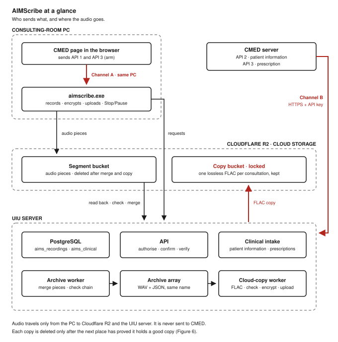
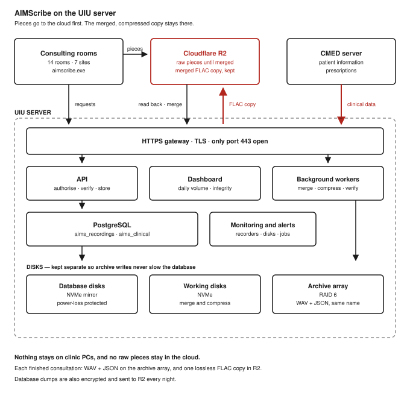
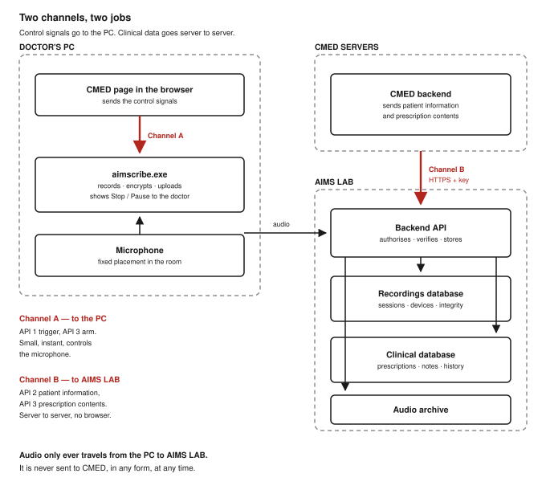
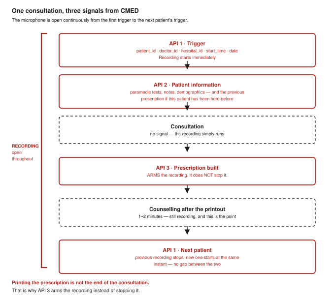
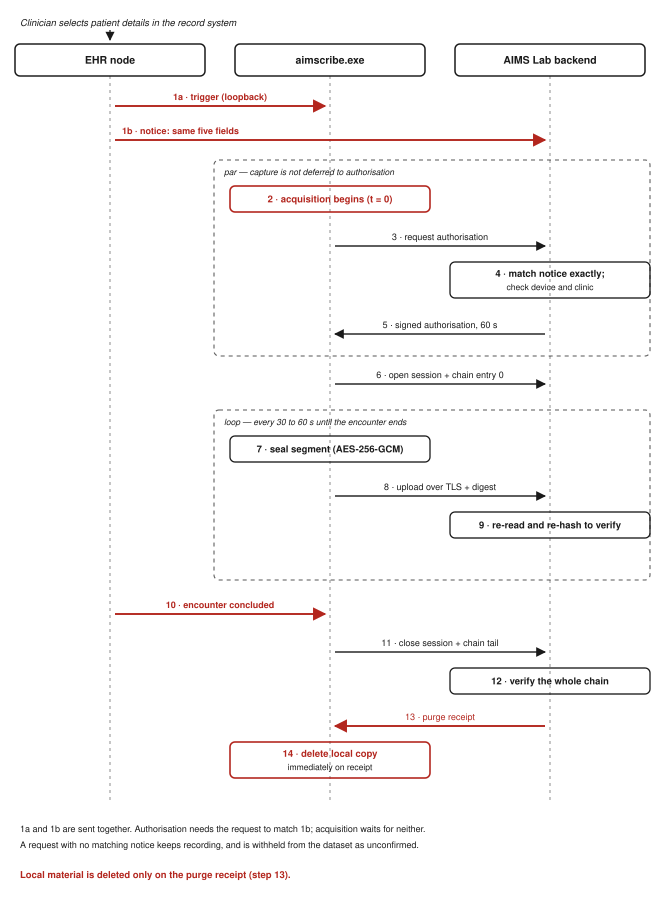
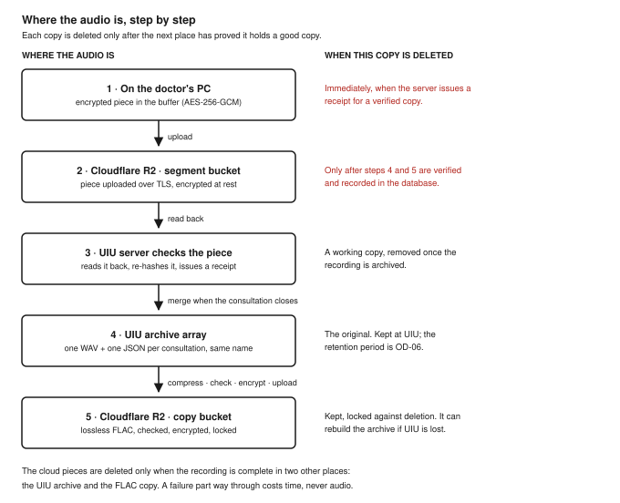
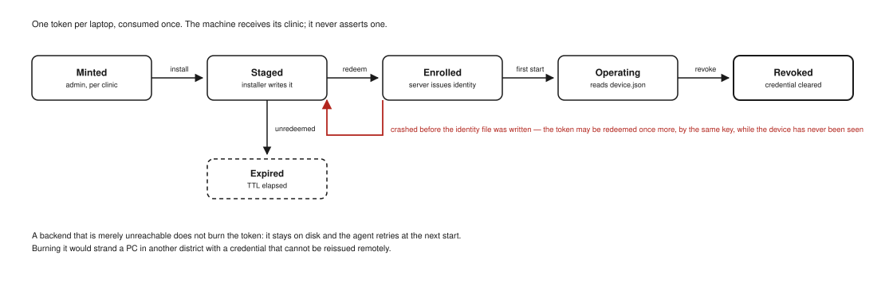
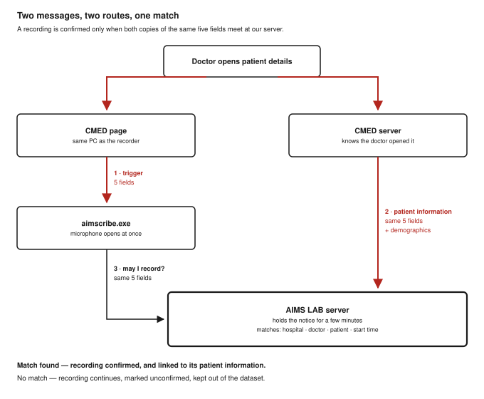
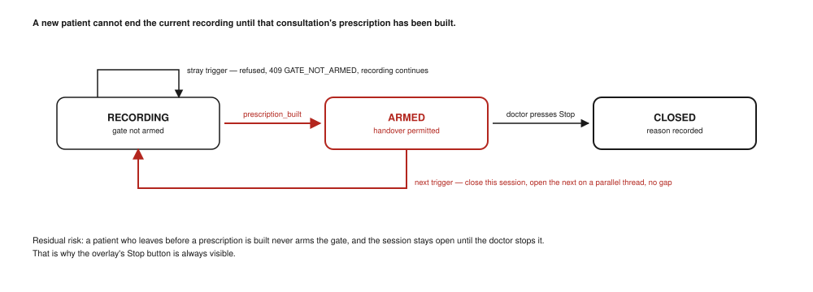
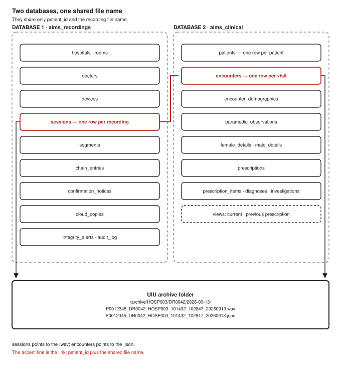

# AIMScribe — Software Requirements Specification

**System:** AIMScribe clinical consultation recording system
**For:** the CMED software engineering team, and AIMS LAB engineering
**Prepared by:** AIMS LAB · Independent University, Bangladesh

| | |
|---|---|
| Document | AIMS-SRS-001 |
| Version | 3.2 |
| Date | 14 September 2026 |
| Status | Baseline for integration. Items marked **OD-nn** are open and need a decision (§14). |
| Plan described | The plan agreed on 13 September 2026 — AIMS LAB server at UIU, three CMED signals over two channels, every recording confirmed, a lossless copy kept in the cloud |
| Companion document | *AIMScribe — Integration Guide for CMED* (14 September 2026), the short version of what CMED builds |
| Recorder version | 2.3.1 (`AIMScribe_Agent.exe`) |
| Wire protocol | 2 today. The message changes in §6.1 are the next revision (§13.1). |
| Deployment | 7 clinics · 14 consulting rooms · 30 doctors · 16 enrolled laptops |

---

## Contents

**Part I — Understanding the system**

1. Introduction — what AIMScribe is, the system on one page, what is new in 3.0
2. Overall description — identities, constraints, who does what
3. System architecture — two channels, one consultation, where the audio goes

**Part II — The questions CMED asks first**

4. Device enrolment and machine identity
5. Authorisation, and confirming every recording with CMED's server

**Part III — Requirements**

6. Interfaces — including everything CMED sends (§6.1 and §6.2)
7. Functional requirements — recording, upload, the gate, the archive and the cloud copy
8. Data requirements — patient information, the two databases, the file beside each recording
9. Non-functional requirements
10. Capacity — the UIU server and cloud storage
11. Failure modes

**Part IV — Closing out**

12. Verification and acceptance
13. Delivery plan and division of work
14. Open decisions
15. Appendices — response codes, reference code, API reference, requirement index, history

---

# Part I — Understanding the system

## 1. Introduction

### 1.1 What AIMScribe is

AIMScribe records the conversation between a doctor and a patient in a consulting room. AIMS LAB later transcribes the recording and uses it to draft prescriptions and to build a research dataset.

AIMScribe can hear a consultation, but it cannot know whose consultation it is. Only CMED knows which doctor has opened which patient. So CMED tells AIMScribe, with three short signals. Everything else — recording, encryption, upload, checking and storage — is built and run by AIMS LAB.

This document states what the whole system must do, as numbered requirements that can each be tested. It gives CMED a fixed contract to build against, and lets either side point to a requirement later and say whether it was met.

### 1.2 The system on one page



**Figure 1.** AIMScribe at a glance. The CMED page tells the recorder on the same PC when a consultation starts and when its prescription is built (Channel A). CMED's server sends patient information and the prescription to the AIMS LAB server at UIU (Channel B). Audio pieces go from the PC to Cloudflare R2. The UIU server checks them, merges each consultation into one recording with its patient information beside it, and keeps a lossless copy in the cloud. Audio never goes to CMED.

**One consultation, step by step.**

| # | What happens | Who does it |
|---|---|---|
| 1 | The doctor opens a patient's details in CMED. | Doctor |
| 2 | CMED's server creates `start_time` once and returns it to the page with the patient's details. | CMED server |
| 3 | The page sends **API 1 — trigger** to the recorder on the same PC. The microphone opens at once. | CMED page |
| 4 | At the same moment, CMED's server sends **API 2 — patient information** to the AIMS LAB server, with the same five fields. | CMED server |
| 5 | The recorder asks the AIMS LAB server for permission to record. The server matches the request to API 2 and confirms the recording. | Recorder, AIMS LAB server |
| 6 | The recorder cuts the audio into 30–60 second pieces, encrypts each piece on disk, and uploads it to Cloudflare R2. | Recorder |
| 7 | The AIMS LAB server reads each piece back from R2 and checks its fingerprint. It then tells the PC it may delete its copy. | AIMS LAB server |
| 8 | The doctor builds the prescription. The page sends **API 3 — prescription built** to the recorder, and CMED's server sends the prescription to AIMS LAB. The recording keeps running while the doctor counsels the patient. | CMED page, CMED server |
| 9 | The doctor opens the next patient, and the page sends API 1 again. The previous recording closes and the next one opens at the same instant. | CMED page, recorder |
| 10 | The AIMS LAB server merges the pieces into one WAV file, checks it, and saves it on the UIU archive with a JSON file of the patient information beside it, under the same name. | AIMS LAB server |
| 11 | It compresses the WAV losslessly (FLAC), checks the copy, encrypts it and stores it in a locked cloud bucket. Only then are the pieces deleted from R2. | AIMS LAB server |

Steps 1 to 4, 8 and 9 involve CMED. Steps 5 to 7, 10 and 11 are AIMS LAB's alone.

### 1.3 What CMED builds, and what AIMS LAB builds

| CMED builds | AIMS LAB builds |
|---|---|
| A connection from the CMED page to the recorder on the same PC | The recorder, its installer, and the on-screen Stop and Pause control |
| **API 1** — the trigger, when patient details open | Registering each PC, and authorising each recording |
| **API 2** — patient information, server to server, at the same moment | Confirming each recording against API 2 |
| **API 3** — prescription built: the arm signal to the recorder, and the prescription to AIMS LAB | Upload, checking, the archive, the cloud copy and both databases |
| Handling replies quietly, so a recorder failure never affects the doctor | The UIU server, cloud storage, monitoring and support |

**CMED holds no cryptographic key, stores no audio, installs nothing on the doctor's PC, and builds no screen for AIMScribe. CMED sends nothing about consent (§7.8a).** The only credential CMED holds is the API key for Channel B, kept on CMED's server. Estimated effort for CMED: **3–4 developer-days** (§13.2).

### 1.4 How to read this document

| If you are | Read |
|---|---|
| A CMED developer building the integration | §1, §3, §6.1, §6.2, Appendices A, B and C |
| A CMED architect or tech lead | §1–§3, §5, §8.1, §11, §13, §14 |
| A CMED security reviewer | §3.6, §4, §5, §6.2.1, §8.1, §8.4, §9.4 |
| AIMS LAB engineering | All of it |
| UIU IT, or anyone buying hardware or storage | §10, §11, §14 |

Most of §7 to §11 describes AIMS LAB's own obligations. It is written down so CMED can see the whole system, and hold us to it.

### 1.5 Words used in this document

| Term | Meaning |
|---|---|
| **Recorder** | `AIMScribe_Agent.exe` (called `aimscribe.exe` in the guides), the program on the doctor's PC that records. Also called *the agent*. |
| **AIMS LAB server** | The AIMS LAB backend, hosted on a server at UIU. Also called *the backend* or *the UIU server*. |
| **Channel A** | The connection from the CMED page to the recorder on the same PC, `ws://127.0.0.1:5050/ws`. It never leaves the machine. |
| **Channel B** | The connection from CMED's server to the AIMS LAB server, over HTTPS, with an API key. |
| **API 1 · Trigger** | Channel A message: a consultation has started. It opens the microphone. |
| **API 2 · Patient information** | Channel B message, sent at the same moment as API 1: demographics, paramedic measurements, and the previous prescription. |
| **API 3 · Prescription built** | Two messages when the prescription is built: `prescription_built` to the recorder, which arms it, and the prescription contents to the AIMS LAB server. |
| **The five fields** | `patient_id`, `doctor_id`, `hospital_id`, `start_time`, `date`. API 1, API 2 and the prescription all carry them, identical. |
| **Session** | One recorded consultation, from the moment the microphone opens to the moment it closes. |
| **Segment** or **piece** | A 30–60 second part of a recording. Audio is sent in pieces, so a failure loses a piece rather than the whole recording. |
| **Buffer** | The recorder's encrypted store on the PC (also called the *spool*). Pieces wait here only until the server confirms a good copy. |
| **Gate** and **arm** | The rule that a new patient cannot end the current recording until its prescription has been built. API 3 arms the gate. |
| **Grant** | A one-minute, one-use permission to record one consultation, issued by the AIMS LAB server. |
| **Confirmation** | Matching a recording's permission request to the API 2 that CMED's server sent. |
| **Enrolment** | Registering one PC with AIMS LAB, once, before it is used. |
| **Hash chain** | A running, signed fingerprint of a recording. If any part is changed, removed or reordered, it stops matching. |
| **Receipt** | Proof from the server that it holds a verified copy of a piece. Only a receipt allows the PC to delete its copy. |
| **Quarantine** | Where a piece that fails its check is kept, outside the evidence archive, while it is reviewed automatically. |
| **Cloudflare R2** | The cloud storage service. It holds audio pieces until they are merged, and one lossless copy of each finished recording. |
| **UIU archive** | The disk array on the UIU server that holds each finished recording as a WAV file and a JSON file with the same name. |
| **FLAC** | A lossless audio format. It makes our recordings much smaller and decodes back to exactly the same samples. |
| **Loopback** | A connection between two programs on the same computer, `127.0.0.1`. |
| **DPAPI** | Windows Data Protection, used to protect secrets stored on the PC. |
| **ULID** | A unique, time-sortable identifier, used to name sessions. |
| **PLP** | Power-loss protection, a property of server-grade SSDs. |
| **Idempotent** | Doing the same thing twice has the same result as doing it once. |

### 1.6 How requirements are written

Every requirement has an identifier such as `SRS-CAP-07`, a priority, a verification method and an owner. Identifiers are permanent. A withdrawn requirement is marked withdrawn and its number is never reused, so numbers are not always continuous.

**Shall** is binding. **Should** is a strong recommendation; leaving it out needs a written reason. **May** is optional.

| Priority | Meaning |
|---|---|
| **M** | Mandatory. The system is not acceptable without it. |
| **S** | Should. Expected at general release; may be deferred through the pilot by agreement. |
| **C** | Could. Done only if it costs little. |

| Verification | Meaning |
|---|---|
| **T** | Automated test |
| **D** | Demonstration on a running system |
| **I** | Inspection of code, configuration or output |
| **A** | Analysis, calculation or measurement |

**Owner** names who builds it: **AIMS**, **CMED**, or **Joint** where both sides change together. A requirement shown in a shaded block reads **`SRS-GRP-nn`** [priority, verification, owner], followed by its text.

### 1.7 Scope

**In scope.** Everything from the microphone to the archive and the cloud copy: recording on the PC; encryption and upload; the hash chain; checking each piece; starting, arming and closing a consultation; the on-screen control; registering PCs and authorising recordings; confirming recordings with CMED's server; receiving patient information and prescriptions; the two databases; the UIU server; cloud storage; and the hardware for all of it.

**Out of scope.** Speech recognition (ASR) and clinical entity extraction (NER). They run inside AIMS LAB after a recording is archived, and need nothing from CMED. Also out of scope: CMED's own application, database, screens and login. This document states what AIMScribe needs to *receive*, never how CMED should build what sends it.

### 1.8 What is new in version 3.0

This version brings the whole document in line with the plan agreed on 13 September 2026. Versions 2.0 to 2.3 added parts of that plan, but several sections still described the earlier one.

| Topic | Earlier versions | Version 3.0 |
|---|---|---|
| AIMS LAB server | Hosted on Render, database on Neon | **A server at UIU**, sized in §10.3 |
| What CMED sends | Two signals to the recorder | **Three signals over two channels** — API 1, API 2 and API 3 |
| The trigger | Carried a consent flag and a clinic code | **Five fields**: `patient_id`, `doctor_id`, `hospital_id`, `start_time`, `date` |
| Consent | A flag in the trigger | **Nothing from CMED.** Reception asks as today. If a patient refuses, the doctor presses Stop and chooses "Patient did not consent", and that recording is deleted everywhere (§7.8a). |
| The arm signal | `consultation_complete` | **`prescription_built`**, carrying the `session_id` |
| Is a request genuine? | Checked against AIMS LAB's register | Also **confirmed against CMED's API 2** (§5.6) |
| Audio on the PC | Deleted after archiving, then a 24-hour wait | **Deleted at once** when the server holds a verified copy |
| Audio pieces in the cloud | Deleted after archiving | Kept until the archive is verified **and a lossless FLAC copy is stored**, then deleted |
| Patient data | Planned | **Two databases**, and a JSON file beside each recording with the same name |
| Sizing | A cloud hosting estimate | **UIU server hardware and cloud storage**, with measured compression |

The full history is in Appendix E.

---

## 2. Overall description

### 2.1 The one hard problem

AIMScribe is a recorder that produces evidence. It is not a clinical system, and it makes no clinical decision.

Its central problem fits in one sentence: **AIMScribe can hear a consultation but cannot know whose it is.** A microphone captures sound. It does not capture which patient is present, which doctor is speaking, or that a consultation has begun. Only the clinical application the doctor is already using knows those things.

That is why CMED is involved. CMED is not asked to record, store or protect any audio. CMED is asked to say *this doctor has opened this patient* (API 1 and API 2), and later *the prescription is built* (API 3).

### 2.2 The three identities

Almost every design decision follows from keeping these three apart. Mixing any two of them caused misfiled recordings in the first version.

| Identity | Where it comes from | Changes how often | Can a web page set it? |
|---|---|---|---|
| **Clinic** (`hospital_id`) | The PC's enrolment record at AIMS LAB | Never, for a given PC | **No.** The page's value is only checked against it. |
| **Doctor** (`doctor_id`) | CMED, per consultation | Twice a day — morning and afternoon shifts share a laptop | Only as a claim, checked against AIMS LAB's register and CMED's API 2 |
| **Patient** (`patient_id`) | CMED, per consultation | Every consultation | Only as a claim, checked against CMED's API 2 |

**Why the clinic comes from the machine.** The clinic code is the top-level folder of the archive. If a page could set it, a mistyped or malicious value would create a new folder, and the recording would disappear into it without anyone noticing. It is fixed when an administrator enrols the PC.

**Why the doctor cannot come from the machine.** A consulting room runs two shifts. Tying the doctor to the PC filed every afternoon consultation under the morning doctor — in the file name, where a wrong value looks most believable. The doctor must come from CMED, which knows who is logged in.

**How CMED's `hospital_id` relates to ours.** CMED sends its own clinic identifier in `hospital_id`, for example `CMED-DHK-BANANI-01`. AIMS LAB maps it to an internal code, for example `HOSP003`, using a table agreed once for each clinic (`SRS-ENR-19`). The internal code is what appears in file names and folders.

> **`SRS-INV-01`** [M, I, AIMS] The clinic under which a recording is filed shall come only from the device's enrolment record. A `hospital_id` received on any interface shall be checked against it, and never used in its place.
>
> **`SRS-INV-02`** [M, I, AIMS] A device's clinic code shall not change for the life of its enrolment. A clinic's *display name* may change at any time; its code may not, because existing archive paths depend on it.
>
> **`SRS-INV-03`** [M, T, AIMS] `doctor_id` shall have no default and no fallback anywhere in the system. A trigger naming no doctor shall be refused rather than attributed to a guess.
>
> **`SRS-INV-04`** [M, T, AIMS] A patient's name shall never be written to the hash chain, a file name, an archive path, a cloud object key or a log line. Names reach AIMS LAB only through API 2, and are stored only in the clinical database and in the JSON file beside the recording (§8).

### 2.3 Who uses the system

| Group | Number | Technical skill | What they touch |
|---|---|---|---|
| **Doctor** | ~30 | Low. Uses CMED all day. | The Stop and Pause buttons, and nothing else. Never a terminal. |
| **Clinic administrator** | ~7 | Low to moderate | Runs the installer once per PC and pastes one code |
| **AIMS LAB operator** | 2–3 | High | Issues enrolment codes, watches alerts and the dashboard, runs the UIU server |
| **CMED developer** | 2–4 | High | Builds API 1, 2 and 3; never operates the system |
| **Researcher or auditor** | Occasional | Moderate | Reads recordings and checks chains; never changes anything |

> **`SRS-USR-01`** [M, I, AIMS] No routine task performed by a doctor or a clinic administrator shall require a command line, a script, a `.bat` file or a terminal window. Clinical machines receive a signed installer and a graphical interface only.

A `.bat` file on a clinical PC is a support call waiting to happen, and an audit finding waiting to be written.

### 2.4 Operating environment

| Element | Specification |
|---|---|
| Consulting-room PC | Windows 10 21H2 or Windows 11, x64, at least 4 GB RAM and 10 GB free disk |
| Audio input | USB speakerphone or microphone. How it is connected is a requirement, not a detail (§7.1a). |
| Browser | Chrome or Edge, current version, on the same PC as the recorder |
| Clinic network | Broadband where available, mobile tethering elsewhere. Short interruptions are expected. |
| Recorder | Python 3.12, delivered as one signed Windows installer; nothing else is installed |
| CMED server | Any technology able to make outbound HTTPS requests |
| AIMS LAB server | At UIU. Ubuntu Server 24.04 LTS, Docker Compose, an HTTPS gateway (Caddy or Nginx), FastAPI on Python 3.12 |
| Databases | PostgreSQL 16 on the UIU server: `aims_recordings` and `aims_clinical` |
| Cloud storage | Cloudflare R2, S3-compatible: a segment bucket and a locked copy bucket |
| Archive | RAID 6 disk array on the UIU server: `/archive/<hospital_id>/<doctor_id>/<YYYY-MM-DD>/` |
| Time zone | `Asia/Dhaka` (UTC+06). Every timestamp on the wire is RFC 3339 with an explicit offset, for example `2026-09-13T10:14:32+06:00`. |

### 2.5 Constraints

| ID | Constraint | What follows from it |
|---|---|---|
| **CON-01** | CMED will not change its architecture for AIMScribe | The integration is additive: a small client in the page, and two outbound calls from CMED's server |
| **CON-02** | AIMS LAB never calls CMED | Every exchange starts at CMED: page to recorder (Channel A), and CMED server to AIMS LAB server (Channel B). CMED exposes no endpoint to AIMS LAB. |
| **CON-03** | CMED will not hold, generate or rotate a cryptographic key | Grants are issued by the AIMS LAB server (§5). The only credential CMED holds is the Channel B API key, which AIMS LAB issues and rotates. |
| **CON-04** | Clinical PCs get an installer, never scripts | `SRS-USR-01` |
| **CON-05** | Both AIMScribe source repositories are public | No secret may appear in either. Enrolment code sheets and the CMED API key are credentials. |
| **CON-06** | Clinic internet is limited and unreliable | Recording must continue through short outages; pieces wait in the buffer |
| **CON-07** | The archive is evidence | Lossy compression is never used, on the archive or on its cloud copy |
| **CON-08** | Consultations run back to back, 20–30 seconds apart | The handover between patients must have no gap |
| **CON-09** | The browser page is untrusted input | Not because CMED is distrusted, but because any page on the PC can open a connection. Every claim is checked. |

### 2.6 Assumptions

| ID | Assumption | If it proves false |
|---|---|---|
| **ASM-01** | The doctor's browser runs on the same PC as the recorder | Channel A cannot work; a different design is needed |
| **ASM-02** | CMED can run JavaScript on the patient-details page | No integration is possible |
| **ASM-03** | CMED holds a stable `patient_id`, `doctor_id` and clinic identifier | Recordings cannot be filed correctly |
| **ASM-04** | A Build Prescription action exists and is used for every patient | The gate has no signal; §7.7 and §11 cover its absence |
| **ASM-05** | Reception asks every patient for consent before the consultation, and tells them they may refuse at any time | A patient who was never asked cannot refuse; the refusal path (§7.8a) depends on this |
| **ASM-06** | CMED authenticates its own doctors | AIMScribe never authenticates anyone against CMED |
| **ASM-07** | PC clocks are within ±5 minutes of true time | Grant checks fail; see §11 |
| **ASM-08** | CMED's server can send HTTPS requests to the AIMS LAB server at the moment a patient is opened | Recordings stay unconfirmed until API 2 arrives |
| **ASM-09** | CMED's server can create `start_time` once and give the same value to the page and to API 2 | Confirmation cannot match (§5.6) |

### 2.7 Who is responsible for what

| Concern | AIMS LAB | CMED |
|---|---|---|
| Audio capture, cutting, encryption and upload | ● | |
| All cryptographic keys | ● | |
| Registering PCs | ● | |
| Authorising and confirming recordings | ● | |
| UIU server, databases, archive and cloud storage | ● | |
| The on-screen Stop and Pause control, and every message a doctor sees | ● | |
| Recorder installation and support | ● | |
| Server and storage capacity, and their cost | ● | |
| Issuing and rotating the Channel B API key | ● | |
| Deleting a recording when the patient refuses (§7.8a) | ● | |
| **API 1 — the trigger, from the page** | | ● |
| **API 2 — patient information, from the server** | | ● |
| **API 3 — prescription built, from the page and the server** | | ● |
| **Creating `start_time` once, on the server** | | ● |
| **Handling replies, and failing quietly** | | ● |
| **Keeping the API key on the server, never in the page** | | ● |
| **Giving us the page addresses and clinic identifiers** | | ● |
| Keeping identifiers stable over time | | ● |
| The message formats | ◐ | ◐ |

---

## 3. System architecture

### 3.1 Components

| # | Component | Runs on | Built with | Talks to |
|---|---|---|---|---|
| 1 | **CMED page** | Doctor's browser | CMED's stack plus a small client (Appendix B) | Recorder, over Channel A |
| 2 | **CMED server** | CMED | CMED's stack | AIMS LAB server, over Channel B |
| 3 | Recorder — control | Doctor's PC | FastAPI on `127.0.0.1:5050` | The page |
| 4 | Recorder — capture | Same program, own thread | PyAudio, WASAPI | The microphone |
| 5 | Recorder — cutter | Same program, own thread | NumPy | Capture to buffer |
| 6 | Recorder — buffer | Same program | AES-256-GCM and a journal | Local disk |
| 7 | Recorder — hash chain | Same program | Ed25519 | Buffer, AIMS LAB server |
| 8 | Recorder — uploader | Same program | aiohttp | AIMS LAB server, Cloudflare R2 |
| 9 | Recorder — Stop and Pause control | Same program, screen thread | tkinter | The doctor |
| 10 | HTTPS gateway | UIU server | Caddy or Nginx | The internet, on port 443 only |
| 11 | API | UIU server | FastAPI | Recorders, CMED server, workers |
| 12 | Clinical intake | UIU server, inside the API | FastAPI | CMED server, `aims_clinical` |
| 13 | Confirmation matcher | UIU server, inside the API | FastAPI | `aims_recordings` |
| 14 | Databases | UIU server | PostgreSQL 16 with PgBouncer | API, workers, dashboard |
| 15 | Segment bucket | Cloudflare R2 | S3 API | Recorder (upload), API (read back), workers |
| 16 | Archive worker | UIU server | Python | Segment bucket, archive array, databases |
| 17 | Cloud-copy worker | UIU server | Python and FLAC | Archive array, copy bucket, databases |
| 18 | Copy bucket, locked | Cloudflare R2 | S3 API | Cloud-copy worker |
| 19 | Dashboard | UIU server | Web application | `aims_recordings` only |
| 20 | Monitoring and alerts | UIU server | — | Everything above |
| 21 | *ASR and NER pipeline* | AIMS LAB | *out of scope* | Reads the archive |

### 3.2 Where everything runs



**Figure 2.** AIMScribe on the UIU server. Recorders upload audio pieces to Cloudflare R2 and send their requests to the UIU server. The UIU server checks each piece, merges each consultation into one recording on its archive array, and uploads a lossless, encrypted copy back to R2. CMED's server sends clinical data to the same server.

**Every connection is started by the side that has something to send.** Recorders call the UIU server and R2. CMED's server calls the UIU server. The UIU server calls R2. Nothing ever calls into a clinic PC or into CMED. From the internet, the UIU server accepts connections on one port only: 443, for HTTPS.

**Why the pieces go to R2 and not straight to UIU.** Each recorder asks the UIU server for a short-lived upload link, then uploads the piece directly to R2. The UIU server reads the piece back to check it. This is how the system works today, and it is unchanged.

> **`SRS-TOP-02`** [M, I, AIMS] The UIU server shall accept connections from the internet on port 443 (HTTPS) only. Workers on the server shall make outbound connections only.
>
> **`SRS-TOP-03`** [M, I, Joint] AIMS LAB shall never open a connection to a service operated by CMED. Every exchange between the two organisations shall be started by CMED (`CON-02`).

### 3.3 Two channels



**Figure 3.** Two channels, two jobs. Control signals travel to the recorder on the doctor's own PC. Clinical data travels server to server, from CMED to AIMS LAB. Audio travels only from the PC to AIMS LAB, and never to CMED.

CMED sends two kinds of message, and they take different routes for a practical reason. Control signals must be instant, because they open a microphone. Clinical data can be large, and has no business passing through a browser.

| | Route | Carries | Why this route |
|---|---|---|---|
| **Channel A** | CMED page → recorder, on the doctor's own PC | API 1 (trigger) and the arm half of API 3 | It must be immediate. A round trip to a server before the microphone opened would lose the first seconds of the consultation — when the patient says why they came. |
| **Channel B** | CMED server → AIMS LAB server, over HTTPS | API 2 (patient information) and the prescription half of API 3 | Server to server. Size does not matter, and nothing sensitive passes through a browser. |

> **`SRS-TOP-04`** [M, I, Joint] Control signals shall travel on Channel A and clinical data on Channel B. Clinical data shall not be relayed through the browser, and control signals shall not depend on a server round trip.
>
> **`SRS-TOP-05`** [M, I, AIMS] Channel B shall be authenticated with an API key issued to CMED, and shall accept clinical data only. No recording shall be started, stopped or paused over Channel B.
>
> **`SRS-TOP-06`** [M, T, AIMS] Audio shall never travel towards CMED, on either channel.

### 3.4 One consultation, start to finish



**Figure 4.** One consultation, three signals. The microphone stays open continuously from one patient's API 1 to the next patient's API 1. API 3 arms the recording; it does not stop it.

**The point most easily missed is API 3.** Printing the prescription is not the end of the consultation. The doctor prints it, hands it over, and then counsels the patient for another minute or two — and that counselling is exactly the part worth recording. So API 3 does not stop the recording. It *arms* it: this consultation is finished, so the next patient may now end it. The recording closes when the next patient's API 1 arrives.



**Figure 5.** Behind the trigger. The trigger (1a) and the patient information (1b) leave CMED together. Recording starts at once, while the server matches the recorder's permission request to 1b. Pieces are sealed, uploaded and verified throughout, and the PC deletes its copy as soon as the receipt arrives.

**Read steps 1a, 1b and 2 together.** Recording starts before permission is confirmed, and the two run side by side. A slow network must never cost the opening seconds of a consultation. If permission is then refused for a hard reason — an unregistered PC, or the wrong clinic — the audio already captured is discarded (`SRS-GRT-08`).

**The handover.** When the next patient's trigger arrives and the gate is armed, the previous session closes and the next opens on separate threads, so there is no gap between two patients (`CON-08`).

### 3.5 Where the audio is, step by step



**Figure 6.** Where the audio is, step by step. Each copy is deleted only after the next place has proved it holds a good copy. The cloud pieces are deleted only when the recording is complete in two other places: the UIU archive and the FLAC copy.

| Stage | Where | In what form | Deleted when |
|---|---|---|---|
| 1 | Doctor's PC, in the buffer | Pieces, encrypted on disk | At once, when the server issues a receipt — normally within seconds (`SRS-REC-15`, `SRS-REC-16`) |
| 2 | Cloudflare R2, segment bucket | Pieces, sent over TLS and encrypted at rest | Only after stages 4 and 5 are both verified and recorded (`SRS-ARC-09`) |
| 3 | UIU server, working disks | Pieces downloaded to check them | When the recording is archived (`SRS-ARC-15`) |
| 4 | UIU archive array | One WAV and one JSON per consultation, with the same name | At the end of the retention period — **OD-06** |
| 5 | Cloudflare R2, copy bucket, locked | One lossless FLAC and its JSON, encrypted at UIU before upload | At the end of the retention period — **OD-06** |

**Why merging happens on the UIU server.** R2 stores files; it cannot run the program that joins and compresses audio. The UIU server has already joined the pieces to make the archive WAV, so it compresses that same file and uploads it.

**Why FLAC, and not a smaller lossy format.** FLAC decodes back to exactly the samples in the archive, so the cloud copy can rebuild the archive and still be checked against the hash chain. A lossy copy such as Opus is about four times smaller again, but can do neither. Sizes and costs are in §10.4.

### 3.6 Trust boundaries

| Party | Proves who it is with | Trusted to | Not trusted to |
|---|---|---|---|
| **CMED page** — really, any page on the PC | Nothing. Its web address is checked against an allowlist. | Say *where* a consultation is happening: on this PC | Choose the clinic, or start a trusted recording on its own |
| **Recorder** on an enrolled PC | A device token and a private key that never leaves the PC | Record, and sign what it recorded | Choose its own clinic, or record without a grant |
| **CMED server** | The Channel B API key | Say a doctor *really* opened a patient, and send clinical data | Start, stop or control a recording |
| **AIMS LAB server** | Its TLS certificate and the grant signing key | Authorise recordings, verify audio, issue receipts | — |

**The trigger says where; the notice says whether.** A page on the PC can reach the recorder. It cannot make CMED's server send a matching API 2. So a recording with no matching notice is never admitted to the dataset (§5.6).

> **`SRS-TOP-01`** [M, I, AIMS] The recorder shall listen on loopback addresses only. It shall never listen on an address reachable from the network.

---

# Part II — The questions CMED asks first

## 4. Device enrolment and machine identity

> **Short answer: CMED builds nothing for enrolment, and maintains nothing.** Enrolment is between the consulting-room PC and the AIMS LAB server. CMED is not part of it, cannot see it, and is not affected by it. This section explains why the integration cannot weaken it.

### 4.1 What enrolment is for

Enrolment exists for one purpose: **a laptop that has not been registered cannot record.** A PC not enrolled by an AIMS LAB administrator will install, start, show its tray icon — and refuse to record.

What enrolment does *not* do matters just as much, because it decides who builds what:

| Enrolment **does** | Enrolment **does not** |
|---|---|
| Tie one PC to one clinic, permanently | Decide who the doctor is |
| Register the PC's public key with the AIMS LAB server | Authenticate a person |
| Give the PC a long-lived credential | Stop a random web page from asking the recorder to record |
| Give AIMS LAB a register of devices it can revoke | Involve CMED in any way |

The third row leads to §5. Enrolment answers *may this machine record at all*. It does not answer *is this particular request to record genuine*. That is the job of the grant and the confirmation, and the two questions must not be confused.

### 4.2 The credentials

Five different secrets exist. Mixing them up is the most common cause of a misconfigured deployment, so here they all are.

| # | Secret | Created by | Kept where | Lifetime | Used for |
|---|---|---|---|---|---|
| 1 | **Enrolment code** (token) | AIMS LAB administrator, via `POST /api/v2/admin/enrollment-token` | An instruction sheet, then `%PROGRAMDATA%\AIMScribe\state\enrollment.token` until used, then deleted | 72 hours by default, 720 at most, **single use** | Turning one PC into one enrolled device |
| 2 | **Device token** | AIMS LAB server, at enrolment | `%PROGRAMDATA%\AIMScribe\state\device.token`, protected by DPAPI | Until revoked | Every later request from that PC |
| 3 | **Device private key** | The recorder, on first start. It never leaves the PC. | `%PROGRAMDATA%\AIMScribe\keys\`, protected by DPAPI | Until the machine is rebuilt | Signing every hash-chain entry |
| 4 | **Grant signing key** | AIMS LAB | UIU server configuration only | Rotatable | Signing permissions to record (§5) |
| 5 | **CMED API key** | AIMS LAB administrator | CMED's server configuration only | Rotatable | Authenticating Channel B (§6.2) |

> **`SRS-ENR-01`** [M, I, AIMS] The enrolment code shall be stored in the database as a SHA-256 hash only. The plain code shall exist nowhere but the instruction sheet, and cannot be recovered once that sheet is destroyed.
>
> **`SRS-ENR-02`** [M, T, AIMS] An enrolment code shall work once, enforced inside a single database transaction with row locking, so two simultaneous attempts cannot both succeed.
>
> **`SRS-ENR-03`** [M, T, AIMS] An enrolment code shall expire after between 1 and 720 hours, 72 by default.
>
> **`SRS-ENR-04`** [M, I, AIMS] An unknown code, an expired code and an already-used code shall all produce the same error, so a caller learns nothing about which case occurred.
>
> **`SRS-ENR-05`** [M, I, AIMS] The device token and the device private key shall both be protected by DPAPI on disk. Unprotected storage shall be possible only under an explicit development setting that the production configuration check refuses.
>
> **`SRS-ENR-06`** [M, I, AIMS] Enrolment code sheets are credentials. They shall never be committed to a repository, and the generated `register.csv` shall contain no codes.

### 4.3 The life of an enrolment



**Figure 7.** Device enrolment lifecycle. A code is created for a clinic, placed on the PC by the installer, used at first start, and replaced by a stored identity. An unreachable server does not use up the code, and a crash before the identity is saved returns the machine to the waiting state.

**A server that is merely unreachable must not use up the administrator's code.** If enrolment fails because the network is down, the code stays on disk and the recorder tries again at the next start. Using it up would strand a PC in another district with a credential that cannot be reissued remotely.

**A code may be used twice, in one narrow case.** Suppose the server records the enrolment, and the PC then fails to save its own copy — a full disk, a permissions problem, a crash between two writes. The PC now has no credential and its code is spent. The only symptom is a PC saying *not enrolled* while the server shows it enrolled. This happened in the field. So a spent code may be used once more, but only by the same machine, proven by the same device key, and only while that device has never been seen. After its first heartbeat, a second attempt is a replay and is refused.

> **`SRS-ENR-07`** [M, T, AIMS] An enrolment that fails because the server is unreachable shall leave the code on disk for a later retry.
>
> **`SRS-ENR-08`** [M, T, AIMS] A used code may be redeemed a second time only if all three hold: the device it created exists; that device has never been seen (`last_seen_at IS NULL`); and the public key presented matches the one registered. Any other repeat shall be refused and logged as a replay attempt.
>
> **`SRS-ENR-09`** [M, T, AIMS] The recorder shall save the device token before the identity file, so that a crash between the two leaves the machine unenrolled rather than holding an identity with no credential.
>
> **`SRS-ENR-10`** [M, T, AIMS] The recorder shall delete the enrolment code from disk immediately after it has been used successfully.
>
> **`SRS-ENR-11`** [M, T, AIMS] At every start, the recorder shall compare the stored key fingerprint with its live device key. If they differ — a wiped key folder, a restored disk image — it shall refuse to record and require re-enrolment.

### 4.4 How an administrator enrols a PC

One code per **laptop**, not per doctor. A room with two laptops needs two codes.

1. The operator writes a **new, dated** list of the machines to enrol. Existing fleet files are never edited, because a rewritten `laptops.csv` reads as *these hospitals were deleted*.
2. A tool calls `POST /api/v2/admin/enrollment-token` once per machine and writes one instruction sheet per PC, plus a `register.csv` with no codes in it.
3. The clinic administrator runs `AIMScribeSetup.exe` on the PC and pastes the code into one of three fields. The other two are already filled in.
4. The installer places the code, sets the recorder to start at logon, and installs the pinned public keys. The recorder uses the code on first start and deletes it.
5. The instruction sheets are destroyed once the machines are working.

`doctor_id` on an enrolment record is **optional and decides nothing.** It labels the room in the paperwork. Most laptops are shared across shifts and have none. Even when one is set, it is never used to file a consultation, because the doctor arrives from CMED with every trigger (`SRS-INV-03`).

> **`SRS-ENR-12`** [M, I, AIMS] Fleet registration files shall only ever be added. A new dated file shall be written; an existing one shall not be rewritten.
>
> **`SRS-ENR-13`** [S, D, AIMS] Operators shall be able to create enrolment codes through an interface that does not require editing the database directly.
>
> **`SRS-ENR-14`** [M, I, AIMS] `doctor_id` on an enrolment code shall be optional, and shall never be used to file a recorded consultation.

### 4.5 Revoking a PC

> **`SRS-ENR-15`** [M, T, AIMS] An administrator shall be able to revoke a device by its identifier. Revocation shall delete the stored token hash, not merely set a flag, so a stolen laptop's credential stops working immediately.
>
> **`SRS-ENR-16`** [M, T, AIMS] A revoked device shall be refused at every authenticated route, and told clearly enough that its tray icon shows the state.
>
> **`SRS-ENR-17`** [M, I, AIMS] Every enrolment, re-issue and revocation shall be written to the append-only audit log with the acting administrator's name.
>
> **`SRS-ENR-21`** [M, T, AIMS] A device shall not be re-enrolled while pieces remain undelivered in its buffer. Re-enrolment creates a new device identity, and pieces from sessions opened under the old identity cannot be committed with the new credential. The buffer shall be emptied first, and the recorder shall refuse re-enrolment until it is.

### 4.6 What the integration changes for enrolment

**Nothing.** This is stated as a requirement rather than a reassurance, because CMED's security reviewer will ask.

> **`SRS-ENR-18`** [M, I, Joint] Enrolment shall require nothing from CMED. No CMED endpoint is called, no CMED credential is used, and no enrolment data is held by CMED. Enrolling, re-enrolling or revoking a PC shall need no change to CMED software.

Enrolment ties a **machine** to a **clinic**. Both are AIMS LAB facts: AIMS LAB owns the laptops, assigns each to a consulting room, and owns the archive whose top-level folder is the clinic code. A laptop moved to another clinic is an AIMS LAB logistics event, handled by re-enrolment, and CMED has nothing to do.

The **doctor** and the **patient**, by contrast, are CMED facts. They arrive with every consultation, in API 1 and API 2. None of CMED's messages is involved in registering a machine.

**The one shared fact.** For each clinic, AIMS LAB needs to know which CMED clinic identifier corresponds to which AIMS LAB clinic code. That is one row per clinic, agreed once in writing.

> **`SRS-ENR-19`** [M, I, Joint] For each clinic, CMED and AIMS LAB shall agree in writing one stable mapping from CMED's clinic identifier (sent as `hospital_id`) to the AIMS LAB clinic code, before the first recording at that site.
>
> **`SRS-ENR-20`** [M, T, AIMS] The AIMS LAB server shall refuse a trigger whose `hospital_id` does not map to the clinic of the device that sent it. §5.5 explains why it refuses rather than warns.

**The clinic register.** Seven sites, two consulting rooms each, one laptop per room:

| AIMS LAB code | Site | Operator | Rooms | Status |
|---|---|---|---|---|
| `HOSP001` | Karail | Aalo | 2 | In service — signed recordings exist |
| `HOSP002` | Mirpur | Aalo | 2 | Assigned |
| `HOSP003` | Dholpur | Aalo | 2 | In service — signed recordings exist |
| `HOSP004` | Shyampur | Aalo | 2 | In service — signed recordings exist |
| `HOSP005` | Naryanganj | Aalo | 2 | To be assigned |
| `HOSP006` | Ershadnagar | Aalo | 2 | To be assigned |
| `HOSP007` | Amader Susastho | Amader Susastho | 2 | To be assigned |

Fourteen rooms, fourteen laptops, and two spares held centrally: sixteen enrolment codes in total.

`HOSP001`, `HOSP003` and `HOSP004` can never be renamed. They appear inside signed hash-chain entries in the existing archive, so changing one would break the signature on every entry that follows it, and a signed entry cannot be edited by hand. Display names can still change at any time.

---

## 5. Authorisation, and confirming every recording

### 5.1 The gap enrolment leaves open

An enrolled laptop may record. That is not the same as *this request to record is genuine*.

Consider the gap concretely. A doctor's PC is enrolled and working. The doctor opens an unrelated website in another tab. That page runs JavaScript, opens a connection to `127.0.0.1:5050` — which any page on the machine can attempt — and sends a trigger. Without further checks, the recorder would record.

Two controls close that gap. The **grant** proves the AIMS LAB server has checked the request against its own register. The **confirmation** proves CMED's server really opened that patient.

### 5.2 What a grant is

A grant is a short-lived, single-use, signed statement from the AIMS LAB server that a named doctor may record a named patient at a named clinic.

| Property | Value | Why |
|---|---|---|
| Algorithm | EdDSA (Ed25519) | Small, fast, and no parameters to get wrong |
| Lifetime | 60 seconds | Long enough to reach the recorder; too short to be worth stealing |
| Clock allowance | 5 seconds | PC clocks drift |
| Replay protection | A single-use identifier (`jti`), tracked by the recorder | A copied grant is refused even within its 60 seconds |
| Audience | `aimscribe-recorder` | A grant cannot be reused for another service |
| Claims | `patient_ref`, `doctor_id`, `hospital_id`, `start_time` | The recording is tied to exactly one consultation |

### 5.3 Where grants are made

**In the dummy application** AIMS LAB built for testing, the web page's own server made the grant and held a private key.

**Real CMED will not do that**, and does not need to. The grant is made by the AIMS LAB server. This is stronger than the dummy design, not weaker.

| | Dummy application | Real CMED |
|---|---|---|
| Who holds a private key | The web application | The AIMS LAB server only |
| What the page sends | A signed token it made itself | Five plain fields |
| Who checks the doctor | Nobody | The AIMS LAB server, against its register |
| Who checks the clinic | Nobody | The AIMS LAB server, against the PC's enrolment |
| Who proves the consultation is real | Nobody | CMED's server, through API 2 (§5.6) |
| CMED's key-management work | Real | **None** |

> **`SRS-GRT-01`** [M, I, AIMS] Grants shall be made only by the AIMS LAB server. No grant signing key shall be issued to, held by, or required of CMED.
>
> **`SRS-GRT-02`** [M, T, AIMS] The grant endpoint shall be authenticated by the calling device's token, and shall grant only for that device's enrolled clinic.
>
> **`SRS-GRT-03`** [M, T, AIMS] Before granting, the AIMS LAB server shall check that: the doctor exists and is active; the doctor works at that clinic; and the clinic matches the device's enrolment. Any failure shall refuse the grant with a distinct code. Whether a matching API 2 exists is decided by §5.6.
>
> **`SRS-GRT-04`** [M, T, AIMS] The recorder shall check every grant against a public key pinned at installation: signature, issuer, audience and expiry, allowing no more than 5 seconds of clock difference.
>
> **`SRS-GRT-05`** [M, T, AIMS] The recorder shall accept each grant once, by `jti`, and refuse a repeat within its lifetime.
>
> **`SRS-GRT-06`** [M, T, AIMS] The recorder shall refuse to record if no grant verification key is installed. It shall never fall back to recording without authorisation under any setting reachable in production.
>
> **`SRS-GRT-07`** [M, D, AIMS] Asking for a grant shall not delay the microphone. Capture shall begin when the trigger arrives, and authorisation shall run alongside it.
>
> **`SRS-GRT-08`** [M, T, AIMS] If authorisation fails for a hard reason after capture has begun — the device is not enrolled or is revoked, the clinic does not match, or the doctor is not registered at that clinic — the audio captured under that trigger shall be discarded and not written to the buffer. A missing API 2 is not a hard failure; it is handled by §5.6.

### 5.4 What CMED builds for authorisation

Nothing cryptographic. CMED's part is:

1. Send five plain fields in API 1, instead of a signed token.
2. Create `start_time` once on the server, and use the same value in API 1 and API 2.
3. Send API 2 from the server at the moment the patient is opened.
4. Read the recorder's reply and branch on `code`.

There is no key to generate, protect or rotate, no signing library, and no clock to synchronise. The only credential is the Channel B API key, which stays on CMED's server.

> **`SRS-GRT-09`** [M, I, CMED] CMED shall send the trigger as plain JSON fields, and shall not be required to compute any signature, hash or MAC.

### 5.5 A clinic mismatch is refused, not warned about

If a trigger names a clinic that does not match the PC's enrolment, one of two things is true: the clinic mapping is wrong, or a laptop is in a different building from where it is registered. Both produce wrongly labelled evidence, which is worse than no evidence, because it is believed.

> **`SRS-GRT-10`** [M, T, AIMS] A clinic mismatch shall refuse the recording with `401 CLINIC_MISMATCH` and raise an operational alert. The system shall not record and warn.

**OD-03** offers CMED the option of recording with a warning during the pilot only.

### 5.6 Confirming every recording with CMED's server — `CNF`

**The idea.** When a doctor opens a patient, two messages leave CMED at the same moment, by two routes. The page sends API 1 to the recorder on the same PC (Channel A). CMED's server sends API 2 to the AIMS LAB server (Channel B). Both carry the same five fields. The AIMS LAB server confirms a recording only when the two match.



**Figure 8.** Two messages, two routes, one match. The page's trigger tells the recorder to start. CMED's server tells AIMS LAB the request is genuine. The recorder's permission request is matched to the notice on hospital, doctor, patient, date and start time.

**Why it is needed.** The page-address allowlist (§6.1.2) stops a page served from the wrong address. It cannot stop a page that has found a way past it. A matching API 2 can only come from CMED's server, which authenticates its own doctors. A page on the laptop can reach the recorder, but it cannot make CMED's server send AIMS LAB a notice.

**Why the trigger still goes to the PC.** The AIMS LAB server does not know which laptop a doctor is using, because rooms are shared across shifts. The page is running on that laptop, so the trigger lands on the right machine without any lookup. The trigger says *where*; the notice says *whether*.

**Why the match can be exact.** CMED's server creates `start_time` once, and the same value goes into both messages. Clock differences between the laptop and the servers therefore cannot affect the match. No `session_id` is needed in API 2.

| Situation | What happens |
|---|---|
| API 2 arrives within a second or two | Confirmed. Nobody notices anything. |
| API 2 is late | Recording continues. The recorder asks again every 5 seconds and shows "confirming". Confirmed when API 2 arrives. |
| API 2 never arrives | Recording is **not** cut. After two minutes it is marked *unconfirmed*, uploaded as usual, kept out of the dataset, and an alert is raised. |
| API 2 arrives after that | The recording is admitted. |
| No API 2 within 24 hours | The unconfirmed recording is deleted from AIMS LAB's storage, and the deletion logged. |
| The doctor opens a patient just to look | API 2 arrives, but no recording asks for it. It expires after five minutes. No harm. |
| The doctor opens the same patient twice | The most recent unused API 2 is matched. |
| The device is unregistered, or the clinic does not match | Refused, and the audio discarded (`SRS-GRT-08`). |

> **`SRS-CNF-01`** [M, T, CMED] CMED's server shall send API 2 at the moment the patient is opened, at the same time as the page sends API 1. It shall not wait for the recording to start.
>
> **`SRS-CNF-02`** [M, T, Joint] API 2 and API 1 shall carry identical `patient_id`, `doctor_id`, `hospital_id`, `start_time` and `date`. `start_time` shall be created once, by CMED's server, and reused — never created separately by the page.
>
> **`SRS-CNF-03`** [M, T, AIMS] The AIMS LAB server shall hold each API 2 for matching for five minutes. A notice not matched within that time shall expire, and expiry shall not be treated as an error. The patient information itself is kept as a clinical record (§8.6).
>
> **`SRS-CNF-04`** [M, T, AIMS] A permission request shall be confirmed only when an unused API 2 matches it on all five fields, and that notice's hospital matches the enrolled clinic of the requesting device. A notice shall confirm at most one request.
>
> **`SRS-CNF-05`** [M, T, AIMS] Where more than one unused notice matches, the most recent shall be used.
>
> **`SRS-CNF-06`** [M, T, AIMS] The microphone shall not wait for confirmation. Capture begins on the trigger, and confirmation runs alongside it (`SRS-GRT-07`).
>
> **`SRS-CNF-07`** [M, T, AIMS] If no notice matches, the recorder shall ask again every five seconds and show "confirming" on its on-screen control. It shall not show an error to the doctor.
>
> **`SRS-CNF-08`** [M, T, AIMS] If no notice has matched after two minutes, the recording shall continue and be marked **unconfirmed**. It shall be uploaded as usual, kept out of the dataset, and an alert raised. It shall never be cut because a notice is late.
>
> **`SRS-CNF-09`** [M, T, AIMS] A notice arriving after a recording was marked unconfirmed shall still be matched, and the recording admitted. An unconfirmed recording that no notice matches within 24 hours shall be deleted from AIMS LAB's storage, and the deletion recorded in the audit log.
>
> **`SRS-CNF-10`** [M, T, AIMS] The match shall link the recording to its clinical record. The prescription sent later shall attach to the same consultation by the same five fields.
>
> **`SRS-CNF-11`** *Withdrawn in 3.2.* CMED does not send consent. A patient's refusal is handled on the recorder (§7.8a).
>
> **`SRS-CNF-12`** *Withdrawn in 3.2.* See §7.8a.

**A useful side effect.** Because the match links each recording to its patient information from the moment it starts, the nightly reconciliation in §8.6 becomes a safety net, not the main way records and recordings are joined.

---

# Part III — Requirements

## 6. Interfaces

This section defines every connection in the system. **§6.1 and §6.2 are what CMED builds.** §6.3 to §6.5 are AIMS LAB's own, shown so CMED's reviewers can see the whole chain of custody.

| Interface | From → to | Built by | Section |
|---|---|---|---|
| Channel A | CMED page → recorder, same PC | CMED sends; AIMS LAB receives | §6.1 |
| Channel B | CMED server → AIMS LAB server | CMED sends; AIMS LAB receives | §6.2 |
| Recorder API | Recorder → AIMS LAB server | AIMS LAB | §6.3 |
| Storage | Recorder and AIMS LAB server → Cloudflare R2 | AIMS LAB | §6.4 |
| Workers | Archive and cloud-copy workers | AIMS LAB | §6.5 |

### 6.1 Channel A — CMED page to the recorder

#### 6.1.1 Connection

| Property | Value |
|---|---|
| Address | `ws://127.0.0.1:5050/ws` |
| Health check | `GET http://127.0.0.1:5050/health` — no authentication, no side effects |
| Format | UTF-8 JSON, one object per WebSocket frame |
| Largest frame | 64 KB; larger frames are refused |
| Reconnecting | Wait 1 second, doubling each time up to 30 seconds, for as long as the page is open |
| Waiting for a reply | 3 seconds, then treat it as no reply |
| `Origin` header | Required; must exactly match an allowlisted page address |

**Why `127.0.0.1` and not `localhost`.** On some Windows machines `localhost` resolves to the IPv6 address first. `127.0.0.1` always means this computer, and it is the address the recorder's security check expects.

**Why plain `ws://` is allowed from an HTTPS page.** Browsers treat the loopback address as a trustworthy origin (W3C *Secure Contexts*), so they do not block `ws://127.0.0.1` as mixed content. The alternative — a TLS certificate for `127.0.0.1` on every PC — is worse in every way: certificates expire, and an expired certificate on a clinic PC stops recordings with no warning.

**Why WebSocket rather than HTTP.** The recorder must be able to *push* news to the page — a stopped recording, a lost microphone — and plain HTTP cannot push. A WebSocket connection also lets the page know the recorder is alive without polling. There is deliberately no second way to start a recording, because that is where the origin check lives, and a second path would be a weaker one.

> **`SRS-IF1-01`** [M, D, CMED] The CMED page shall connect to `ws://127.0.0.1:5050/ws` from the doctor's browser and keep the connection open while the doctor is logged in.
>
> **`SRS-IF1-02`** [M, T, CMED] The page shall reconnect after a disconnection with a growing delay, and shall never retry in a tight loop.
>
> **`SRS-IF1-03`** [M, I, CMED] If CMED uses a Content-Security-Policy, its `connect-src` directive shall allow `ws://127.0.0.1:5050`. Without it, the browser blocks the connection before the recorder sees it.
>
> **`SRS-IF1-04`** [S, D, CMED] The page should call `GET /health` before its first connection, to tell *recorder not installed* apart from *recorder failing*.

#### 6.1.2 Who may connect

Three checks run in order **before** the connection is accepted. Each failure closes the socket with code `4403`.

| # | Check | Rule | Protects against |
|---|---|---|---|
| 1 | `Origin` | Must appear exactly in the allowlist. A missing or `null` origin is refused. | A random page on the PC opening a connection |
| 2 | `Host` | Must be an expected loopback address | DNS rebinding — a hostile site name made to point at 127.0.0.1 |
| 3 | Caller address | Must be `127.0.0.1` or `::1` | A caller from the network |

Check 3 alone was the flaw in the first version: every browser on the PC connects from the loopback address, so it always passed.

> **`SRS-IF1-05`** [M, I, CMED] CMED shall give AIMS LAB the exact page addresses — scheme, host and port — from which the page will connect, for production and for testing. Wildcards shall not be accepted.
>
> **`SRS-IF1-06`** [M, T, AIMS] The recorder shall refuse a connection whose origin is missing, `null`, or not exactly on the allowlist, and shall refuse to start with an allowlist containing a wildcard.

#### 6.1.3 API 1 — the trigger

**When:** the doctor opens a patient's details or history.

```json
{
  "command": "start",
  "request_id": "cmed-7f3a2b91",
  "trigger": {
    "patient_id":  "P0012345",
    "doctor_id":   "DR0042",
    "hospital_id": "CMED-DHK-BANANI-01",
    "start_time":  "2026-09-13T10:14:32+06:00",
    "date":        "2026-09-13"
  }
}
```

| Field | Required | Rule |
|---|---|---|
| `patient_id` | **Yes** | Letters, digits, `_` and `-` only, up to 64 characters. Always the same value for the same patient. |
| `doctor_id` | **Yes** | Same rule. Never blank — the recorder refuses rather than guesses (`SRS-INV-03`). |
| `hospital_id` | **Yes** | Same rule. CMED's own clinic identifier; must map to this PC's clinic (`SRS-ENR-19`). |
| `start_time` | **Yes** | RFC 3339 with the offset, e.g. `+06:00`. **Created by CMED's server**, identical to API 2 (`SRS-CNF-02`). |
| `date` | **Yes** | `YYYY-MM-DD`, the clinic's local date |
| `request_id` | Helpful | Any string. It is sent back in the reply so the page can match it. |

**Why `patient_id` must never change for a patient.** It becomes part of the recording's file name and links every recording to that patient's clinical record. If it changes, the patient's recordings split into two unrelated sets that cannot be joined again.

#### 6.1.4 The reply

Every command receives exactly one reply, with a numeric `status` that follows HTTP meanings and a fixed text `code`.

```json
{
  "event": "ack",
  "command": "start",
  "request_id": "cmed-7f3a2b91",
  "status": 200,
  "code": "RECORDING_STARTED",
  "message": "Recording started.",
  "data": {
    "session_id": "01JB8XQ4M7YZ2K9V3N5P6R8T0W",
    "started_at": "2026-09-13T10:14:32+06:00",
    "armed": false
  }
}
```

The page keeps `session_id` and sends it back with `prescription_built` (§6.1.5). CMED's server does not need it.

> **`SRS-IF1-07`** [M, T, AIMS] Every command shall receive exactly one reply carrying `status`, `code` and, where the page supplied one, its `request_id`.
>
> **`SRS-IF1-08`** [M, D, AIMS] A recording that has started shall reply `status: 200`, `code: "RECORDING_STARTED"`, with the `session_id`.
>
> **`SRS-IF1-09`** [M, I, CMED] The page shall act on `code`, never on `message`. Message text is written for doctors and may be reworded at any time; codes do not change.
>
> **`SRS-IF1-10`** [M, T, AIMS] The full set of codes in Appendix A shall be implemented, and no other code shall be returned for these commands.

#### 6.1.5 API 3, part one — `prescription_built`

**When:** the doctor presses **Build Prescription** and it succeeds. This happens for every patient, because the paramedic in the investigation room reads the result, so it is a reliable sign that the consultation has reached its end.

```json
{
  "command": "prescription_built",
  "request_id": "cmed-7f3a2b92",
  "patient_id": "P0012345",
  "session_id": "01JB8XQ4M7YZ2K9V3N5P6R8T0W",
  "occurred_at": "2026-09-13T10:26:11+06:00"
}
```

**What this signal does, and does not do.** It does **not** stop the recording. The doctor builds the prescription, prints it, hands it over, and then counsels the patient for another minute or two — valuable audio. The signal *arms the gate*: it allows the **next** trigger to end this session. Recording continues until the next patient is opened, typically 20–30 seconds later.

At the same moment, CMED's server sends the prescription contents over Channel B (§6.2.3).

> **`SRS-IF1-11`** [M, D, CMED] The page shall send `prescription_built` when the Build Prescription action succeeds, carrying the same `patient_id` as the trigger and the `session_id` from the trigger's reply.
>
> **`SRS-IF1-12`** [M, T, AIMS] `prescription_built` shall not stop, pause or otherwise change the current recording. It shall only arm the gate.
>
> **`SRS-IF1-13`** [M, T, AIMS] A `prescription_built` naming a patient or session other than the open session's shall be refused with `409 PATIENT_MISMATCH` and shall not arm the gate.
>
> **`SRS-IF1-14`** [M, T, AIMS] A repeated `prescription_built` for a session already armed shall succeed again, with `200 GATE_ALREADY_ARMED`.
>
> **`SRS-IF1-15`** [M, I, AIMS] The recorder shall use `prescription_built` only to arm the gate. Nothing in it shall be stored as clinical content; the prescription itself arrives over Channel B.

#### 6.1.6 Messages the recorder sends without being asked

| Event | When | What CMED should do |
|---|---|---|
| `status` | On connection, and whenever state changes | Update an indicator, if CMED shows one |
| `session_started` | Recording is running | Nothing required |
| `session_stopped` | Session closed, with the reason — including `patient_refused` | Nothing required |
| `session_paused` · `session_resumed` | The doctor used the on-screen control | Nothing required |
| `session_confirmed` · `session_unconfirmed` | Result of the confirmation (§5.6) | Nothing required |
| `gate_armed` | `prescription_built` accepted | Nothing required |
| `warning` | Disk low, microphone lost, server unreachable | Nothing required |

> **`SRS-IF1-16`** [M, I, AIMS] **CMED shall not be required to display anything.** Every message meant for the doctor — recording state, gate state, "confirming", level prompts, disk and microphone warnings, errors — shall come from the AIMScribe on-screen control (§7.8), which AIMS LAB builds.
>
> **`SRS-IF1-18`** [C, D, CMED] CMED *may* show its own indicator from these events, but nothing in this specification depends on it, and the system works fully when CMED shows nothing.

This follows from CMED's constraint not to change its software beyond sending the signals. If doctor-facing messages depended on CMED's screens, every new message would need a CMED release. Because the on-screen control is ours, AIMS LAB can change what a doctor is told without asking anyone.

#### 6.1.7 When the recorder is absent

This requirement outranks the rest of the document.

> **`SRS-IF1-17`** [M, T, CMED] Any failure in the AIMScribe integration — connection refused, timeout, error reply, malformed message, or a Channel B call that fails — shall be caught, logged and otherwise ignored by CMED. It shall never show a dialog, block navigation, delay the patient's details, or stop the doctor seeing the patient.

A recording that fails is a recording lost. A clinical system that stops because a recorder failed is a patient not seen. These are not comparable, and the design never treats them as such. In code it is one line: `.catch(() => {})` (Appendix B).

### 6.2 Channel B — CMED server to the AIMS LAB server — `CHB`

#### 6.2.1 Connection

| Property | Value |
|---|---|
| Base address | `https://<aims-lab-server>/api/v2/clinical/` — the address is given to CMED at the start (for example `https://aimscribe.uiu.ac.bd`, to be confirmed with UIU IT, **OD-18**) |
| Authentication | Header `X-CMED-Key: <key issued by AIMS LAB>` |
| Transport | HTTPS, TLS 1.2 or later |
| Format | `Content-Type: application/json`, UTF-8 |
| Largest request | 1 MB |
| Endpoints | `POST patient-information` (API 2) · `POST prescription` (API 3, part two) |
| Test environment | A separate address and a separate key (`SRS-API-05`) |

> **`SRS-CHB-01`** [M, I, CMED] Channel B requests shall be sent from CMED's server only. The API key shall never be sent to a browser, placed in a web page, logged, or committed to a repository.
>
> **`SRS-CHB-02`** [M, T, AIMS] The AIMS LAB server shall refuse a request with a missing or wrong key with `401 INVALID_KEY`, and store nothing from it.
>
> **`SRS-CHB-03`** [M, D, AIMS] AIMS LAB shall issue separate keys for production and testing, and shall be able to replace a key with an overlap period in which both old and new work, so a key can be changed without a coordinated release.
>
> **`SRS-CHB-04`** [M, T, AIMS] The AIMS LAB server shall reply as soon as the request is safely stored — `202 ACCEPTED` — and within one second at the 95th percentile. Loading the record into the database may continue after the reply.
>
> **`SRS-CHB-05`** [M, T, CMED] A request that fails with a timeout, a network error, `429` or a `5xx` status shall be retried in the background with a growing delay, for at least 24 hours. A `4xx` other than `429` shall not be retried unchanged; it shall be logged for a developer.
>
> **`SRS-CHB-06`** [M, T, CMED] Sending or retrying a Channel B request shall never delay showing the patient's details to the doctor, or building the prescription.
>
> **`SRS-CHB-07`** [M, T, AIMS] Both endpoints shall be idempotent. The same request sent twice shall produce one record, and the second reply shall be `200 ALREADY_RECEIVED` (`SRS-CRI-09`).
>
> **`SRS-CHB-08`** [M, T, AIMS] A prescription sent again for the same five fields with different contents — for example, after the doctor edits and rebuilds it — shall be stored as a new version. The latest version is current; earlier versions are kept.
>
> **`SRS-CHB-09`** [M, T, AIMS] A prescription that arrives before its patient information shall be accepted, and attached by the five fields when the patient information arrives.
>
> **`SRS-CHB-10`** [M, T, AIMS] A request that fails validation shall be stored unchanged in a quarantine area and answered `422 SCHEMA_INVALID`, naming the fields at fault (`SRS-CRI-07`).
>
> **`SRS-CHB-11`** [M, T, AIMS] Fields AIMS LAB does not yet use shall be stored, not rejected (`SRS-NFM-05`), so CMED can send more than is listed without breaking anything.
>
> **`SRS-CHB-12`** [S, I, Joint] The list of fields for each endpoint shall be agreed in writing and given a version number (`SRS-CRI-11`).

#### 6.2.2 API 2 — patient information

**When:** the moment the doctor opens the patient's details — at the same time the page sends API 1. Do not wait for the recording to start (`SRS-CNF-01`).

**Why it is needed.** Before the patient enters the room, a paramedic records their details and takes basic measurements. The doctor needs these at the start of the consultation, and so does AIMS LAB. For a returning patient, AIMS LAB also needs the most recent prescription: the doctor refers to it, and the transcript cannot be understood without it. API 2 is also what confirms the recording is genuine (§5.6).

```
POST /api/v2/clinical/patient-information
X-CMED-Key: <the key AIMS LAB issues to CMED>
Content-Type: application/json
```

```json
{
  "patient_id":  "P0012345",
  "doctor_id":   "DR0042",
  "hospital_id": "CMED-DHK-BANANI-01",
  "start_time":  "2026-09-13T10:14:32+06:00",
  "date":        "2026-09-13",
  "demographics": {
    "name": "…", "sex": "female", "age_years": 34,
    "phone": "…", "address": "…"
  },
  "paramedic": {
    "recorded_at": "2026-09-13T10:06:00+06:00",
    "weight_kg": 58.0, "height_cm": 156,
    "blood_pressure": "120/80", "pulse_bpm": 78,
    "temperature_c": 37.1, "spo2_percent": 98,
    "notes": "…"
  },
  "previous_visit": {
    "date": "2026-06-02",
    "prescription": { "…": "…" },
    "diagnoses": ["…"],
    "notes": "…"
  }
}
```

| Field | Required | Rule |
|---|---|---|
| The five fields | **Yes** | Identical to API 1, character for character |
| `demographics` | **Yes** | `name`, `sex` (`female` or `male`), `age_years` or `date_of_birth`, `phone`, `address` — send what CMED holds |
| `paramedic` | When measured | `recorded_at` and each measurement taken. The full list is agreed with CMED (**OD-16**). |
| `previous_visit` | **Yes** | `null` for a first visit. Otherwise the date, prescription, diagnoses and notes of the most recent visit to this hospital. |

The fields needed for female and male patients differ. CMED sends what applies; the clinical database enforces the right rules for each (`SRS-DBA-06`). Send everything held for a returning patient — a field AIMS LAB does not yet use is stored, not lost.

**Reply:**

```json
{ "status": 202, "code": "ACCEPTED", "record_id": "01JB8XR2K4…",
  "received_at": "2026-09-13T10:14:33+06:00" }
```

#### 6.2.3 API 3, part two — the prescription

**When:** the doctor presses Build Prescription and it succeeds — the same moment the page sends `prescription_built`.

```
POST /api/v2/clinical/prescription
X-CMED-Key: <your key>
Content-Type: application/json
```

```json
{
  "patient_id":  "P0012345",
  "doctor_id":   "DR0042",
  "hospital_id": "CMED-DHK-BANANI-01",
  "start_time":  "2026-09-13T10:14:32+06:00",
  "date":        "2026-09-13",
  "issued_at":   "2026-09-13T10:26:11+06:00",
  "diagnoses":   ["…"],
  "items": [
    { "drug": "…", "dose": "…", "frequency": "…", "duration": "…",
      "instructions": "…" }
  ],
  "investigations": ["…"],
  "advice": "…",
  "follow_up": "2026-10-13",
  "notes": "…"
}
```

| Field | Required | Rule |
|---|---|---|
| The five fields | **Yes** | The same as API 1, with the consultation's **original** `start_time` — not the time the prescription was issued |
| `issued_at` | **Yes** | When the prescription was built |
| `diagnoses` | **Yes** | A list; empty if none |
| `items` | **Yes** | A list, **one entry per medicine**, each with `drug`, `dose`, `frequency`, `duration`, `instructions` |
| `investigations` | **Yes** | A list of tests ordered; empty if none |
| `advice`, `follow_up`, `notes` | When present | `follow_up` is a date, `YYYY-MM-DD` |

**Why items must be a list.** AIMS LAB stores each medicine as its own row, with dose and frequency in their own columns. A block of text has to be taken apart later, and information that was clear when CMED sent it is lost in the process.

#### 6.2.4 Channel B replies

| `status` | `code` | Meaning | What CMED's server should do |
|---|---|---|---|
| 202 | `ACCEPTED` | Stored | Nothing |
| 200 | `ALREADY_RECEIVED` | This exact request was already stored | Nothing |
| 400 | `MISSING_FIELD` · `INVALID_IDENTIFIER` · `MALFORMED_JSON` | The request is wrong | Log it; a developer fixes it. Do not retry unchanged. |
| 401 | `INVALID_KEY` | Key missing or wrong | Log it and tell AIMS LAB. Do not retry. |
| 413 | `TOO_LARGE` | Over 1 MB | Log it and tell AIMS LAB |
| 422 | `SCHEMA_INVALID` | Stored in quarantine; named fields are wrong | Log it; a developer fixes it |
| 429 | `RATE_LIMITED` | Too many requests | Retry after the `Retry-After` delay |
| 500 · 503 | `SERVER_ERROR` · `UNAVAILABLE` | AIMS LAB's problem | Retry in the background (`SRS-CHB-05`) |

### 6.3 Recorder to the AIMS LAB server (AIMS LAB internal)

| Route | Credential | Purpose |
|---|---|---|
| `POST /api/v2/device/enroll` | Enrolment code | Exchange a one-time code for a device identity |
| `POST /api/v2/grant/mint` | Device token | Ask permission to record one consultation, and confirm it (§5) |
| `POST /api/v2/session/open` | Device token | Open a session and submit hash-chain entry 0 |
| `POST /api/v2/segment/authorize` | Device token | Get a 300-second upload link to R2 for one piece |
| `POST /api/v2/segment/commit` | Device token | Declare a piece uploaded, with its SHA-256; the server reads it back and checks it |
| `POST /api/v2/session/pause` · `/resume` | Device token | Record a pause and its reason |
| `POST /api/v2/session/close` | Device token | Close the session and submit the end of the chain |
| `GET /api/v2/session/{id}/receipts` | Device token | Collect receipts that allow local deletion |
| `POST /api/v2/heartbeat` | Device token | Liveness, buffer depth, version, audio level figures |
| `GET /api/v2/doctors` | Device token | Doctor names for this clinic only |
| `/api/v2/admin/*` | Admin key | Clinics, doctors, enrolment codes, revocation, alerts |

> **`SRS-IF2-01`** [M, I, AIMS] All traffic between the recorder and the AIMS LAB server shall use TLS 1.2 or later.
>
> **`SRS-IF2-02`** [M, T, AIMS] Separate credentials shall exist for devices, workers, administrators and CMED, and none shall work in place of another.
>
> **`SRS-IF2-03`** [M, T, AIMS] A device shall be able to read only its own clinic's data. `GET /api/v2/doctors` for another clinic shall return `403`.

### 6.4 Cloud storage — Cloudflare R2 — `STO`

> **`SRS-STO-01`** [M, I, AIMS] Two buckets shall be used: a **segment bucket** for audio pieces waiting to be merged, and a **copy bucket** for the lossless copy of each finished recording and its JSON (`SRS-ARC-12`).
>
> **`SRS-STO-02`** [M, I, AIMS] Each role shall have its own storage credential, allowed only what it needs. The recorder holds no storage key at all and uploads only through 300-second upload links. The API reads the segment bucket. The clean-up credential can delete from the segment bucket only. The cloud-copy credential can write to the copy bucket but not delete from it. The restore credential can only read. No credential can do everything.
>
> **`SRS-STO-03`** [M, I, AIMS] Object names in both buckets shall be built from the session ULID, the clinic code and the date, and shall never contain a patient identifier or name (`SRS-UPL-04`).
>
> **`SRS-STO-04`** [M, A, Joint] Before the first patient audio is stored, the ethics committee shall confirm that holding encrypted patient audio with a provider outside Bangladesh is acceptable under the study's approval (**OD-14**).
>
> **`SRS-STO-05`** [S, I, AIMS] Storage shall be reached only through the standard S3 interface, so the provider can be changed without changing the recorder (`SRS-NFM-04`).
>
> **`SRS-STO-06`** [M, D, AIMS] Every month, one day's recordings shall be restored from the copy bucket to a spare machine, decrypted, decoded and compared with the archive, and the result recorded. A backup is trusted only once it has been restored.

### 6.5 Workers on the UIU server

> **`SRS-IF3-01`** [M, I, AIMS] The archive worker and the cloud-copy worker shall make outbound connections only, and shall accept no incoming connection.
>
> **`SRS-IF3-02`** [M, T, AIMS] Workers shall claim work in batches, with a guard that prevents two workers from processing the same session at the same time.

---

## 7. Functional requirements

These are AIMS LAB's obligations. CMED builds none of them.

### 7.1 Audio capture — `CAP`

| ID | Requirement | Pri | Ver | Owner |
|---|---|---|---|---|
| `SRS-CAP-01` | Audio shall be captured as WAV PCM, 44.1 kHz, mono, 16-bit — 88,200 bytes per second, 318 MB per hour (**OD-12** proposes 48 kHz). | M | I | AIMS |
| `SRS-CAP-02` | Audio shall never be converted to a lossy format at any point — not before the archive, not in the archive, and not for the cloud copy. | M | I | AIMS |
| `SRS-CAP-03` | Capture shall begin within 500 ms of an accepted trigger. | M | A | AIMS |
| `SRS-CAP-04` | Capture shall run on its own thread and shall never be blocked by network, disk or screen work. | M | I | AIMS |
| `SRS-CAP-05` | If the microphone is lost mid-session, the recorder shall warn, try to recover, and keep everything captured so far. | M | T | AIMS |
| `SRS-CAP-06` | The recorder shall detect a session that stays silent — level below about −52 dBFS across two pieces in a row — and send one `silent_session` notification per session. | S | T | AIMS |

**On `SRS-CAP-02`.** Opus at 32 kbps would make recordings about twenty times smaller and was rejected. The archive is evidence. A lossy copy cannot be checked against what the microphone heard, which destroys the property the hash chain exists to prove. FLAC is allowed for the cloud copy because it is lossless: it decodes to exactly the same samples (`CON-07`, §8.5).

**On `SRS-CAP-06`.** This is a level check on finished pieces — a microphone muted at its switch, unplugged, or set to the wrong input. It is different from the cutter's background-noise estimate in `SRS-SEG-03`, which only finds places to cut and raises no notification.

### 7.1a How the microphone is connected — `CAP` continued

Between the microphone and the WAV file sit several stages of optional processing, and every one is a place where a quiet speaker disappears. A consultation has two speakers at very different levels. The doctor is close to the device and speaks clearly. The patient is further away, often unwell or elderly, and speaks quietly. Any processing designed to "isolate the main speaker" — which is what conference hardware does — removes the patient.

Measurements on 128 archived sessions showed the pattern. In poor sessions, background noise sits at −87 to −97 dBFS with **8.7% of the audio at exact digital silence**, and the quiet speaker at −56 to −69 dBFS. In good sessions from the same clinics, background noise is −60 to −71 dBFS and the quiet speaker −36 to −42 dBFS. The loud speaker is at −18 to −21 dBFS in both. A microphone in a room with a fan cannot produce exact digital silence; only a noise gate can.

| ID | Requirement | Pri | Ver | Owner |
|---|---|---|---|---|
| `SRS-CAP-07` | Capture shall use the device's **own sample rate and channel count**, with no resampling or channel mixing by the operating system. | M | T | AIMS |
| `SRS-CAP-08` | Capture shall use the low-latency Windows audio path (WASAPI) where available. The old MME path shall not be used. | M | I | AIMS |
| `SRS-CAP-09` | The microphone shall be chosen by **name and audio path**, never by number, because device numbers change between restarts and USB ports. | M | T | AIMS |
| `SRS-CAP-10` | Automatic gain control, noise suppression and gating in the device or in Windows shall be turned off wherever they can be. | M | I | AIMS |
| `SRS-CAP-11` | A machine shall not be put into service until a measurement shows **less than 0.5% of the audio at digital silence** over 60 seconds of an occupied room. | M | T | AIMS |
| `SRS-CAP-12` | That measurement shall record, per room: peak level, background noise, quiet-speaker level and loud-speaker level. | M | T | AIMS |
| `SRS-CAP-13` | Where the processing cannot be turned off, a microphone without built-in processing shall be used instead. A conference device whose processing cannot be disabled is not fit for recording evidence. | M | A | AIMS |

**Accepted range**, taken from the good sessions in our own clinics:

| Measure | Target | Reject |
|---|---|---|
| Peak (loud speaker) | −6 to −12 dBFS | above −3 dBFS (clipping) |
| Background noise | −60 to −75 dBFS | below −85 dBFS (gating) |
| Quiet speaker | above −45 dBFS | below −50 dBFS |
| Audio at digital silence | under 0.5% | 0.5% or more |

**Turning up the gain does not help.** The doctor is already recorded at the right level, and one archived session already clipped. More gain pushes the doctor into clipping without lifting the patient, because the patient is not too quiet — the patient is being gated out. Moving the microphone towards the patient helps by 6 to 10 dB and costs nothing: sound falls by 6 dB each time distance doubles, so moving closer to the patient takes level from the doctor, who has plenty, and gives it to the patient, who needs it.

### 7.1b Speech level monitoring — `LVL`

| ID | Requirement | Pri | Ver | Owner |
|---|---|---|---|---|
| `SRS-LVL-01` | The recorder shall work out, for each finished piece, the background noise and the quiet and loud speech levels. | M | T | AIMS |
| `SRS-LVL-02` | These figures shall be sent to the AIMS LAB server for every session. | M | T | AIMS |
| `SRS-LVL-03` | When the quiet speaker falls below −50 dBFS while the loud speaker is above −25 dBFS, the on-screen control shall show a small prompt suggesting the patient speak a little louder. | S | D | AIMS |
| `SRS-LVL-04` | When both speakers are low, the prompt shall instead report a microphone problem, because a patient cannot fix that. | S | T | AIMS |
| `SRS-LVL-05` | When the loud speaker goes above −3 dBFS, the recorder shall warn that the recording is clipping. | S | T | AIMS |
| `SRS-LVL-06` | Level prompts shall appear **at most once per session**, shall never block the screen, and shall never need to be dismissed. | M | T | AIMS |
| `SRS-LVL-07` | The first piece of a session shall be exempt, while the background-noise estimate settles. | M | T | AIMS |
| `SRS-LVL-08` | Rooms that are below the accepted range day after day shall be reported to operations as a **room or hardware fault**, not handled by prompting the doctor. | M | I | AIMS |

`SRS-LVL-08` matters more than the prompt. A room that is too quiet every day needs its microphone moved or replaced. Asking a doctor to raise their voice thirty times a day hides a hardware fault behind a person.

### 7.2 Cutting audio into pieces — `SEG`

| ID | Requirement | Pri | Ver | Owner |
|---|---|---|---|---|
| `SRS-SEG-01` | Pieces shall be 30–60 seconds long, cut at a quiet moment inside that window. | M | T | AIMS |
| `SRS-SEG-02` | If no quiet moment is found by 60 seconds, the cutter shall wait up to 15 seconds more, then cut at 75 seconds. | M | T | AIMS |
| `SRS-SEG-03` | Quiet moments shall be found using signal level (threshold 320, held for 3.0 s) against a background-noise estimate, together with zero-crossing rate. | M | I | AIMS |
| `SRS-SEG-04` | The cutter shall run on its own thread, so a slow disk cannot stall capture. | M | I | AIMS |
| `SRS-SEG-05` | Pieces shall be numbered from zero within a session, with no gaps. | M | T | AIMS |
| `SRS-SEG-06` | Quiet detection shall not depend on absolute loudness: the speech estimate shall be taken from the opening seconds of audio, not from a fixed number, so a quiet input still cuts in the right places. | M | T | AIMS |
| `SRS-SEG-07` | At least 80% of pieces in a commissioned room shall be 30–60 seconds long, measured over a clinic day. | M | A | AIMS |

**Why 30–60 seconds, not three minutes.** A piece is the unit that is uploaded, retried and — at worst — lost. At three minutes, one failure risked three minutes of consultation and held back everything after it. At one minute, the risk is a minute, and a poor connection recovers in smaller steps. The server joins the pieces back into one file, so nothing is lost by cutting often.

### 7.3 The buffer on the PC — `SPL`

**Nothing is kept on the doctor's PC.** That is the rule; this section explains how it is kept.

Audio has to exist somewhere for a moment between being recorded and being sent. That moment is short. A piece is written to disk encrypted, uploaded, and deleted as soon as the server confirms it has a good copy. Normally this takes seconds. The buffer is a shock absorber, not a store: if the link drops for a few minutes, pieces wait and then go. If anything is still waiting after fifteen minutes, something is wrong, and the system says so.

| ID | Requirement | Pri | Ver | Owner |
|---|---|---|---|---|
| `SRS-SPL-01` | Every finished piece shall be encrypted with AES-256-GCM, using its own key, before it is written to disk. | M | I | AIMS |
| `SRS-SPL-02` | The buffer's master key shall be protected by DPAPI. | M | I | AIMS |
| `SRS-SPL-03` | Each piece shall move through PENDING → COMMITTED → RECEIPTED → PURGED, with QUARANTINED as a separate branch. | M | T | AIMS |
| `SRS-SPL-04` | Each change of state shall be written to an append-only journal, flushed to disk, before the action it records. | M | T | AIMS |
| `SRS-SPL-05` | The buffer shall survive a sudden power loss without accepting a half-written piece as complete. | M | T | AIMS |
| `SRS-SPL-06` | The buffer shall be sized for a short interruption: 4 GB, about 13 hours of recording. | M | A | AIMS |
| `SRS-SPL-07` | The recorder shall raise an alert if the buffer is more than 25% full, or if the oldest undelivered piece is more than 15 minutes old. Either means delivery has stalled. | M | T | AIMS |
| `SRS-SPL-08` | Local audio shall be deleted as soon as a valid receipt arrives, with no waiting period. The receipt is the proof; waiting longer adds nothing. | M | T | AIMS |
| `SRS-SPL-09` | A QUARANTINED piece shall be delivered to the server before it is deleted, exactly like a verified one. It shall not be deleted while undelivered, and shall not be kept once delivered. | M | T | AIMS |
| `SRS-SPL-13` | No piece shall stay on the PC beyond one delivery cycle once the connection allows delivery. The age of the oldest undelivered piece shall be reported in every heartbeat. | M | T | AIMS |
| `SRS-SPL-14` | The buffer shall be empty whenever the server has been reachable and idle for one delivery cycle. A non-empty buffer on a connected machine is a fault and shall raise an alert. | M | T | AIMS |

**Audio held only in memory, stated honestly.** Between capture and a piece being sealed, about **99 seconds** of audio exists only in memory — a 75-second capture buffer plus about 24 seconds in a queue. A sudden power loss during that window loses it. Cutting into pieces limits this; it does not remove it.

| ID | Requirement | Pri | Ver | Owner |
|---|---|---|---|---|
| `SRS-SPL-10` | An intermediate save point shall be added within each piece, reducing the audio held only in memory without changing the cutting, chain or encryption design. | S | T | AIMS |
| `SRS-SPL-11` | The save-point interval shall be set from measured disk-flush times on the clinic PCs, not guessed (**OD-09**). | S | A | AIMS |
| `SRS-SPL-12` | The save point shall be proven across repeated forced shutdowns before it is described as working. | S | T | AIMS |

### 7.4 Integrity — the hash chain — `CHN`

Each session carries a chain of signed entries: one when it opens, one for every piece, one for every pause and resume, and one when it closes. Every entry includes the fingerprint of the entry before it and is signed by the PC's private key. Removing, reordering or editing anything breaks the chain, and the break can be seen.

| ID | Requirement | Pri | Ver | Owner |
|---|---|---|---|---|
| `SRS-CHN-01` | Each session shall carry an Ed25519-signed hash chain with entries of type `open`, `segment`, `pause`, `resume` and `close`. | M | T | AIMS |
| `SRS-CHN-02` | Each entry shall include the previous entry's fingerprint, so a missing or reordered entry is detectable. | M | T | AIMS |
| `SRS-CHN-03` | Fingerprints shall be SHA-256 with a label for each use — `aimscribe.chain.v2`, `aimscribe.receipt.v2`, and equivalents — so one kind cannot be passed off as another. | M | I | AIMS |
| `SRS-CHN-04` | Entries shall be signed with the device key registered at enrolment. | M | T | AIMS |
| `SRS-CHN-05` | The AIMS LAB server shall verify the whole chain when the session closes, and quarantine the session if it fails. | M | T | AIMS |
| `SRS-CHN-06` | Chain entries shall be written in one exact JSON form, so a signature can be reproduced byte for byte. | M | T | AIMS |
| `SRS-CHN-07` | A broken chain shall be repaired only by fixing the system code that broke it. Editing chain data by hand is prohibited. | M | I | AIMS |

**On `SRS-CHN-07`.** A chain repaired by hand proves nothing. If a chain breaks, the fault is in the code that produced it, and patching the evidence by hand destroys the only reason the evidence exists.

### 7.5 Upload and checking on arrival — `UPL`

| ID | Requirement | Pri | Ver | Owner |
|---|---|---|---|---|
| `SRS-UPL-01` | Each piece shall be uploaded to the R2 segment bucket through its own upload link, valid for 300 seconds. | M | T | AIMS |
| `SRS-UPL-02` | When a piece is declared uploaded, the AIMS LAB server shall **read it back** from R2 and recompute its fingerprint, comparing it with the declared SHA-256 in constant time. | M | T | AIMS |
| `SRS-UPL-03` | A mismatch on arrival shall be handled by §7.5a and shall raise an alert. | M | T | AIMS |
| `SRS-UPL-04` | Object names shall be built from the session ULID and a prefix, never from a patient identifier. | M | I | AIMS |
| `SRS-UPL-05` | Uploads shall retry with a growing delay and shall never block capture or cutting. | M | T | AIMS |
| `SRS-UPL-06` | The recorder shall keep recording without a connection, holding pieces in the buffer and uploading them when the connection returns. | M | D | AIMS |

**On `SRS-UPL-02`, and its cost.** Because every piece is read back, the UIU server downloads the full audio volume from R2 — about 10 Mbit/s at the busiest time — and §10 sizes its internet line for that. The alternative, trusting the recorder's own fingerprint, would make the whole chain decorative: a damaged upload would be recorded as verified.

**On `SRS-UPL-04`.** Object names appear in access logs, dashboards and error reports. A patient identifier in a name would appear in all three.

### 7.5a When a piece fails its check — `REC`

**The first thing to know: a failed check on the server almost never means damaged audio.** The recorder decrypts and re-checks every piece against its recorded fingerprint *immediately before each upload*. If the file on the PC is damaged, it is caught there. So a piece that reaches the server was verified good moments earlier. And most failures are not about the audio at all.

#### 7.5a.1 Every way a session can be quarantined

| # | Cause | Where | Is the audio damaged? | Likely reason |
|---|---|---|---|---|
| 1 | `local_segment_unreadable` | Recorder, before upload | **Possibly** | Disk damage while waiting; a half-written file after power loss; antivirus changing the file; a DPAPI key that no longer works after a Windows profile rebuild |
| 2 | Fingerprint mismatch on arrival | Server, on commit | **No** — checked just before upload | Upload cut short; upload link expired mid-transfer; a retried upload leaving a partial object; a storage-side fault |
| 3 | Chain entry rejected | Server, on commit | **No** | An entry arriving before the one it follows; a lost pause or resume entry; a device key that no longer matches |
| 4 | Same piece number with a different fingerprint | Server, on commit | **No** | A commit that succeeded but whose reply was lost, retried with different bytes; two copies of the recorder using one buffer |
| 5 | Whole-chain check fails | Server, on close | **No** | Any gap, break or bad signature built up across the session |

Only row 1 puts the recording itself at risk, and row 1 is caught on the PC. Rows 2 to 5 describe a consultation whose audio is complete and correct, held back by a fault in the paperwork around it.

| ID | Requirement | Pri | Ver | Owner |
|---|---|---|---|---|
| `SRS-REC-01` | When the server rejects a piece, the recorder shall re-check its local copy and, if it passes, treat the failure as recoverable. | M | T | AIMS |
| `SRS-REC-02` | If the local copy is good, the piece shall be uploaded again to a **new object name** and committed again. The suspect object shall not be overwritten; it is evidence of the failure. | M | T | AIMS |
| `SRS-REC-03` | Retries shall be limited to three, with growing delay. A rejected piece shall not be retried on every cycle. | M | T | AIMS |
| `SRS-REC-04` | If the local copy is **not** good, the recorder shall stop retrying, mark the piece unverifiable, and upload it under `SRS-REC-07` anyway. It shall not keep it. | M | T | AIMS |
| `SRS-REC-05` | The server shall quarantine the **piece**, and the whole session only once retries are exhausted. | M | T | AIMS |
| `SRS-REC-06` | Quarantine shall be resolved by an automatic process on the server. It shall not require an administrator, and never any action on a clinic PC. | M | T | AIMS |
| `SRS-REC-07` | A piece that cannot be verified shall still be uploaded, to a separate `quarantine/` area, outside the chain and marked unverifiable. It shall not enter the evidence archive, and it shall not remain on the PC. | M | T | AIMS |
| `SRS-REC-08` | Every heartbeat shall report the number and size of pieces stuck on the PC, so a PC holding audio is visible centrally, not only in its own log. | M | T | AIMS |
| `SRS-REC-09` | An operator view shall list sessions stuck in quarantine across all clinics, with clinic, room, age and size. | M | D | AIMS |

**Evidence and data are different goals.** The chain protects evidence. A consultation whose chain broke still holds clinical speech worth keeping — and a prescription cannot be drafted from a recording that never arrived. Keeping the two goals apart lets both hold: the archive stays strictly verified, and the unverifiable recording arrives anyway, with its fault recorded against it.

#### 7.5a.2 Deletion follows custody, not archiving

In September 2026, audio was found still sitting on clinic PCs days after it had been uploaded and verified. Delivery had worked. Deletion had not, for two reasons, both since removed:

1. **Deletion waited for the archive.** A receipt was issued only after the archive worker had merged and filed the session, so a verified piece could wait on a PC for a process elsewhere to run.
2. **A 24-hour wait followed the receipt.** Clinic PCs are switched off after clinic hours, so the wait usually expired while the PC was off, and deletion slipped day after day.

> **`SRS-REC-15`** [M, T, AIMS] A receipt allowing deletion shall be issued as soon as the AIMS LAB server holds a verified copy of the piece in R2. It shall not wait for archiving, which is an internal AIMS LAB step and shall not decide what stays on a clinic PC.
>
> **`SRS-REC-16`** [M, T, AIMS] Deletion shall follow the receipt immediately. No waiting period shall come between a verified receipt and removal of the local copy.
>
> **`SRS-REC-17`** [M, T, AIMS] The recorder shall clear anything deletable at start-up, before it begins recording, so a PC switched on in the morning clears the previous day within seconds.
>
> **`SRS-REC-18`** [M, T, AIMS] The recorder shall try a final delivery and clean-up at shutdown, within a time limit, so a laptop closed straight after the last patient leaves as little behind as possible.

#### 7.5a.3 Nothing waits on the PC for a person

Nothing waits on a clinic PC for a decision, because nobody there will make one. The doctor is seeing patients. A file waiting for review on a laptop in Ershadnagar is a file nobody will ever review.

> **`SRS-REC-10`** [M, T, AIMS] Every finished piece shall reach the server without human involvement, with one exception: pieces of a consultation the patient refused are deleted on the PC and never sent (`SRS-CNS-03`). Otherwise, its check decides *where* it lands — the evidence archive or quarantine — never *whether* it is sent.
>
> **`SRS-REC-11`** [M, T, AIMS] A scheduled sweep shall deliver anything not yet sent — pending, failed, quarantined, or left by a crash. It shall run separately from normal upload, and shall not skip a piece because an earlier one failed.
>
> **`SRS-REC-12`** [M, T, AIMS] Local copies shall be deleted once the server confirms it has them — a receipt for verified audio, or an intake confirmation for quarantined audio. Deletion follows custody, not the check result, and not archiving.
>
> **`SRS-REC-13`** [M, I, AIMS] No normal or exceptional procedure shall require a person to open, copy, inspect or delete a file on a clinic PC.
>
> **`SRS-REC-14`** [M, T, AIMS] Quarantined material shall be reviewed by a server process that reaches its own conclusion: it re-checks the piece against the chain, admits it to the archive if it now matches, or files it permanently as unverifiable. A person is told the result; nobody is waited for.

### 7.6 Sessions and the handover between patients — `SES`

| ID | Requirement | Pri | Ver | Owner |
|---|---|---|---|---|
| `SRS-SES-01` | Sessions shall be identified by a ULID created by the AIMS LAB server. | M | I | AIMS |
| `SRS-SES-02` | A new trigger, when the gate allows it, shall close the current session and open the next with no break in capture. | M | D | AIMS |
| `SRS-SES-03` | The new session's start time shall become the previous session's end time, so consultations follow each other with no gap or overlap. | M | T | AIMS |
| `SRS-SES-04` | Closing one session and opening the next shall run on separate threads, so the handover costs no recording time. | M | D | AIMS |
| `SRS-SES-05` | The archived files shall be named `PatientID_DoctorID_HospitalID_HHMMSS_HHMMSS_YYYYMMDD` — patient, doctor, AIMS LAB clinic code, start time, end time, date — for example `P0012345_DR0042_HOSP003_101432_102847_20260913`. | M | I | AIMS |
| `SRS-SES-06` | Every close shall record a reason, telling normal closes apart from abnormal ones. | M | T | AIMS |
| `SRS-SES-07` | `superseded_by_new_patient` shall be a normal close and shall not need a reason from the doctor. | M | T | AIMS |
| `SRS-SES-08` | Abnormal closes shall raise an integrity alert, keyed on the reason. | M | T | AIMS |
| `SRS-SES-09` | A crash mid-session shall leave a recoverable session. On restart, the recorder shall close it with an explicit abnormal reason rather than discard it. | M | T | AIMS |

**On `SRS-SES-05`.** Times are written `HHMMSS` because Windows does not allow `:` in file names. The clinic part is AIMS LAB's code (`HOSP003`), not CMED's identifier.

**On `SRS-SES-07`.** Asking the doctor for a reason at every automatic handover would mean thirty forms a day for the most ordinary event in the clinic. The reason form in §7.8 applies only to deliberate stops.

### 7.7 The consultation gate — `GAT`

**The problem.** Mid-consultation, a doctor clicks another patient in the waiting list — to check something, or by mistake. If every trigger ended the current recording, the consultation would be cut in half, with no warning and no way to know.

**The solution.** A new trigger does not end the current session until that session's prescription has been built.



**Figure 9.** The consultation gate. A session starts unarmed, and a stray trigger is refused while the recording continues. Only `prescription_built` arms the gate; after that, the next trigger hands over to the next patient with no gap.

| ID | Requirement | Pri | Ver | Owner |
|---|---|---|---|---|
| `SRS-GAT-01` | A session shall start unarmed. | M | T | AIMS |
| `SRS-GAT-02` | Only `prescription_built` for the open session's patient and session shall arm the gate. | M | T | AIMS |
| `SRS-GAT-03` | A trigger arriving while unarmed shall be refused with `409 GATE_NOT_ARMED`; the current recording shall continue undisturbed. | M | T | AIMS |
| `SRS-GAT-04` | A trigger arriving while armed shall perform the handover of `SRS-SES-02`. | M | T | AIMS |
| `SRS-GAT-05` | The Stop button shall close a session whether or not the gate is armed, subject to §7.8. | M | T | AIMS |
| `SRS-GAT-06` | Every refused trigger shall be logged with patient, doctor and time, and shown in operational reports. | M | T | AIMS |
| `SRS-GAT-07` | Gate state shall be included in `status` events, so CMED may show it if it wishes. | S | T | AIMS |

**The remaining risk.** Sometimes a patient leaves before a prescription is built: sent for a test, referred elsewhere, or simply gone. The gate then never arms, and the recording stays open until the doctor presses Stop or opens the next patient's prescription. This is why the Stop button is always visible. **OD-04** asks what share of consultations end without a prescription, because that decides whether a time limit is also needed.

### 7.8 The on-screen Stop and Pause control — `UIX`

Before this control, a doctor who wanted to pause had to find the Windows tray, locate AIMScribe, right-click and choose from a menu — during a consultation, with a patient watching. A control nobody can use is a control nobody uses.

**The control.** When recording starts, a small always-on-top window appears at the top right of the screen, in front of the browser. It is fixed in place and small enough to cover nothing clinically important.

| Control | Shape | Colour | Action |
|---|---|---|---|
| **Stop** | Circle | Red | Ends the session — after a reason is given |
| **Pause** | Rectangle | Blue | Pauses recording — after a reason is given |

| ID | Requirement | Pri | Ver | Owner |
|---|---|---|---|---|
| `SRS-UIX-01` | The control shall appear automatically when a session starts, and disappear when it closes. | M | D | AIMS |
| `SRS-UIX-02` | It shall stay on top, fixed at the top right, and shall not need to be moved. | M | D | AIMS |
| `SRS-UIX-03` | It shall have exactly two buttons: a red circular Stop and a blue rectangular Pause. | M | I | AIMS |
| `SRS-UIX-04` | Pressing Pause shall show a list of reasons and a free-text comment box. | M | D | AIMS |
| `SRS-UIX-05` | The pause shall take effect **only after** a reason is chosen or typed and confirmed. | M | T | AIMS |
| `SRS-UIX-06` | Pressing Stop shall show the same form, and the session shall close **only after** a reason is chosen or typed and confirmed. | M | T | AIMS |
| `SRS-UIX-07` | The reason form shall not close without either a reason being given or the action being cancelled. | M | T | AIMS |
| `SRS-UIX-08` | On Stop, the microphone shall cut the instant the button is pressed. The reason decides how the session is *filed*, not whether the doctor stops being recorded. | M | T | AIMS |
| `SRS-UIX-09` | Reasons shall be recorded in the chain, as signed `pause`, `resume` and `close` entries. | M | T | AIMS |
| `SRS-UIX-10` | A pause longer than a set duration shall be flagged for review. | S | T | AIMS |
| `SRS-UIX-11` | The control shall work from the keyboard and be readable at 125% and 150% display scaling. | S | D | AIMS |
| `SRS-UIX-12` | The control shall require nothing from CMED. | M | I | AIMS |
| `SRS-UIX-13` | While a recording waits for confirmation (`SRS-CNF-07`), the control shall show "confirming" in plain words, without an error or a sound. | M | D | AIMS |
| `SRS-UIX-14` | *Withdrawn in 3.2.* Consent no longer arrives in API 2; a refusal is handled by §7.8a. | — | — | — |

**On `SRS-UIX-08`.** A doctor cannot stop a recording without a reason, so a vague stop cannot quietly damage data collection. But if the doctor pressed Stop because the patient just objected to being recorded, the microphone must stop *now*, not after a form. So the press cuts the microphone at once, and the form decides how the session is filed. The session stays open and unfiled until the form is completed, but the patient's objection is honoured instantly.

### 7.8a When a patient does not want to be recorded — `CNS`

**Consent is taken by reception, not by the system.** Reception asks every patient before the consultation, as the clinic does today. CMED sends nothing about consent, and the doctor is not asked to confirm consent for each patient. Almost every patient agrees, and for them nothing extra happens.

What AIMScribe must do is honour a refusal **at once, and completely**.

| Step | What happens |
|---|---|
| 1 | The patient says they do not want to be recorded — at the start, or at any point during the consultation. |
| 2 | The doctor presses the red **Stop** button. The microphone stops the moment it is pressed (`SRS-UIX-08`). |
| 3 | The doctor chooses **Patient did not consent**, the first reason in the list, and confirms once. |
| 4 | The recorder deletes every piece of this consultation still on the PC, and tells the AIMS LAB server. |
| 5 | The server deletes the pieces already uploaded, from R2 and its working disks. It never archives or copies the recording, and deletes the patient information and prescription for this visit — including a prescription that arrives later. |
| 6 | Only an audit entry remains: that a refusal happened, with session, clinic, doctor, date and time. No audio, and no patient identifier. |
| 7 | The next patient is recorded as usual. |

**Nothing changes for CMED.** CMED keeps sending API 1, API 2 and API 3 as normal. The server still answers `202 ACCEPTED`, and simply keeps nothing for a refused visit. The recorder may answer `prescription_built` with `409 NO_ACTIVE_SESSION`, which the page already ignores.

> **`SRS-CNS-01`** [M, I, AIMS] Consent shall be obtained by reception before the consultation, under the clinic's existing process. CMED shall not be required to send any consent information, and the doctor shall not be asked to confirm consent for each patient.
>
> **`SRS-CNS-02`** [M, T, AIMS] **Patient did not consent** shall be the first reason in the Stop form, and shall need no comment.
>
> **`SRS-CNS-03`** [M, T, AIMS] When that reason is confirmed, the recorder shall delete every piece of the session still in its buffer, including pieces not yet uploaded, and shall upload nothing more from it. This is the one case in which a piece is deleted without reaching the server (`SRS-REC-10`).
>
> **`SRS-CNS-04`** [M, T, AIMS] The recorder shall send the refusal to the server with the `session_id`. The server shall delete the session's pieces from the segment bucket and the working disks, shall not archive or copy the session, and shall delete the patient information and prescription for that visit, including any that arrive later. Requests for that visit on Channel B shall still be answered `202 ACCEPTED`.
>
> **`SRS-CNS-05`** [M, T, AIMS] The refusal shall be written to the recorder's journal before anything is deleted, so it survives a crash or power cut, and sent as soon as the server can be reached. The server shall finish its deletions within five minutes of receiving it.
>
> **`SRS-CNS-06`** [M, T, AIMS] The audit log shall record each refusal with session, clinic, doctor, date and time, and nothing else — no audio, no patient identifier, no clinical content.
>
> **`SRS-CNS-07`** [M, T, AIMS] A refused session shall never be archived, copied, transcribed or used for research. The database shall enforce this: a session marked refused cannot be given an archive path or a cloud copy.
>
> **`SRS-CNS-08`** [M, T, AIMS] Because deletion cannot be undone, confirming **Patient did not consent** shall ask once: "Delete this recording? It cannot be recovered." Cancelling returns to the reason list.
>
> **`SRS-CNS-09`** [M, D, AIMS] The dashboard shall show refusals per clinic and per day, with no patient details, so that a sudden rise — or a room that never records a refusal — is visible.
>
> **`SRS-CNS-10`** [M, I, Joint] The consent information given at reception (`SRS-DAT-15`) shall tell patients they may refuse at any time, including during the consultation, and that a refused recording and that visit's information are deleted.

Whether the ethics committee accepts consent taken at reception, with refusals recorded by the system, is **OD-22**.

### 7.9 The AIMS LAB server — `BKD`

| ID | Requirement | Pri | Ver | Owner |
|---|---|---|---|---|
| `SRS-BKD-01` | A patient's refusal shall be enforced in three places: the recorder, which deletes the local pieces and uploads nothing more; the server, which deletes the uploaded pieces and never archives the session; and a database constraint, which stops a refused session ever being archived or copied (§7.8a). | M | T | AIMS |
| `SRS-BKD-02` | An `audit_log` shall record every security-relevant event. Rows shall never be edited or deleted, enforced by a database trigger rather than by convention. | M | T | AIMS |
| `SRS-BKD-03` | Every write shall be safe to retry; a repeated commit shall not create a duplicate row. | M | T | AIMS |
| `SRS-BKD-04` | Identifiers shall be checked against `^[A-Za-z0-9_-]{1,64}$` wherever they enter the system. | M | T | AIMS |
| `SRS-BKD-05` | Error replies shall not reveal which of several causes occurred where that would help an attacker. | M | I | AIMS |
| `SRS-BKD-06` | The server shall provide a health endpoint reporting whether the databases and R2 can be reached. | M | D | AIMS |

**On `SRS-BKD-04`.** Identifiers become folder and file names on the archive. This one pattern is what stops a stray `../` from escaping the archive folder.

### 7.10 The archive and the cloud copy — `ARC`

| ID | Requirement | Pri | Ver | Owner |
|---|---|---|---|---|
| `SRS-ARC-01` | The archive worker shall archive only sessions whose chain has been verified and whose recording is confirmed (§5.6). | M | T | AIMS |
| `SRS-ARC-02` | It shall join the pieces, in order, into one WAV file per consultation. | M | T | AIMS |
| `SRS-ARC-03` | It shall check the joined file against the hash chain before reporting completion. | M | T | AIMS |
| `SRS-ARC-04` | It shall file each recording under `/archive/<hospital_id>/<doctor_id>/<YYYY-MM-DD>/`, using AIMS LAB's clinic code. | M | I | AIMS |
| `SRS-ARC-05` | *Withdrawn in 3.0.* Receipts are now issued on custody, not after archiving — see `SRS-REC-15`. | — | — | — |
| `SRS-ARC-06` | It shall check for work at a fixed interval, in batches of limited size, and shall wait and retry calmly when a database or R2 is unreachable. | M | T | AIMS |
| `SRS-ARC-07` | The archive array shall be backed up — by the copy bucket (`SRS-ARC-09`) — and the backup restore-tested (`SRS-STO-06`). | M | D | AIMS |
| `SRS-ARC-08` | Pieces in R2 shall not be deleted as soon as a session is archived. Each finished consultation shall first be kept in the cloud as one merged, losslessly compressed copy. | M | T | AIMS |
| `SRS-ARC-09` | The steps shall run in this order, and each shall succeed before the next begins: (1) the merged WAV and its JSON are written to the UIU archive and the WAV checked against the hash chain; (2) the WAV is compressed to FLAC; (3) the FLAC is decoded and confirmed to contain exactly the samples of the archived WAV; (4) the FLAC and the JSON are encrypted and uploaded to the copy bucket; (5) they are downloaded again and confirmed complete; (6) the cloud copy is recorded in the recordings database; (7) only then are the pieces deleted from the segment bucket. | M | T | AIMS |
| `SRS-ARC-10` | If any step fails, the pieces shall be kept and the step retried. Repeated failure shall raise an alert. No step shall ever be skipped to free space. | M | T | AIMS |
| `SRS-ARC-11` | The cloud copy shall be lossless (FLAC). A lossy format shall not be used, because a lossy copy cannot rebuild the archive or be checked against the hash chain. | M | I | AIMS |
| `SRS-ARC-12` | Pieces and merged copies shall be kept in separate buckets. The copy bucket shall be locked against deletion; the segment bucket shall not be, so clean-up can run. The credential that deletes pieces shall have no access to the copy bucket. | M | I | AIMS |
| `SRS-ARC-13` | When a prescription arrives after the recording is archived, the JSON file beside it shall be rewritten, and the new JSON uploaded to the copy bucket as a new object. Earlier versions are kept. | M | T | AIMS |
| `SRS-ARC-14` | Recordings shall normally be archived within five minutes of closing, and their cloud copy made the same night. | S | A | AIMS |
| `SRS-ARC-15` | Pieces downloaded to the UIU working disks for checking shall be deleted once the recording is archived and verified. | M | T | AIMS |
| `SRS-ARC-16` | An unconfirmed recording (`SRS-CNF-08`) shall not be archived or copied until it is confirmed. If it is deleted under `SRS-CNF-09`, its pieces shall be deleted from R2 and the deletion recorded in the audit log. | M | T | AIMS |

**Why the order matters.** The pieces are deleted only after two things are proven: the UIU server holds the recording and it matches the chain, and the cloud holds a lossless copy that decodes to the same samples. Until step 7, at least two complete copies of the audio exist, so a failure part way through costs time, never audio.

---

## 8. Data requirements

### 8.1 What crosses between CMED and AIMS LAB

**CMED → AIMS LAB**

| Data | Sent in | Kind of data | Kept? |
|---|---|---|---|
| The five fields | API 1, API 2, API 3 | Identifiers and times | Yes — file name and both databases |
| `session_id` | `prescription_built` | Opaque identifier AIMS LAB created | Used to arm the gate only |
| Name, sex, age, phone, address | API 2 | Personal data | Yes — clinical database and JSON file only |
| Paramedic measurements and notes | API 2 | Clinical | Yes |
| Previous prescription | API 2 | Clinical | Yes |
| Prescription, diagnoses, tests, advice, follow-up | API 3 (Channel B) | Clinical | Yes |
| Consent | **Not sent.** Reception takes consent; a refusal is recorded on the recorder (§7.8a) | — | — |

**AIMS LAB → CMED**

| Data | Notes |
|---|---|
| `status`, `code`, `message` | The outcome of each command or request |
| `session_id`, `record_id` | Opaque identifiers |
| Recording, gate and confirmation state | For an optional indicator |
| Warnings | Disk, microphone, connection |
| Audio | **Never.** In no form, at no time. |
| Transcripts or AI output | **Never** through these interfaces |

> **`SRS-DAT-01`** [M, I, AIMS] Audio shall never be sent to CMED, in any form, through any interface in this document.
>
> **`SRS-DAT-02`** [M, T, AIMS] A patient's name shall never appear in a hash-chain entry, a file name, an archive path, a cloud object name or a log line. It is stored only in the clinical database (§8.7) and in the JSON file beside the recording (§8.8), where access is separately controlled.
>
> **`SRS-DAT-03`** [M, I, Joint] Clinical content crosses in one direction only: from CMED to AIMS LAB. Nothing clinical is ever sent back.

**What holding patient information changes.** Once the archive holds patient information, it is no longer a store of unlabelled audio.

| While only audio was held | Now that patient information is held |
|---|---|
| A folder name revealed nothing | Each recording sits beside a file naming the patient |
| Consent covered audio recording | Consent must also cover collecting the clinical record |
| Losing a disk exposed unlabelled audio | Losing a disk exposes an identified clinical record |

> **`SRS-DAT-15`** [M, I, Joint] The consent text given to patients shall be revised before any clinical record is collected, and the revision dated. Consent for audio recording alone does not cover collecting the record.
>
> **`SRS-DAT-16`** [M, I, AIMS] The archive and the clinical database shall be encrypted at rest. Access to the clinical database shall be granted separately from access to the recordings catalogue: a role that can search recordings shall not thereby be able to read prescriptions.

### 8.2 Identifiers and file names

> **`SRS-DAT-04`** [M, T, Joint] Every identifier shall match `^[A-Za-z0-9_-]{1,64}$`.
>
> **`SRS-DAT-05`** [M, I, CMED] Identifiers shall stay the same over time. If a patient's `patient_id` changes, their recordings become two unrelated sets that cannot be joined again (**OD-02**).
>
> **`SRS-DAT-06`** [M, I, CMED] Identifiers shall not contain personal data. A patient identifier containing a name or national ID number would put that data into file names, logs and dashboards.

**The recording's name.** Every recording has one name, used in three places. This name is how everything about a visit is found.

```
P0012345_DR0042_HOSP003_101432_102847_20260913
```

| Part | Meaning |
|---|---|
| `P0012345` | Patient ID, from CMED |
| `DR0042` | Doctor ID, from CMED |
| `HOSP003` | AIMS LAB clinic code, from the PC's enrolment |
| `101432` | Start time, `HHMMSS` |
| `102847` | End time, `HHMMSS` |
| `20260913` | Date, `YYYYMMDD` |

| Where | How the name is used |
|---|---|
| UIU archive | `/archive/HOSP003/DR0042/2026-09-13/<name>.wav` and `<name>.json` |
| `aims_recordings.sessions` | Column `file_stem` |
| `aims_clinical.encounters` | Column `file_stem` |

### 8.3 How long data is kept

| Data | Where | Kept until |
|---|---|---|
| Encrypted pieces | Doctor's PC | The receipt — then deleted at once |
| Pieces | R2 segment bucket | The archive and the cloud copy are both verified (`SRS-ARC-09`) — then deleted |
| Pieces of an unconfirmed recording | R2 segment bucket | Confirmed, or 24 hours without confirmation — then deleted (`SRS-CNF-09`) |
| Working copies | UIU working disks | The recording is archived (`SRS-ARC-15`) |
| WAV and JSON | UIU archive | **OD-06** — not yet decided |
| FLAC and JSON copy | R2 copy bucket, locked | **OD-06**; the lock period is **OD-20** |
| Patient information waiting to be matched | `aims_recordings` | Five minutes (`SRS-CNF-03`); the information itself is kept as a clinical record |
| A consultation the patient refused | PC, R2, UIU working disks, both databases | Deleted within five minutes of the refusal reaching the server; only an audit entry is kept (`SRS-CNS-04`–`06`) |
| Clinical records | `aims_clinical` | **OD-17** — decided with the ethics committee |
| Session details | `aims_recordings` | Indefinitely |
| Audit logs | Both databases | Indefinitely; never edited |
| Database backups | R2, encrypted | Nightly; the retention period follows **OD-17** |
| Recorder logs | Doctor's PC | 30 days |

> **`SRS-DAT-07`** [M, A, AIMS] A retention period for audio shall be decided before hardware and storage are bought. At about 11 TB a year on the archive and 5 TB a year in the cloud, retention is the largest cost in the system (**OD-06**).

### 8.4 Protecting data

> **`SRS-DAT-08`** [M, I, AIMS] Audio shall be encrypted at rest at every stage: AES-256-GCM in the buffer on the PC, the provider's encryption in the segment bucket, and encrypted disks on the UIU server. The FLAC copy and its JSON shall also be encrypted on the UIU server before upload, with a key that never leaves UIU, so the storage provider holds data it cannot read.
>
> **`SRS-DAT-09`** [M, I, AIMS] Audio and clinical data shall be encrypted in transit at every stage, with TLS 1.2 or later.
>
> **`SRS-DAT-10`** [M, I, AIMS] No secret shall appear in either public source repository. Configuration files holding secrets shall be excluded from version control, and enrolment code sheets and the CMED API key shall be treated as credentials.

### 8.5 The original, the backup, and the transcription copy

Improving audio for speech recognition and keeping it as evidence make opposite demands on a file. They are not reconciled by compromise, but by keeping separate copies with separate rules.

| | **Archive WAV — the original** | **FLAC in the cloud — the backup** | **Transcription copy — derived** |
|---|---|---|---|
| Where | UIU archive | R2 copy bucket | Wherever the ASR pipeline runs |
| Processing | None, ever | None — lossless compression only | Whatever helps recognition |
| Checked against the chain | Yes | Yes, after decoding | No |
| Can rebuild the original | It is the original | Yes | No |
| Kept | Per retention policy | Per retention policy | Disposable; can be recreated |
| Format | WAV PCM, capture rate, mono | FLAC, same rate and samples | 16 kHz mono |

> **`SRS-DAT-11`** [M, I, AIMS] The archived recording shall be bit-identical to the captured audio. No filtering, level change, noise reduction or re-encoding shall ever be applied to it.
>
> **`SRS-DAT-12`** [M, T, AIMS] Any copy prepared for speech recognition shall be made from the archived original, stored separately, and shall never replace it or be treated as evidence.
>
> **`SRS-DAT-17`** [M, T, AIMS] The FLAC copy in the cloud is a backup of the original, not a transcription copy. Because FLAC is lossless it decodes to samples identical to the archived WAV, so it may be used to rebuild the archive. It shall never be filtered, levelled or re-encoded.
>
> **`SRS-DAT-13`** [M, I, AIMS] The transcription processing and its settings shall be versioned and recorded, so every transcript can be traced to exactly how its audio was prepared.
>
> **`SRS-DAT-14`** [S, A, AIMS] Transcription processing shall avoid aggressive noise reduction and fast-acting compression, both of which add artefacts that make speech recognisers invent words. Room noise measured in our clinics sits at 100–300 Hz, so a gentle 80 Hz high-pass filter and slow level normalisation give most of the benefit.

### 8.6 Receiving patient information and prescriptions — `CRI`

The clinical record arrives at two moments, both server to server on Channel B (§6.2). The Channel A messages carry no clinical data.

| Moment | What CMED's server sends | Why then |
|---|---|---|
| Patient opened | **API 2**: demographics, paramedic measurements and notes, and the previous prescription for a returning patient | The doctor needs the history at the start. It also confirms the recording (§5.6). |
| Prescription built | **API 3**: prescription, diagnoses, tests, advice, notes | These do not exist until the prescription is built — the same moment the recording is armed |

> **`SRS-CRI-01`** [M, T, CMED] Patient information shall be sent by CMED's server to the AIMS LAB server at the moment the patient is opened, carrying the five fields and a `demographics` object with the details recorded before the patient entered the room.
>
> **`SRS-CRI-02`** [M, T, CMED] For a patient who has visited before, the patient information shall also carry `previous_visit`: the complete most recent prescription, with its date.
>
> **`SRS-CRI-03`** [M, T, CMED] When the prescription is built, CMED's server shall send its contents, diagnoses, notes and tests ordered, carrying the same five fields as the trigger, including the consultation's original `start_time`.
>
> **`SRS-CRI-04`** [M, T, AIMS] Receiving clinical data shall never hold up recording. A record that is missing, late, malformed or rejected shall be logged and reconciled later; the recording continues regardless.
>
> **`SRS-CRI-05`** [M, T, AIMS] Each consultation's clinical record shall be written as a JSON file beside its audio, in the same folder and under the same name with `.json` (§8.8). It shall be written when the recording is archived, and rewritten if the prescription arrives later (`SRS-ARC-13`).
>
> **`SRS-CRI-06`** [M, T, AIMS] The record shall also be loaded into the clinical database (§8.7) field by field. The file travels with the audio; the database is the index. Neither is built from the other at query time.
>
> **`SRS-CRI-07`** [M, T, AIMS] Each record shall be checked against a published schema on arrival. A record that fails shall be stored unchanged in quarantine and reported — never silently discarded, and never partly loaded.
>
> **`SRS-CRI-08`** [M, I, AIMS] The patient's name shall be taken from the record and stored only in the clinical database and the JSON file. It shall not enter the file name, the folder path, the chain or the recordings database.
>
> **`SRS-CRI-09`** [M, T, AIMS] Receiving shall be idempotent. A record delivered twice shall produce one row, not two.
>
> **`SRS-CRI-10`** [M, T, AIMS] Records and recordings shall be reconciled every night. A recording with no record and a record with no recording shall both be reported; they are different faults with different causes.
>
> **`SRS-CRI-11`** [S, I, Joint] The fields required at each moment shall be agreed in writing and versioned. A field added later shall not invalidate records already stored under an earlier version.
>
> **`SRS-CRI-12`** [M, I, AIMS] Records shall be encrypted at rest, and shall not be sent to any downstream service that does not need them.

**Reconciliation is a safety net.** Most records are linked to their recordings at the moment of confirmation (`SRS-CNF-10`). The nightly check finds what that missed — a prescription that never arrived, or a recording that stayed unconfirmed.

### 8.7 The two databases — `DBA`



**Figure 10.** Two databases, one shared file name. `aims_recordings` tracks recordings; `aims_clinical` holds patient information. They share only `patient_id` and the recording's file name, which is also the name of the WAV and JSON files on the UIU archive.

| | `aims_recordings` | `aims_clinical` |
|---|---|---|
| Holds | Every recording, its pieces, its integrity checks, the devices and clinics | Patients, visits, paramedic measurements, prescriptions, diagnoses |
| Grows by | About 560 recordings a day | About 560 visits a day |
| Used by | The dashboard, the recorder API, the workers | The prescription pipeline and research |
| Contains patient names | **No** | Yes |
| Who can read it | Operations and engineering | A smaller, named clinical group (**OD-19**) |

Separating them costs a join made in application code rather than by the database. That cost is accepted: it lets an engineer run the whole fleet without ever seeing a patient's name.

> **`SRS-DBA-20`** [M, I, AIMS] The recordings database and the clinical database shall be separate databases with separate credentials. No application role shall be able to write to both.
>
> **`SRS-DBA-21`** [M, T, AIMS] `patient_id` and the recording's file name (`file_stem`) shall be the only fields the two databases share. Reconciliation across them shall be done by a dedicated read-only role.
>
> **`SRS-DBA-22b`** [M, I, AIMS] The dashboard shall read the recordings database only, and shall need no credential for the clinical database.

#### 8.7.1 `aims_recordings` — what was recorded, where it is, and can it be trusted

| Table | One row per | Main columns |
|---|---|---|
| `hospitals` | Clinic | `hospital_id` (never changes), `name`, `operator`, CMED's clinic identifier |
| `rooms` | Consulting room | `room_id`, `hospital_id`, `label` |
| `doctors` | Doctor at a clinic | `doctor_id`, `hospital_id`, `full_name`, `active` |
| `devices` | Registered PC | `device_id`, `hospital_id`, `room_id`, `public_key`, `last_seen_at`, `revoked_at` |
| `enrollment_tokens` | Enrolment code | Hash only, `expires_at`, `used_at` |
| **`sessions`** | **Recording** | `session_id`, `file_stem`, `hospital_id`, `doctor_id`, `session_date`, `patient_id`, `room_id`, `device_id`, `started_at`, `ended_at`, `status`, `confirmation`, `close_reason`, `chain_verified_at`, `quarantine_reason`, `archive_path`, `archive_sha256` |
| `segments` | Piece | `session_id`, `seq_no`, `object_key`, `sha256`, `bytes`, `state` |
| `chain_entries` | Signed chain entry | `session_id`, `entry_no`, `prev_hash`, `entry_hash`, `signature` |
| `confirmation_notices` | API 2 waiting to be matched | The five fields, `received_at`, `expires_at`, `claimed_by_session` |
| `cloud_copies` | FLAC copy in the cloud | `session_id`, `object_key`, `codec`, `bytes`, `verified_at`, `pieces_deleted_at` |
| `integrity_alerts` | Problem needing attention | `alert_type`, `severity`, `session_id`, `resolved_at` |
| `audit_log` | Security-relevant event | Append-only; rows can never be edited or deleted |

> **`SRS-DBA-01`** [M, I, AIMS] The recordings database shall model the tables above, with foreign keys enforced by the database rather than implied.
>
> **`SRS-DBA-02`** [M, T, AIMS] The hierarchy clinic → doctor → date → patient shall be served by an index on `(hospital_id, doctor_id, session_date, patient_id)`.
>
> **`SRS-DBA-03`** [M, T, AIMS] Every session row shall carry its archive file name and path, so a recording can be found by a query alone, without searching folders.
>
> **`SRS-DBA-04`** [M, T, AIMS] Each session shall record its close reason, whether its chain verified, whether it was quarantined and why, whether the doctor stopped it early, and its confirmation state.
>
> **`SRS-DBA-22`** [M, T, AIMS] There shall be one authoritative catalogue of recordings. The archive worker shall write each archived file's name, path, size and fingerprint back into it, so a single query answers where a recording is and whether it is verified.
>
> **`SRS-DBA-23`** [M, I, AIMS] The database shall never suspend or scale down to zero. Waking a sleeping database is indistinguishable, to a user, from a slow search.
>
> **`SRS-DBA-24`** [S, T, AIMS] Searching for part of a file name shall use a trigram index (`pg_trgm`), so the search stays fast as recordings grow from hundreds to hundreds of thousands.
>
> **`SRS-DBA-25`** [M, T, AIMS] The parts of the file name — patient, doctor, clinic, start, end, date — shall each be stored in their own column, and never pulled out of the file name at query time. The file name is for people; the columns are for queries.

#### 8.7.2 `aims_clinical` — who the patient was, what was measured, what was prescribed

| Table | One row per | Holds |
|---|---|---|
| `patients` | Patient | `patient_id` (primary key), `sex`, `full_name`, `date_of_birth`, `phone`, `address` |
| **`encounters`** | **Visit** | `encounter_id`, `patient_id`, `doctor_id`, `hospital_id`, `start_time`, `date`, `file_stem`, `session_id`, `source` |
| `encounter_demographics` | Visit | Details as CMED sent them that day, so older visits still show what was true then |
| `paramedic_observations` | Visit | Blood pressure, pulse, temperature, oxygen, weight, height, notes |
| `female_details` | Visit, female patients only | Fields that apply only to female patients (**OD-15**) |
| `male_details` | Visit, male patients only | Fields that apply only to male patients (**OD-15**) |
| `prescriptions` | Prescription version | `encounter_id`, `version`, `issued_at`, `advice`, `follow_up_date`, `notes`, the original JSON |
| `prescription_items` | Medicine | `line_no`, `drug`, `dose`, `frequency`, `duration`, `instructions` |
| `diagnoses` | Diagnosis | `line_no`, `text`, optional code |
| `investigations` | Test ordered | `line_no`, `name` |

`source` says where a visit came from: `live` for a consultation that was recorded, or `previous_visit` for an older prescription CMED sent in API 2.

**Female and male patients: one database, the right fields for each.** The fields needed differ by sex. Rather than two databases — which would turn "how many patients at Dholpur today" into two queries, and let any report that forgets one side under-count silently — each gets its own table, and the database itself enforces which table a patient may use:

```sql
-- A patient's sex is part of a unique key...
ALTER TABLE patients ADD UNIQUE (patient_id, sex);

-- ...so a female-only table can require it.
CREATE TABLE female_details (
    encounter_id UUID PRIMARY KEY REFERENCES encounters(encounter_id),
    patient_id   TEXT NOT NULL,
    sex          TEXT NOT NULL DEFAULT 'female' CHECK (sex = 'female'),
    FOREIGN KEY (patient_id, sex) REFERENCES patients (patient_id, sex)
    -- plus the female-only fields, once agreed with clinicians (OD-15)
);
```

A male patient's visit **cannot** be saved into `female_details`: the database refuses it, whatever the application does. `male_details` works the same way.

> **`SRS-DBA-05`** [M, I, AIMS] Patients shall be held in one table in one database. Fields that apply to one sex only shall be held in separate tables joined on `patient_id`.
>
> **`SRS-DBA-06`** [M, T, AIMS] Which patients may use a sex-specific table, and which of its fields are mandatory, shall be enforced by database constraints, so a wrong or incomplete record is refused by the database rather than by convention.

**Current and previous prescription.** These are provided as **views** keyed by `patient_id`, not as two tables. Two real tables keyed by `patient_id` can hold only one previous prescription, so on a patient's third visit the first would be overwritten and lost for good. With views, every visit is kept: the third becomes current, the second becomes previous, and the first is still there.

> **`SRS-DBA-07`** [M, I, AIMS] Prescriptions shall be stored in one table linked to their visit, keeping every visit and every version.
>
> **`SRS-DBA-08`** [M, T, AIMS] `current_prescription` and `previous_prescription` shall be provided as views keyed by `patient_id`, resolved by visit date.
>
> **`SRS-DBA-09`** [M, T, AIMS] `previous_prescription` shall return the most recent visit **strictly before** the current one, so a second visit on the same day can never return the visit in progress.
>
> **`SRS-DBA-10`** [M, I, AIMS] Prescription contents shall be stored in typed columns, with one row per medicine in `prescription_items` — drug, dose, frequency and duration each in its own column. Free text stays free text; structured data does not become text.
>
> **`SRS-DBA-11`** [S, I, AIMS] The original JSON shall be kept alongside, in a `JSONB` column, so a field not yet modelled is never lost and can be extracted later.

#### 8.7.3 Keeping both databases safe

> **`SRS-DBA-12`** [M, I, AIMS] Table changes shall be made only by versioned scripts held in version control. No one shall change a table by hand.
>
> **`SRS-DBA-13`** [M, T, AIMS] Rules shall be enforced in the database — foreign keys, `NOT NULL`, `CHECK`, uniqueness — and not only in application code.
>
> **`SRS-DBA-14`** [M, T, AIMS] Every table holding clinical or identifying data shall have `created_at` and `updated_at`, maintained by the database.
>
> **`SRS-DBA-15`** [M, T, AIMS] Access to the clinical database shall be by role, with separate read, write and administration roles. No application shall connect as the owner.
>
> **`SRS-DBA-16`** [M, D, AIMS] Both databases shall have continuous write-ahead-log archiving, and a nightly encrypted dump written to Cloudflare R2, off the UIU server. Continuous archiving protects against a mistake; the off-site dump protects against losing the server.
>
> **`SRS-DBA-17`** [M, D, AIMS] Restoring from backup shall be tested every month, and each test recorded. A backup that has never been restored is not yet a backup.
>
> **`SRS-DBA-18`** [M, T, AIMS] Every read and write of clinical data shall be recorded in an append-only log: who, what and when.
>
> **`SRS-DBA-19`** [S, I, AIMS] Connection pooling shall run in transaction mode, with the database driver configured to match.

### 8.8 The JSON file beside each recording

One JSON file per visit, with the same name as the WAV, written when the recording is archived and rewritten if the prescription arrives later:

```json
{
  "file_stem": "P0012345_DR0042_HOSP003_101432_102847_20260913",
  "patient":   { "patient_id": "P0012345", "sex": "female", "full_name": "…" },
  "visit":     { "doctor_id": "DR0042", "hospital_id": "HOSP003",
                 "cmed_hospital_id": "CMED-DHK-BANANI-01",
                 "start_time": "2026-09-13T10:14:32+06:00",
                 "end_time":   "2026-09-13T10:28:47+06:00" },
  "paramedic": { "blood_pressure": "120/80", "pulse_bpm": 78 },
  "previous_visit": { "date": "2026-06-02", "prescription": { "…": "…" } },
  "prescription":   { "version": 1, "diagnoses": ["…"], "items": [ { "drug": "…" } ] },
  "recording": { "session_id": "01JB8XQ4M7YZ…", "confirmation": "confirmed",
                 "audio_sha256": "…" }
}
```

The database is the index; the JSON file is the portable copy that travels with the audio, including into the cloud copy.

### 8.9 The operational dashboard — `DSH`

> **`SRS-DSH-01`** [M, D, AIMS] The dashboard shall show daily volume by clinic and by doctor — number of recordings and total recorded hours — as a chart and as a table.
>
> **`SRS-DSH-02`** [M, D, AIMS] It shall let an operator go from clinic, to doctor, to date, to patient, and find a recording at any level.
>
> **`SRS-DSH-03`** [M, D, AIMS] It shall show integrity results: recordings whose chain failed, recordings quarantined and for which of the five causes (§7.5a.1), and recordings stopped by the doctor before the consultation ended.
>
> **`SRS-DSH-04`** [M, D, AIMS] It shall show recording health per room: audio stuck on PCs (`SRS-REC-08`), speech levels (`SRS-LVL-02`), and recorders not heard from in three heartbeat intervals.
>
> **`SRS-DSH-05`** [M, D, AIMS] It shall show reconciliation: recordings without a clinical record, and records without a recording (`SRS-CRI-10`).
>
> **`SRS-DSH-06`** [M, I, AIMS] The dashboard shall read the recordings database only, and shall never show patient names or clinical content.
>
> **`SRS-DSH-07`** [S, D, AIMS] Every count shall open into the rows behind it. A number nobody can look inside is a number nobody can act on.
>
> **`SRS-DSH-08`** [M, D, AIMS] It shall show confirmation results per day and clinic: confirmed, still confirming, and unconfirmed recordings.
>
> **`SRS-DSH-09`** [M, D, AIMS] It shall show backup status: recordings not yet copied to the cloud, pieces in R2 older than 48 hours, and the date and result of the last restore test.

`SRS-DSH-03` changes behaviour, not just reporting. Showing quarantines and forced stops against clinic and doctor turns a recurring problem in one room into a visible pattern, instead of a series of unrelated incidents.

---

## 9. Non-functional requirements

### 9.1 Speed

| ID | Requirement | Pri | Ver |
|---|---|---|---|
| `SRS-NFP-01` | Trigger to microphone open: 500 ms or less, for 95% of consultations. | M | A |
| `SRS-NFP-02` | Trigger to the reply `200 RECORDING_STARTED`: 2 s or less, for 95%, on a working connection. | M | A |
| `SRS-NFP-03` | Handover between patients: no gap in capture, measured with a continuous test tone. | M | T |
| `SRS-NFP-04` | Recorder processor use: under 5% of one core, on average, while recording. | S | A |
| `SRS-NFP-05` | Recorder memory: under 250 MB. | S | A |
| `SRS-NFP-06` | AIMS LAB server reply time for control requests: under 300 ms for 95%, not counting piece checks. | S | A |
| `SRS-NFP-07` | Piece check on commit, including read-back and fingerprint: under 3 s for 95%. | S | A |

### 9.2 Volume

| ID | Requirement | Pri | Ver |
|---|---|---|---|
| `SRS-NFC-01` | 7 clinics, 14 consulting rooms, 30 doctors across two shifts, about 560 sessions and 112 recording hours a day. At most 14 recordings run at once — one per room. | M | A |
| `SRS-NFC-02` | About 36 GB of audio a day to the archive (11 TB a year), and about 16 GB a day of FLAC copies to the cloud (5 TB a year, planning figure). | M | A |
| `SRS-NFC-03` | Absorb three times the normal load for one hour without loss, using the buffer. | M | A |
| `SRS-NFC-04` | Support twice today's size without changing the design. | S | A |

### 9.3 Availability and reliability

| ID | Requirement | Pri | Ver |
|---|---|---|---|
| `SRS-NFR-01` | The recorder shall keep recording through a short network interruption and deliver the backlog automatically when the connection returns. | M | D |
| `SRS-NFR-02` | UIU server availability target: 99.5% a month, excluding planned maintenance, which shall be scheduled outside clinic hours. | S | A |
| `SRS-NFR-03` | Updating the AIMS LAB server shall not interrupt any recording in progress. | M | D |
| `SRS-NFR-04` | No single failure shall lose audio silently; every way of losing audio shall raise an alert. | M | T |
| `SRS-NFR-05` | Archived audio shall never be lost: the archive is on RAID 6 and every recording has a verified cloud copy. | M | A |
| `SRS-NFR-06` | If the UIU server is lost entirely, the archive shall be rebuildable from the cloud copies, and the databases from their nightly dump. | M | D |

### 9.4 Security

| ID | Requirement | Pri | Ver |
|---|---|---|---|
| `SRS-NFS-01` | Protection shall be layered: page address, `Host` check, loopback, grant, confirmation against API 2, device token, hash chain, read-back check, receipt, Channel B key. No single layer's failure shall be enough to cause harm. | M | I |
| `SRS-NFS-02` | Credentials shall be compared in constant time. | M | I |
| `SRS-NFS-03` | `AIMScribe_Agent.exe` and `AIMScribeSetup.exe` shall be code-signed (Authenticode). | M | I |
| `SRS-NFS-04` | Every credential shall be replaceable without reinstalling recorders, except the device key, which needs re-enrolment by design. | S | D |
| `SRS-NFS-05` | Security failures shall be logged with enough detail to diagnose, and without revealing secrets. | M | I |
| `SRS-NFS-06` | The system shall treat the browser page as hostile, and take no trust from its claims alone. | M | I |

### 9.5 Monitoring

| ID | Requirement | Pri | Ver |
|---|---|---|---|
| `SRS-NFO-01` | Every recorder shall send a heartbeat every 30 s, with its version, buffer depth and number of waiting pieces. | M | T |
| `SRS-NFO-02` | A recorder not heard from for three heartbeat intervals during clinic hours shall raise an alert. | M | T |
| `SRS-NFO-03` | Alerts shall exist for: chain failure, fingerprint mismatch on arrival, buffer above 25%, abnormal close, silent session, repeated gate refusal, unconfirmed recordings, Channel B errors, archive or cloud-copy backlog, pieces in R2 older than 48 hours, disk space on the UIU server, and certificate expiry. | M | T |
| `SRS-NFO-04` | Operators shall be able to see the state of every clinic without database access. | S | D |
| `SRS-NFO-05` | Logs shall be structured and shall contain no patient information beyond the pseudonymous `patient_id`. | S | I |

### 9.6 Maintainability

| ID | Requirement | Pri | Ver |
|---|---|---|---|
| `SRS-NFM-01` | The message format version shall be explicit; a mismatch shall be refused, never guessed at. | M | T |
| `SRS-NFM-02` | Fixed reference messages with pinned fingerprints shall exist in both repositories, to catch an incompatible change. | M | T |
| `SRS-NFM-03` | The AIMS LAB server shall be deployable from the same container images on the UIU server or on a cloud host. | M | D |
| `SRS-NFM-04` | No part shall depend on one provider's special features without a layer that allows the provider to be replaced. | S | I |
| `SRS-NFM-05` | Unknown fields in a message shall be ignored or stored, never rejected, so either side can add fields without breaking the other. | M | T |

### 9.7 Ease of use

| ID | Requirement | Pri | Ver |
|---|---|---|---|
| `SRS-NFU-01` | A doctor shall need no training beyond "the red circle stops it, the blue rectangle pauses it". | M | D |
| `SRS-NFU-02` | Installation shall be one signed installer, three fields, two of them already filled. | M | D |
| `SRS-NFU-03` | The tray icon shall show the recording state at a glance. | S | D |
| `SRS-NFU-04` | Every message a doctor sees shall be plain language, with no technical words. | M | I |

---

## 10. Capacity — the UIU server and cloud storage

### 10.1 The load

| Figure | Value | Source |
|---|---|---|
| Clinics | 7 | 6 Aalo branches and Amader Susastho |
| **Consulting rooms** | **14** | Deployment plan |
| **Recordings at the same time, at most** | **14** | One per room |
| Enrolled laptops | 16 | One per room, plus two spares |
| Doctors | 30 | Two shifts share the same rooms |
| Room hours per day | 8 | Morning and afternoon shifts |
| Recording hours per day | 112 | 14 rooms × 8 hours |
| Clinic days per year | 312 | Six days a week |
| Average consultation | 12 minutes | Estimate — **OD-05** |
| Sessions per day | About 560 | Derived |
| Audio | 318 MB per recorded hour | WAV, 44.1 kHz, mono, 16-bit (`SRS-CAP-01`) |

### 10.2 What that means

| Quantity | Value |
|---|---|
| Pieces per day | About 9,000 |
| Recorder requests per day | About 28,000 |
| Channel B requests per day | About 1,100 — API 2 and a prescription for each visit |
| **Average request rate** | **About 1.2 per second** |
| Peak request rate | About 4 per second |
| **Audio uploaded to R2** | **About 36 GB a day** |
| Read back by the UIU server at the busiest time | **About 10 Mbit/s** |
| Archive growth | About 36 GB a day, 11 TB a year |
| Cloud copy growth, planning figure | About 16 GB a day, 5 TB a year |
| Cloud copy upload | About 16 GB each night — under an hour at 50 Mbit/s |

> **This is not a processor-heavy system. It is a storage and bandwidth system.**

About one request a second is trivial for any server. 36 GB of audio every clinic day is not trivial, and it arrives whether anyone is watching or not.

**Size by rooms, not by doctors.** A room records one consultation at a time, so 30 doctors in 14 rooms produce 14 simultaneous recordings, not 30. Every figure above follows from the room count.

### 10.3 The UIU server

Figure 2 in §3.2 shows what runs on it.

| Part | Minimum | **Recommended** |
|---|---|---|
| Processor | 8 cores | **16 cores**, server grade, with AES-NI and SHA extensions |
| Memory | 32 GB ECC | **64 GB ECC** |
| System disks | 2 × 480 GB SSD, mirrored | **2 × 960 GB NVMe, mirrored** |
| Database disks | 2 × 1 TB NVMe, mirrored, power-loss protected | **2 × 2 TB NVMe, mirrored, power-loss protected** |
| Working disks | 1 × 1 TB NVMe | **2 × 2 TB NVMe, mirrored** |
| Archive array | 6 × 12 TB, RAID 6 — 48 TB usable, about 3.5 years | **8 × 16 TB, RAID 6 — 96 TB usable, about 7 years** |
| Internet | 50 Mbit/s up and down | **100 Mbit/s up and down** |
| Power | UPS, 30 minutes | **UPS, 30 minutes, with automatic safe shutdown** |
| Software | Ubuntu Server 24.04 LTS, Docker Compose, Caddy or Nginx, PostgreSQL 16, PgBouncer | Same |

Archive years assume 11 TB a year with 20% of the array kept free. Recording at 48 kHz (**OD-12**) adds 9% to every storage figure.

**Why each part matters.**

- **ECC memory** corrects memory errors by itself. For a system whose whole purpose is proving recordings were not changed, it is required.
- **Power-loss-protected database disks** decide whether the system feels fast and whether its records are true. Cheap SSDs report a write as saved while it is still in volatile memory, and lose it in a power cut — the exact failure the hash chain exists to detect.
- **Separate working disks** hold pieces downloaded for checking and for merging, so a busy merge never slows a database query a recorder is waiting on.
- **RAID 6** keeps working if any two disks fail at once. With large disks, a second failure during a rebuild is common enough that RAID 5 is not safe.
- **A symmetric internet line** is needed because the server downloads every piece during clinic hours and uploads the cloud copy at night. Most business lines are fast down and slow up.
- **The UPS must shut the server down cleanly**, or a recording being written when the power fails can be damaged.

| What a user notices | Target |
|---|---|
| Doctor opens a patient → microphone on | Under 0.5 s — happens on the PC |
| Recorder asks permission | Under 0.3 s |
| One piece accepted and checked | Under 1 s |
| Dashboard page loads | Under 1 s |
| Finished consultation appears in the archive | Within 5 minutes |
| Cloud copy made | The same night |

> **`SRS-SRV-01`** [M, I, AIMS] The UIU server shall use ECC memory.
>
> **`SRS-SRV-02`** [M, A, AIMS] Database disks shall be mirrored NVMe with power-loss protection, with a measured flush time under 1 ms for 99% of writes.
>
> **`SRS-SRV-03`** [M, I, AIMS] Working disks shall be separate from the database disks and from the archive array.
>
> **`SRS-SRV-04`** [M, D, AIMS] The archive array shall keep working with any two disks failed, shall be encrypted at rest, and shall be readable only by the AIMScribe services and named staff.
>
> **`SRS-SRV-05`** [M, A, AIMS] The server's internet line shall provide at least 50 Mbit/s in both directions (**OD-18**).
>
> **`SRS-SRV-06`** [M, D, AIMS] The server shall be on a UPS that shuts it down cleanly before the battery runs out.
>
> **`SRS-SRV-07`** [M, I, AIMS] From the internet, only port 443 shall be open. Remote administration (SSH) shall be allowed only from named machines on the UIU network.
>
> **`SRS-SRV-08`** [M, D, AIMS] Monitoring shall alert on disk space, failed background jobs, silent recorders and certificate expiry, before a doctor would notice.
>
> **`SRS-SRV-09`** [M, I, AIMS] Server configuration shall be kept in version control, so a replacement server can be built from it.

### 10.4 Cloud storage

**Lossless or lossy — measured on our own recordings.** 48 real recordings, spread across 12 recording days, 7.2 hours of audio:

| | **FLAC (lossless)** | Opus 32 kbps (lossy) |
|---|---|---|
| Size of our recordings | **16% of the WAV overall** — 18% typical, 28% or less for 9 in 10, 42% at most | About 4% |
| Decodes back to the original exactly | **Yes — every file checked, every sample identical** | No |
| Can be checked against the hash chain | **Yes** | No |
| Can rebuild the UIU archive | **Yes** | No |
| Speed | About 1,100 times faster than real time — a day's audio in about six minutes of one core | — |

**Why we plan with 45%, not 16%.** Some of today's recordings contain stretches of digital silence caused by the speakerphone's noise gate (§7.1a). Silence compresses extremely well, which flatters today's figure. Once microphones are fixed, recordings will contain real room sound and compress less. 45% is a cautious figure for clean speech.

| | Per recorded hour | Per day | **Per year** |
|---|---|---|---|
| Original WAV (on the UIU archive) | 318 MB | 36 GB | 11.1 TB |
| **FLAC, planning figure (45%)** | **143 MB** | **16 GB** | **5.0 TB** |
| FLAC, 9 in 10 of today's files (28%) | 89 MB | 10 GB | 3.1 TB |
| Pieces waiting in R2 to be merged | — | 36 GB, deleted within about a day | About 70 GB at any moment |

**Cost.** Monthly bill at the end of each year, at 5 TB a year. Published list prices, checked on 13 September 2026. Nothing needs to be bought in advance; every provider charges monthly for what is stored.

| Provider | Per TB per month | End of year 1 | End of year 2 | End of year 3 | About 3 years in total |
|---|---|---|---|---|---|
| **Cloudflare R2, Standard** | $15 | **$75** | **$150** | **$225** | **$4,000** |
| Cloudflare R2, Infrequent Access | $10 | $50 | $100 | $150 | $2,700 |
| Backblaze B2 | $6.95 | $35 | $70 | $104 | $1,900 |
| Wasabi | $7.99 | $40 | $80 | $120 | $2,200 |
| Amazon S3, Standard | $23 | $115 | $230 | $345 | $6,200 |
| Amazon S3, Glacier Deep Archive | $0.99 | $5 | $10 | $15 | $270, plus retrieval charges |

Upload and request charges add about $2 a month on R2. Downloading a year of copies (5 TB) costs nothing on R2, and about $450 on Amazon S3 — which matters because transcription and research read audio back. Glacier Deep Archive looks cheapest but takes hours to retrieve, charges per GB, and keeps every file at least 180 days; it does not suit audio the pipeline will read.

**Choice: Cloudflare R2 Standard.** The system already works with it, downloads are free, and billing is simple. Revisit at 10 TB, around the end of year 2. If cost becomes the priority, files older than 30 days can move to R2 Infrequent Access, or the copies can move to Backblaze B2 (`SRS-STO-05`).

**Safety comes from settings, not the provider.** All of these providers state the same durability and encrypt at rest. What protects patients is: encrypting before upload with a key that stays at UIU (`SRS-DAT-08`); locking the copy bucket (`SRS-ARC-12`); and giving each role its own limited credential (`SRS-STO-02`). None of these providers stores data in Bangladesh — **OD-14**.

### 10.5 Upload needed at each clinic

| Rooms at the site | Upload needed |
|---|---|
| 2 (every site today) | About 1.4 Mbit/s |
| 3 | About 2.1 Mbit/s |
| 4 | About 2.8 Mbit/s |

Modest, but sustained through clinic hours. The buffer covers short gaps; the line does not need to be sized for the worst moment.

### 10.6 Growth

| Scale | Rooms | Audio per day | Archive per year | Cloud copy per year | What changes |
|---|---|---|---|---|---|
| Today | 14 | 36 GB | 11 TB | 5 TB | — |
| 2× | 28 | 71 GB | 22 TB | 10 TB | Storage only |
| 5× | 70 | 178 GB | 55 TB | 25 TB | Storage, a larger internet line, and a second API instance |
| 10× | 140 | 356 GB | 111 TB | 50 TB | Tiered storage; regional servers |

At every scale, the first limit is how long audio is kept, not processing power (`SRS-DAT-07`, **OD-06**).

---

## 11. Failure modes

| # | Failure | How it is noticed | What happens | Doctor sees | Effect on care |
|---|---|---|---|---|---|
| 1 | Recorder not installed | Connection refused | CMED page logs it and carries on | Nothing | **None** |
| 2 | Recorder stopped | Connection refused | Page reconnects with growing delay | Nothing | **None** |
| 3 | UIU server unreachable from the clinic | Requests time out | Keeps recording; pieces wait in the buffer (4 GB, about 13 hours) and upload when it returns | Tray warning only | **None** |
| 4 | Clinic internet down | Same as 3 | Same as 3 | Tray warning only | **None** |
| 5 | Cloudflare R2 unreachable | Uploads fail | Same as 3 | Tray warning only | **None** |
| 6 | Buffer over 25%, or a piece waiting over 15 minutes | Checked on the PC | Alert; recording continues | Tray warning | None yet |
| 7 | Buffer full | Checked on the PC | New sessions refused until space frees | Clear message | Recording lost; consultation unaffected |
| 8 | Microphone lost mid-session | Capture error | Warn, try to recover, keep what exists | Warning on the control | Partial recording |
| 9 | PC not enrolled or revoked, clinic mismatch, or doctor not at clinic | Server reply | Refused; captured audio discarded (`SRS-GRT-08`); alert | Brief message | Recording lost — deliberately |
| 10 | PC clock wrong by more than 65 s | Grant check fails | Refused | "Authorisation failed" | Recording lost until the clock is fixed |
| 11 | API 2 late | No matching notice yet | Keeps recording; asks every 5 s | "Confirming" | **None** |
| 12 | API 2 never arrives | Two minutes without a match | Keeps recording; marked unconfirmed; alert. Admitted if API 2 arrives within 24 h, otherwise deleted. | Nothing more | Recording withheld from the dataset |
| 13 | CMED server cannot reach the UIU server | CMED sees timeouts | CMED retries in the background (`SRS-CHB-05`) | Nothing | Confirmation delayed |
| 14 | Fingerprint mismatch on arrival | Read-back check | Re-upload to a new object; quarantine if it persists; never lost (§7.5a) | Nothing | Resolved automatically |
| 15 | Chain fails at close | Server check | Quarantine and alert | Nothing | Resolved automatically |
| 16 | Power cut mid-piece | Journal on restart | Half-written piece rejected; at most 99 s lost | Nothing | Small, bounded loss |
| 17 | Prescription never built | Gate stays unarmed | Session stays open; Stop always available | Control stays visible | Long session, reported |
| 18 | Two triggers in quick succession | Gate state | Second refused while unarmed | Nothing | **None** |
| 19 | Archive or cloud-copy worker stopped | Backlog alert | Pieces stay in R2; nothing deleted early | Nothing | **None** — delayed |
| 20 | A cloud-copy step fails | Step check | Pieces kept; step retried; alert if it repeats (`SRS-ARC-10`) | Nothing | **None** |
| 21 | One or two archive disks fail | RAID alert | Array keeps working; disks replaced | Nothing | **None** |
| 22 | UIU server lost entirely | Monitoring | Archive rebuilt from cloud copies, databases from the nightly dump (`SRS-NFR-06`); recorders buffer meanwhile | Tray warning if prolonged | **None** for archived audio; buffered audio at risk after about 13 hours |
| 23 | Patient does not want to be recorded | Doctor presses Stop and chooses "Patient did not consent" | Microphone cut at once; recording deleted from the PC, R2 and the UIU server; nothing kept for the visit but an audit entry (§7.8a) | The reason form, then nothing | **None** — as intended |

**Read the last column.** In these twenty-three situations, a recording may be delayed, withheld, lost or deliberately not kept — but in none of them is a doctor stopped from seeing a patient. That is `SRS-IF1-17` holding all the way down.

---

# Part IV — Closing out

## 12. Verification and acceptance

### 12.1 Acceptance tests

Each test passes or fails on a running system, and names the requirements it checks.

| ID | Test | Checks | Passes when |
|---|---|---|---|
| `AT-01` | Doctor opens a patient in CMED | IF1-01, CAP-03, GRT-07 | Microphone on within 500 ms; `200 RECORDING_STARTED` within 2 s |
| `AT-02` | Send a trigger with no `doctor_id` | INV-03 | Refused `400 MISSING_FIELD`; nothing recorded |
| `AT-03` | Record two minutes, then press Stop and choose Patient did not consent | BKD-01, CNS-02–08 | Microphone cuts on the press; one confirmation asked; within five minutes no piece remains on the PC, in R2 or on the UIU disks; never archived or copied; that visit's patient information deleted; the audit entry has no audio and no patient ID |
| `AT-04` | Send a trigger naming a clinic other than the PC's | GRT-10, ENR-20 | Refused `401 CLINIC_MISMATCH`; alert raised |
| `AT-05` | Connect from a page address not on the allowlist | IF1-06 | Connection closed with `4403` before it is accepted |
| `AT-06` | Connect with `Host: evil.example` pointing at 127.0.0.1 | IF1-06 | Refused |
| `AT-07` | Replay a copied grant within 60 s | GRT-05 | Refused |
| `AT-08` | Present a grant 90 s old | GRT-04 | Refused as expired |
| `AT-09` | Trigger patient B while recording patient A, gate unarmed | GAT-03 | `409 GATE_NOT_ARMED`; patient A's recording continues |
| `AT-10` | Send `prescription_built`, then trigger patient B | GAT-04, SES-02, SES-03 | A closes, B opens; a continuous test tone shows no gap |
| `AT-11` | Send `prescription_built` naming the wrong patient or session | IF1-13 | `409 PATIENT_MISMATCH`; gate not armed |
| `AT-12` | Send `prescription_built` twice | IF1-14 | Second reply `200 GATE_ALREADY_ARMED` |
| `AT-13` | Press Stop, then try to close the reason form | UIX-06, UIX-07 | Form cannot be closed; session stays open |
| `AT-14` | Press Stop and give a reason | UIX-06, UIX-08 | Microphone cuts on the press; session closes on confirm; reason in the chain |
| `AT-15` | Press Pause without a reason | UIX-05 | Pause does not take effect |
| `AT-16` | Disconnect the clinic's internet for 4 hours of recording | NFR-01, UPL-06 | All audio buffered; uploads complete when the link returns; nothing lost |
| `AT-17` | Cut power mid-piece | SPL-04, SPL-05 | Half-written piece rejected on restart; journal consistent; at most 99 s lost |
| `AT-18` | Corrupt a piece in R2 before commit | UPL-02, UPL-03 | Server detects it on read-back |
| `AT-19` | Remove one chain entry before close | CHN-05 | Chain fails; session quarantined |
| `AT-20` | Fill the buffer past 25%, then to its 4 GB limit | SPL-06, SPL-07 | Alert at 25%; new sessions refused when full |
| `AT-21` | Redeem an enrolment code twice from the same never-seen device | ENR-08 | Second attempt succeeds with re-issued credentials |
| `AT-22` | Redeem a code twice after the device has sent a heartbeat | ENR-08 | Refused; replay logged |
| `AT-23` | Redeem an expired code | ENR-03, ENR-04 | Refused with the same message as unknown and used codes |
| `AT-24` | Enrol while the server is unreachable | ENR-07 | Code stays on disk; later retry succeeds |
| `AT-25` | Wipe the key folder and restart | ENR-11 | Recorder refuses to record and asks for re-enrolment |
| `AT-26` | Revoke a device, then try to upload | ENR-15, ENR-16 | Refused at every route |
| `AT-27` | Stop the recorder, then open a patient in CMED | IF1-17 | CMED logs it and carries on; no dialog; doctor unaffected |
| `AT-28` | Set the PC clock 10 minutes fast | ASM-07, GRT-04 | Recording refused; log names clock difference as the cause |
| `AT-29` | Run 14 simulated rooms for one clinic day | NFC-01, NFP-06 | No lost pieces; reply times within §9.1 |
| `AT-30` | Update the AIMS LAB server during a recording | NFR-03 | No interruption; no lost piece |
| `AT-31` | Send a 128 KB message on Channel A | IF1 connection | Refused; connection kept |
| `AT-32` | Send a message with an unknown extra field | NFM-05 | Ignored; command succeeds |
| `AT-33` | Full path: consultation → archive → cloud copy | ARC-01–04, ARC-09, SES-05, REC-16 | Correct file name; chain verified; receipt issued and PC copy deleted at once; WAV and JSON archived; FLAC copy stored; pieces deleted |
| `AT-34` | Record 60 s of an occupied room and count digital silence | CAP-11 | Under 0.5%; otherwise the room is not commissioned |
| `AT-35` | Compare capture through each Windows audio path in the same room | CAP-07, CAP-08 | The native low-latency path is chosen and is the least gated |
| `AT-36` | Speak loudly from the doctor's chair and quietly from the patient's | LVL-01, LVL-03 | Quiet-speaker prompt appears; loud-speaker prompt does not |
| `AT-37` | Mute the microphone at its switch mid-session | LVL-04, CAP-06 | Reports a microphone problem, not a patient problem |
| `AT-38` | Record a clinic day in a commissioned room and measure piece lengths | SEG-07 | At least 80% are 30–60 s |
| `AT-39` | Feed a recording whose speech is below the fixed quiet threshold | SEG-06 | Pieces still fall in the target window |
| `AT-40` | Re-enrol a device with pieces still in its buffer | ENR-21 | Refused until the buffer is empty |
| `AT-41` | Compare the archived WAV byte for byte with the captured audio | DAT-11 | Identical; SHA-256 matches the chain |
| `AT-42` | Corrupt a piece in transit, leaving the local file intact | REC-01, REC-02 | Local check passes; re-uploaded to a new object; session completes |
| `AT-43` | Corrupt the local piece on disk, then let it upload | REC-01, REC-04 | Retries stop; alert names local damage; piece delivered to quarantine |
| `AT-44` | Use up the retry allowance on one piece | REC-03, REC-05 | Exactly three attempts; session quarantined only after the third |
| `AT-45` | Clear a quarantine after a verified re-upload | REC-06 | Session archives normally |
| `AT-46` | Leave a session quarantined and read the heartbeat | REC-08, REC-09 | Stuck audio reported centrally and shown in the operator view |
| `AT-47` | Send API 2 with demographics and a previous prescription | CRI-01, CRI-02 | Both stored; recording unaffected |
| `AT-48` | Withhold API 2 and the prescription for one consultation | CRI-04, CRI-10, CNF-08 | Recording completes, unconfirmed; the nightly check reports the gap |
| `AT-49` | Send a record that fails validation | CRI-07, CHB-10 | `422 SCHEMA_INVALID`; stored unchanged in quarantine; nothing partly loaded |
| `AT-50` | Send the same record twice | CRI-09, CHB-07 | One row; second reply `200 ALREADY_RECEIVED` |
| `AT-51` | Search archive paths, file names, object names, logs and the chain for the patient's name | CRI-08, DAT-02, INV-04 | Not found in any of them |
| `AT-52` | Record a third visit for one patient | DBA-07, DBA-08 | All three kept; views return the right current and previous |
| `AT-53` | Two visits for one patient on the same day | DBA-09 | `previous_prescription` returns the earlier one, never the visit in progress |
| `AT-54` | Save female-only details for a male patient | DBA-06 | Refused by a database constraint |
| `AT-55` | Find recordings for one clinic, doctor and date | DBA-02, DSH-02 | Answered from the index, with no folder search |
| `AT-56` | Open the dashboard as an operations user | DSH-06 | Volumes, integrity and reconciliation visible; no patient name or clinical content reachable |
| `AT-57` | Send the trigger and a matching API 2 together | CNF-02, CNF-04 | Recording confirmed and linked to its patient information |
| `AT-58` | Trigger the recorder with no API 2 sent | CNF-04, CNF-08 | Recording continues; unconfirmed after two minutes; alert; kept out of the dataset |
| `AT-59` | Send API 2 thirty seconds after the trigger | CNF-06, CNF-07, UIX-13 | Microphone on from the start; control shows "confirming"; confirmed when API 2 arrives |
| `AT-60` | Send API 2 an hour after a recording was marked unconfirmed | CNF-09 | Recording admitted |
| `AT-61` | Send API 2 and never trigger | CNF-03 | Notice expires after five minutes; no error |
| `AT-62` | Send API 2 with `start_time` one second different from the trigger | CNF-02 | No match — both must use the single server-created value |
| `AT-63` | Send API 2 for a hospital other than the PC's clinic | CNF-04 | No match |
| `AT-64` | Archive one consultation end to end | ARC-08, ARC-09 | WAV and JSON at UIU; FLAC copy in the locked bucket; pieces deleted only after both are verified |
| `AT-65` | Stop the worker between the upload and the database record | ARC-09, ARC-10 | Pieces still present; the step is retried and completes on restart |
| `AT-66` | Corrupt the FLAC before its decode check | ARC-09, ARC-10 | Mismatch detected; pieces kept; alert raised |
| `AT-67` | Try to delete a copy using the piece clean-up credential | ARC-12, STO-02 | Refused |
| `AT-68` | Call Channel B with a missing or wrong key | CHB-02 | `401 INVALID_KEY`; nothing stored |
| `AT-69` | Send a prescription, then a changed one for the same five fields | CHB-08, ARC-13 | Both versions kept; latest is current; JSON rewritten and re-copied |
| `AT-70` | Send the prescription before the patient information | CHB-09 | Accepted, and attached when API 2 arrives |
| `AT-71` | Make the server return `503` for ten minutes while CMED sends API 2 | CHB-05, CHB-06, IF1-17 | CMED retries in the background; doctor unaffected; recording confirmed on delivery |
| `AT-72` | Search the CMED page, its network traffic and CMED's repository for the API key | CHB-01 | Not found |
| `AT-73` | Stop the UIU server for one hour during clinic | NFR-01, SPL-06 | Recording continues; buffers drain when it returns; nothing lost |
| `AT-74` | Restore one day's recordings from the copy bucket to a spare machine | STO-06, NFR-06 | Decoded audio identical to the archive; chains verify |
| `AT-75` | Leave a recording unconfirmed for 24 hours | CNF-09, ARC-16 | Never archived or copied; pieces deleted from R2; deletion in the audit log |
| `AT-76` | Fail two disks in a test RAID 6 array during archiving | SRV-04 | Archiving continues; alert raised |
| `AT-77` | Choose Patient did not consent while the PC is offline, then reconnect | CNS-03–05 | Local pieces deleted at once; refusal survives a restart; sent on reconnect; uploaded pieces deleted within five minutes |
| `AT-78` | Send API 2 and the prescription for a consultation the patient refused | CNS-04 | Both answered `202 ACCEPTED`; neither is kept |

### 12.2 Pilot exit criteria

The integration is accepted when:

1. Every test in §12.1 passes on a clinic-representative PC and the UIU server, except any tied to an open decision that has been deferred in writing.
2. Twenty consecutive real consultations at one clinic are confirmed, archived with verified chains and correct file names, and copied to the cloud.
3. There are zero incidents in which AIMScribe stopped a doctor from working.
4. One power-cut test, one internet-outage test and one restore test pass in the field, not only on the bench.
5. Every **OD-nn** is closed, or deferred in writing.

### 12.3 Which tests check which requirements

| Requirement group | Checked by |
|---|---|
| `INV` | AT-02, AT-04, AT-51, code inspection |
| `ENR` | AT-21 – AT-26, AT-40 |
| `GRT` | AT-04, AT-07, AT-08, AT-28 |
| `CNF` | AT-57 – AT-63, AT-75 |
| `CNS` | AT-03, AT-77, AT-78 |
| `IF1` | AT-01, AT-05, AT-06, AT-09 – AT-12, AT-27, AT-31, AT-32 |
| `CHB` | AT-49, AT-50, AT-68 – AT-72 |
| `STO` | AT-67, AT-74 |
| `CAP` · `LVL` · `SEG` | AT-34 – AT-39, commissioning measurement |
| `SPL` · `UPL` · `CHN` | AT-16 – AT-20, AT-73 |
| `REC` | AT-33, AT-42 – AT-46 |
| `SES` · `GAT` · `UIX` | AT-09 – AT-15, AT-59 |
| `BKD` · `ARC` | AT-03, AT-30, AT-33, AT-64 – AT-67, AT-69, AT-75 |
| `DAT` · `CRI` | AT-41, AT-47 – AT-51 |
| `DBA` · `DSH` | AT-52 – AT-56 |
| `SRV` · `NF*` | AT-29, AT-30, AT-73, AT-74, AT-76, measurement against §9 and §10 |

---

## 13. Delivery plan and division of work

### 13.1 What works today, and what is still to build

This document is a design baseline, not a description of finished software.

| Working today, tested with the dummy application | Owner |
|---|---|
| Channel A connection with page-address, `Host` and loopback checks | AIMS — done |
| Enrolment, device tokens, revocation, audit log | AIMS — done |
| Recording, cutting into pieces, encrypted buffer, hash chain | AIMS — done |
| Upload to R2 through upload links, and read-back checking | AIMS — done |
| Seamless handover between patients | AIMS — done |
| Grant checking in the recorder: Ed25519, 60 s, single use | AIMS — done |

| Still to build | Owner |
|---|---|
| Five-field trigger, `prescription_built`, and the gate (§6.1, §7.7) | AIMS |
| Replies carrying `request_id`, `status` and `code` (§6.1.4) | AIMS |
| `POST /api/v2/grant/mint` on the server (§5) | AIMS |
| Channel B endpoints: `patient-information` and `prescription` (§6.2) | AIMS |
| Confirmation matching (§5.6) | AIMS |
| The on-screen Stop and Pause control (§7.8) | AIMS |
| Receipts on custody, and clean-up at start-up and shutdown (`SRS-REC-15`–`18`) | AIMS |
| Both databases and the JSON beside each recording (§8.7, §8.8) | AIMS |
| The cloud-copy worker and the two buckets (§7.10, §6.4) | AIMS |
| The UIU server: purchase, installation, and moving the backend from Render and Neon (§10.3) | AIMS, with UIU IT |
| The dashboard (§8.9) | AIMS |
| A test page and a test Channel B environment for CMED (`SRS-API-04`, `SRS-API-05`) | AIMS |
| The refusal path: "Patient did not consent" deletes the recording everywhere (§7.8a) | AIMS |
| The intermediate save point in the buffer (`SRS-SPL-10`–`12`) | AIMS |
| API 1, API 2 and API 3 in CMED's page and server | CMED |

**AIMS LAB builds its side first.** The recorder changes, the Channel B endpoints and the test page are finished and running before CMED starts (Phase 1 below), so CMED never builds against something that does not exist yet.

### 13.2 CMED's work, item by item

| # | Task | Estimate |
|---|---|---|
| 1 | Give AIMS LAB the exact page addresses, production and testing | 10 minutes |
| 2 | Give AIMS LAB the clinic identifiers, and which AIMS LAB clinic each maps to | 30 minutes, once |
| 3 | Confirm that `patient_id` never changes for a patient | — |
| 4 | Open the Channel A connection from the page and keep it open (Appendix B.1) | Half a day |
| 5 | Send API 1 when patient details open, using `start_time` from the server | Half a day |
| 6 | Send `prescription_built` when the prescription is built | Quarter of a day |
| 7 | Send API 2 from the server at the moment the patient is opened, and the prescription when it is built, with background retry (Appendix B.3) | One day |
| 8 | Handle replies by `code`, and ignore failures quietly | Half a day |
| 9 | Joint testing with AIMS LAB | One day |
| | **Total** | **3–4 developer-days** |

### 13.3 What AIMS LAB brings

Working recorders on enrolled PCs, the UIU server, both databases, the archive and the cloud copy, the ASR pipeline downstream, installers and support, every key and its rotation, the Channel B endpoints and test environment, server and storage capacity and its cost, and this specification.

### 13.4 Order of work

| Phase | What | Moves on when |
|---|---|---|
| **0** | Agree page addresses, clinic mapping, identifier stability, the consent wording (`SRS-DAT-15`), and the open decisions; exchange the Channel B test key | Written agreement |
| **1** | AIMS LAB: recorder changes, grant, Channel B endpoints, confirmation, test page and test environment | `AT-01`–`AT-12`, `AT-57`–`AT-63` and `AT-68`–`AT-70` pass on a bench |
| **2** | CMED: tasks 4–8 against the test environment, following the testing steps in the *Integration Guide* | `AT-27`, `AT-32`, `AT-71`, `AT-72` pass |
| **3** | AIMS LAB: on-screen control; UIU server in service; archive and cloud copy | `AT-13`–`AT-15`, `AT-64`–`AT-67`, `AT-73`, `AT-74` pass |
| **4** | Together: one clinic, one week | §12.2 exit criteria |
| **5** | Roll out clinic by clinic | Sign-off per clinic |

---

## 14. Open decisions

| ID | Decision | Needed from | Blocks | If it is late |
|---|---|---|---|---|
| **OD-01** | Exact production and testing page addresses for the allowlist | CMED | Phase 2 | Nothing can connect |
| **OD-02** | Is `patient_id` guaranteed never to change for a patient? | CMED | Phase 0 | One patient's recordings split into unrelated sets |
| **OD-03** | Clinic mismatch: refuse (recommended), or record with a warning during the pilot? | Joint | Phase 1 | Default is refuse (`SRS-GRT-10`) |
| **OD-04** | What share of consultations end without a prescription being built? | CMED and clinical team | Phase 3 | Decides whether the gate also needs a time limit |
| **OD-05** | Average consultation length — measured, not estimated | Clinical team | Phase 4 | §10 sizing scales with it |
| **OD-06** | How long audio is kept, on the archive and in the cloud | AIMS LAB and ethics committee | Buying storage | 11 TB a year on the archive and 5 TB in the cloud, growing every year |
| **OD-07** | The list of Stop and Pause reasons, and which count as abnormal | Clinical team | Phase 3 | The on-screen control cannot be finished |
| **OD-08** | Does a long pause need a supervisor's name? | Clinical team | Phase 3 | Affects `SRS-UIX-10` |
| **OD-09** | Save-point interval in the buffer | Measurement | Phase 3 | Must come from the disk benchmark, not a guess |
| **OD-10** | *Closed 13 September 2026:* the AIMS LAB server is hosted at UIU (§10.3). | — | — | — |
| **OD-11** | Can the current speakerphone meet §7.1a, or must the microphone be replaced? | Measurement | Commissioning | Decided by `AT-34` and `AT-35`, not by opinion |
| **OD-12** | Record at the microphone's native 48 kHz instead of 44.1 kHz? | AIMS LAB | Phase 1 | Removes a resampling step; costs 9% more storage |
| **OD-13** | *Closed 14 September 2026:* CMED sends nothing about consent. Reception asks as today; a refusal is recorded with the Stop button and the recording deleted (§7.8a). | — | — | — |
| **OD-14** | Is storing encrypted patient audio with a provider outside Bangladesh acceptable under the study's approval and national data-protection rules? | Ethics committee | First cloud upload | No patient audio can go to the cloud |
| **OD-15** | The fields for `female_details` and `male_details` | Clinical team | Clinical database | Those tables cannot be finished |
| **OD-16** | The full list of paramedic measurements CMED will send | CMED | Phase 1 | API 2 schema incomplete |
| **OD-17** | How long patient information is kept | Ethics committee | Clinical database | Retention of clinical records undefined |
| **OD-18** | UIU internet line (100 or 50 Mbit/s symmetric), fixed public address and domain name, rack and UPS, and who is on call | UIU IT | Phase 3 | The server cannot go into service |
| **OD-19** | Who is in the clinical access group | Principal investigator | Clinical database | No one can be given clinical access |
| **OD-20** | How long the copy bucket locks each object against deletion | AIMS LAB | First cloud copy | Follows **OD-06** |
| **OD-21** | Minimum or recommended archive array (48 TB or 96 TB) | AIMS LAB and UIU IT | Buying hardware | About 3.5 or 7 years before more disks are needed |
| **OD-22** | Does the ethics committee accept consent taken at reception, with refusals recorded and deleted by the system, instead of a yes or no stored for every recording? | Ethics committee | Pilot | If not, the on-screen control must ask the doctor to confirm each patient |

---

## 15. Appendices

### Appendix A — Response codes

#### A.1 Reply to `start` (API 1)

| status | code | Meaning | What CMED should do |
|---|---|---|---|
| 200 | `RECORDING_STARTED` | Recording; `session_id` returned | Keep the `session_id` |
| 202 | `RECORDING_PROVISIONAL` | Recording; permission still being checked | Keep the `session_id`; a later event reports the result |
| 400 | `MISSING_FIELD` | A required field is missing | Fix the message — a build-time bug |
| 400 | `INVALID_IDENTIFIER` | An identifier has characters that are not allowed | Fix the identifier |
| 401 | `AUTHORISATION_FAILED` | Permission could not be granted | Log it; do not retry automatically |
| 401 | `CLINIC_MISMATCH` | This PC does not belong to that hospital | Log it and tell AIMS LAB — the mapping is wrong |
| 403 | `ORIGIN_NOT_ALLOWED` | The page address is not on the allowlist; the connection is closed with `4403` | Configuration — tell AIMS LAB the address |
| 404 | `DOCTOR_NOT_AT_CLINIC` | The doctor is not registered at this clinic | Log it; AIMS LAB updates the register |
| 409 | `GATE_NOT_ARMED` | A consultation is still open | **Expected.** Do nothing. |
| 409 | `SESSION_ALREADY_ACTIVE` | This exact session is already recording | Ignore — usually a double click |
| 423 | `DEVICE_NOT_ENROLLED` | This PC is not registered | Tell AIMS LAB which machine |
| 503 | `AGENT_NOT_READY` | The recorder is starting or recovering | Retry once after a moment |
| — | *no connection* | Recorder not installed or not running | Log it and carry on. **Never block the doctor.** |

#### A.2 Reply to `prescription_built` (API 3, part one)

| status | code | Meaning | What CMED should do |
|---|---|---|---|
| 200 | `GATE_ARMED` | Accepted; the next trigger may hand over | Nothing |
| 200 | `GATE_ALREADY_ARMED` | Already armed | Nothing |
| 400 | `MISSING_FIELD` | `patient_id` or `session_id` missing | Fix the message |
| 409 | `NO_ACTIVE_SESSION` | Nothing is recording | Ignore |
| 409 | `PATIENT_MISMATCH` | Names a patient or session other than the open one | Log it — worth investigating |

#### A.3 Replies on Channel B (API 2 and API 3, part two)

See §6.2.4. In short: `202` and `200` need nothing; `400`, `401`, `413` and `422` are logged for a developer and not retried unchanged; `429` and `5xx` are retried in the background.

#### A.4 Error message on Channel A

```json
{
  "event": "error",
  "command": "start",
  "request_id": "cmed-7f3a2b91",
  "status": 409,
  "code": "GATE_NOT_ARMED",
  "message": "The current consultation has not been completed yet.",
  "timestamp": "2026-09-13T10:14:32+06:00"
}
```

**Act on `code`, never on `message`.** Message text is written for doctors and may be reworded; codes are part of the contract.

### Appendix B — Reference code

#### B.1 The page's connection to the recorder

This is the dummy application's client, reduced to what CMED needs. Every method returns a result instead of throwing, so nothing in it can break the CMED page.

```typescript
// aimscribe.ts — connection from the CMED page to the recorder on this PC.
type Reply = { status: number; code: string; data?: any };

export class AimScribe {
  private ws: WebSocket | null = null;
  private waiting = new Map<string, (r: Reply) => void>();
  private backoff = 1000;

  connect(): void {
    try {
      const ws = new WebSocket('ws://127.0.0.1:5050/ws');
      ws.onopen = () => { this.ws = ws; this.backoff = 1000; };
      ws.onclose = () => { this.ws = null; this.retry(); };
      ws.onerror = () => {};                       // onclose follows
      ws.onmessage = (m) => {
        let msg: any; try { msg = JSON.parse(m.data); } catch { return; }
        const done = msg.request_id && this.waiting.get(msg.request_id);
        if (done) { this.waiting.delete(msg.request_id); done(msg); }
      };
    } catch { this.retry(); }
  }

  private retry(): void {
    setTimeout(() => this.connect(), this.backoff);
    this.backoff = Math.min(this.backoff * 2, 30000);
  }

  send(command: object): Promise<Reply> {
    if (!this.ws || this.ws.readyState !== WebSocket.OPEN) {
      return Promise.resolve({ status: 0, code: 'RECORDER_UNAVAILABLE' });
    }
    const request_id = 'cmed-' + crypto.randomUUID();
    return new Promise((resolve) => {
      this.waiting.set(request_id, resolve);
      setTimeout(() => {
        if (this.waiting.delete(request_id)) resolve({ status: 0, code: 'TIMEOUT' });
      }, 3000);
      this.ws!.send(JSON.stringify({ ...command, request_id }));
    });
  }
}

export const aimscribe = new AimScribe();   // call aimscribe.connect() once, at login
```

#### B.2 The two calls in the page

```typescript
// When patient details have loaded. visit.start_time came from CMED's server.
aimscribe.send({
  command: 'start',
  trigger: {
    patient_id:  visit.patient_id,
    doctor_id:   visit.doctor_id,
    hospital_id: visit.hospital_id,
    start_time:  visit.start_time,
    date:        visit.date,
  },
}).then((r) => {
  if (r.code === 'RECORDING_STARTED') visit.session_id = r.data.session_id;
}).catch(() => {});          // SRS-IF1-17: whatever happens, the doctor carries on

// When Build Prescription succeeds.
aimscribe.send({
  command: 'prescription_built',
  patient_id:  visit.patient_id,
  session_id:  visit.session_id,
  occurred_at: new Date().toISOString(),
}).catch(() => {});
```

#### B.3 CMED's server: API 2 and the prescription

```typescript
// Runs on CMED's server. The key is read from server configuration only.
const AIMS_URL = process.env.AIMS_URL!;        // given by AIMS LAB
const AIMS_KEY = process.env.AIMS_CMED_KEY!;   // never sent to a browser (SRS-CHB-01)

export function sendToAims(path: string, body: object, attempt = 0): void {
  fetch(`${AIMS_URL}/api/v2/clinical/${path}`, {
    method: 'POST',
    headers: { 'Content-Type': 'application/json', 'X-CMED-Key': AIMS_KEY },
    body: JSON.stringify(body),
    signal: AbortSignal.timeout(10_000),
  })
    .then((r) => {
      if (r.status === 429 || r.status >= 500) throw new Error(String(r.status));
      if (r.status >= 400) console.warn('AIMScribe refused', path, r.status);
    })
    .catch(() => {                               // SRS-CHB-05: retry for 24 hours
      const delay = Math.min(1000 * 2 ** attempt, 15 * 60_000);
      if (attempt < 110) setTimeout(() => sendToAims(path, body, attempt + 1), delay);
    });
}

// In the handler that returns patient details to the page:
const visit = { patient_id, doctor_id, hospital_id,
                start_time: dhakaTimestamp(),   // created once, here (SRS-CNF-02)
                date: dhakaDate() };
sendToAims('patient-information',              // not awaited (SRS-CHB-06)
           { ...visit, demographics, paramedic, previous_visit });
return { ...patientDetails, visit };            // the page uses visit.start_time

// When Build Prescription succeeds:
sendToAims('prescription', { ...visit, issued_at, diagnoses, items,
                             investigations, advice, follow_up, notes });
```

A production build should keep unsent requests in a durable queue, so a restart of CMED's server does not lose them.

### Appendix C — API reference

#### C.1 CMED page → recorder (Channel A)

`ws://127.0.0.1:5050/ws` · JSON · 64 KB maximum · `Origin` required

| Command | Sent when | Required fields | Success |
|---|---|---|---|
| `start` (API 1) | Doctor opens patient details | `trigger`: `patient_id`, `doctor_id`, `hospital_id`, `start_time`, `date` | `200 RECORDING_STARTED` |
| `prescription_built` (API 3) | Prescription built | `patient_id`, `session_id`, `occurred_at` | `200 GATE_ARMED` |
| `status` | Any time | — | Current state |
| `pause` · `resume` · `stop` | Not used by CMED | — | — |

`GET http://127.0.0.1:5050/health` needs no authentication, changes nothing, and is the right way to ask whether the recorder is present.

#### C.2 CMED server → AIMS LAB server (Channel B)

`https://<aims-lab-server>` · HTTPS · JSON · 1 MB maximum · `X-CMED-Key` required

| Method | Path | Sent when | Success |
|---|---|---|---|
| POST | `/api/v2/clinical/patient-information` (API 2) | The moment the patient is opened | `202 ACCEPTED` |
| POST | `/api/v2/clinical/prescription` (API 3) | Prescription built | `202 ACCEPTED` |

#### C.3 Recorder and workers → AIMS LAB server (internal)

Listed so CMED's reviewers can see the whole chain of custody. CMED calls none of these.

| Method | Path | Credential | Purpose |
|---|---|---|---|
| POST | `/api/v2/device/enroll` | Enrolment code | Exchange a one-time code for a device identity |
| POST | `/api/v2/grant/mint` | Device token | Permission to record one consultation, and its confirmation *(to be built)* |
| POST | `/api/v2/session/open` | Device token | Open a session, submit chain entry 0 |
| POST | `/api/v2/segment/authorize` | Device token | 300-second upload link to R2 for one piece |
| POST | `/api/v2/segment/commit` | Device token | Declare uploaded, with SHA-256; server reads it back and checks it |
| POST | `/api/v2/session/pause` · `/resume` | Device token | Pause with its reason |
| POST | `/api/v2/session/close` | Device token | Close and submit the end of the chain |
| GET | `/api/v2/session/{id}/receipts` | Device token | Collect receipts |
| POST | `/api/v2/heartbeat` | Device token | Liveness, buffer depth, version, level figures |
| GET | `/api/v2/doctors` | Device token | Doctor names, own clinic only |
| GET | `/api/v2/archive/pending` | Worker key | Sessions ready to archive |
| POST | `/api/v2/archive/complete` | Worker key | Report an archived session |
| POST | `/api/v2/admin/hospital` · `/doctor` | Admin key | Register a clinic or doctor |
| POST | `/api/v2/admin/enrollment-token` | Admin key | Create a single-use enrolment code |
| POST | `/api/v2/admin/device/{id}/revoke` | Admin key | Cut off a lost machine |
| POST | `/api/v2/admin/cmed-key` | Admin key | Issue or rotate the CMED API key |
| GET | `/api/v2/admin/alerts` | Admin key | Unresolved integrity alerts |

Four credentials — `X-Device-Token`, `X-Worker-Key`, `X-Admin-Key` and `X-CMED-Key` — none of which works in place of another (`SRS-IF2-02`).

#### C.4 Tools for testing

> **`SRS-API-01`** [M, D, AIMS] A Postman collection shall cover every route in C.2 and C.3, with an environment file holding addresses and credentials as variables, so no secret is committed with it.
>
> **`SRS-API-02`** [M, D, AIMS] The collection shall include a working end-to-end sequence — enrol, grant, open, upload link, commit, close, receipts — that a reviewer can run against the test environment without reading code.
>
> **`SRS-API-03`** [M, I, AIMS] The AIMS LAB server shall publish OpenAPI at `/openapi.json` and interactive documentation at `/docs`.
>
> **`SRS-API-04`** [S, D, AIMS] A test page shall be provided to CMED: one HTML file that connects to `127.0.0.1:5050`, sends `start` and `prescription_built`, and prints the replies. Postman cannot test the loopback connection, so this is the first tool CMED's developer will use.
>
> **`SRS-API-05`** [M, D, AIMS] A test Channel B environment shall be provided, with its own address and key, and a page showing CMED's developer each record received, whether it passed validation, and whether it confirmed a recording.

### Appendix D — Requirement index

| Prefix | Area | Section |
|---|---|---|
| `INV` | The three identities | 2.2 |
| `USR` | Users | 2.3 |
| `TOP` | Connections and trust | 3.2, 3.3, 3.6 |
| `ENR` | Enrolment | 4 |
| `GRT` | Grants | 5.1–5.5 |
| `CNF` | Confirmation with CMED's server | 5.6 |
| `IF1` | Channel A — CMED page to recorder | 6.1 |
| `CHB` | Channel B — CMED server to AIMS LAB server | 6.2 |
| `IF2` | Recorder to AIMS LAB server | 6.3 |
| `STO` | Cloud storage | 6.4 |
| `IF3` | Workers | 6.5 |
| `CAP` · `LVL` | Capture and speech levels | 7.1, 7.1a, 7.1b |
| `SEG` · `SPL` · `CHN` · `UPL` | Pieces, buffer, chain, upload | 7.2–7.5 |
| `REC` | Failed checks and deletion | 7.5a |
| `SES` · `GAT` · `UIX` | Sessions, gate, on-screen control | 7.6–7.8 |
| `CNS` | A patient's refusal | 7.8a |
| `BKD` · `ARC` | Server, archive and cloud copy | 7.9, 7.10 |
| `DAT` | Data | 8.1–8.5 |
| `CRI` | Receiving clinical records | 8.6 |
| `DBA` | The two databases | 8.7 |
| `DSH` | Dashboard | 8.9 |
| `NFP` · `NFC` · `NFR` · `NFS` · `NFO` · `NFM` · `NFU` | Non-functional | 9 |
| `SRV` | The UIU server | 10.3 |
| `API` | Testing tools | Appendix C.4 |

### Appendix E — Document history

| Version | Date | Change |
|---|---|---|
| 3.2 | 14 September 2026 | Consent no longer comes from CMED: the 3.1 change is reversed, because it added work to CMED's system. Reception asks as today, and a refusal is recorded on the recorder's Stop button, which deletes the recording everywhere (§7.8a, `SRS-CNS-01`–`10`). `SRS-CNF-11`–`12` and `SRS-UIX-14` withdrawn; `SRS-BKD-01` and `SRS-REC-10` rewritten; OD-13 closed on this basis and OD-22 added for the ethics committee; `AT-03` and `AT-77` rewritten, `AT-78` added. |
| 3.1 | 14 September 2026 | Consent travels in API 2 (`consent_obtained`, `consent_method`, `consent_recorded_at`), closing OD-13. Without consent the recording stops, captured audio is deleted without upload, and no clinical content is kept (`SRS-CNF-11`–`12`, `SRS-UIX-14`, reply `200 CONSENT_NOT_GIVEN`). `SRS-BKD-01`, `SRS-GRT-03` and `SRS-GRT-08` updated; failure 23 and `AT-77` added; `AT-03` rewritten. |
| 3.0 | 14 September 2026 | Whole document brought in line with the plan of 13 September 2026, and rewritten for CMED readers. AIMS LAB server hosted at UIU (§10.3, `SRS-SRV-01`–`09`; OD-10 closed). CMED's three signals over two channels described end to end, with Channel B defined as an interface (§6.2, `SRS-CHB-01`–`12`). Trigger reduced to five fields; arm signal renamed `prescription_built`. Audio journey from PC to archive and cloud copy (§3.5); cloud storage requirements (`SRS-STO-01`–`06`) and sizing (§10.4). Two databases and the JSON file beside each recording (§8.7, §8.8). `SRS-ARC-05` withdrawn; `SRS-ARC-13`–`16`, `SRS-UIX-13`, `SRS-DSH-08`–`09`, `SRS-NFR-06`, `SRS-API-05` added. Failure modes extended to 22; tests `AT-68`–`AT-76` added. New figures 1 and 6; figures that described the earlier plan replaced. Open decisions OD-13 to OD-21 added. |
| 2.3 | 13 September 2026 | Cloud pieces no longer simply deleted after archiving: the recording is stored and verified at UIU first, a merged lossless FLAC copy is verified and kept in a locked bucket, and only then are the pieces deleted (`SRS-ARC-08`–`12`, `SRS-DAT-17`, `AT-64`–`AT-67`). |
| 2.2 | 12 September 2026 | Trigger confirmation (`SRS-CNF-01`–`10`): the trigger stays on the PC, and each recording is confirmed against the patient information CMED's server sends at the same moment. Tests `AT-57`–`AT-63`. |
| 2.1 | 11 September 2026 | Why audio stayed on PCs: receipts waited for archiving, then a 24-hour wait expired while PCs were off. `SRS-REC-15`–`18` issue receipts on custody, remove the wait, and clean up at start-up and shutdown. |
| 2.0 | 10 September 2026 | Plain-language reading guide. Channel B added: CMED sends clinical data directly to the AIMS LAB server. Rule that nothing is stored on the doctor's PC. |
| 1.8 | 10 September 2026 | Buffer sized for minutes (4 GB), not weeks. Recording catalogue and clinical record split into two databases with separate credentials. |
| 1.7 | 9 September 2026 | Quarantined material delivered like any other; nothing waits on a PC for a person (`SRS-REC-10`–`14`). Search problems re-diagnosed (`SRS-DBA-22`–`25`). |
| 1.6 | 9 September 2026 | Clinical record ingestion, database architecture and the dashboard added; consent and access requirements `SRS-DAT-15`–`16`. |
| 1.5 | 5 September 2026 | Prepared for submission; diagrams redrawn as figures. |
| 1.4 | 25 August 2026 | The recorder already re-checks every piece before upload; all five quarantine causes listed. |
| 1.3 | 25 August 2026 | Recovery of pieces that fail their check (`SRS-REC-01`–`09`, `AT-42`–`AT-46`). |
| 1.2 | 25 August 2026 | Figures checked for label collisions; API reference and testing tools; CMED shows nothing, all doctor messages come from the on-screen control. |
| 1.1 | 25 August 2026 | Sizing corrected to 14 rooms; capture path, speech levels, original and derived copies, clinic register. |
| 1.0 | 25 August 2026 | First baseline for the CMED integration meeting. |

---

**Questions, corrections and disagreements are welcome.** If anything in this document is unclear, that is a fault in the document — tell AIMS LAB and it will be fixed, rather than leaving CMED to guess.

*AIMS LAB · Independent University, Bangladesh*
